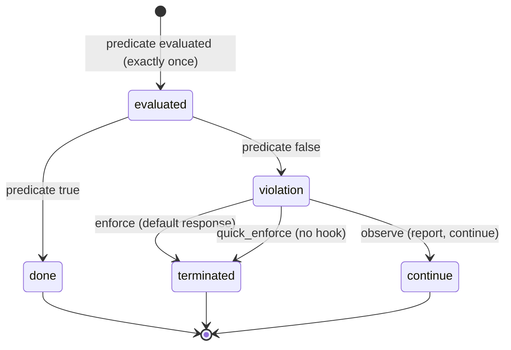
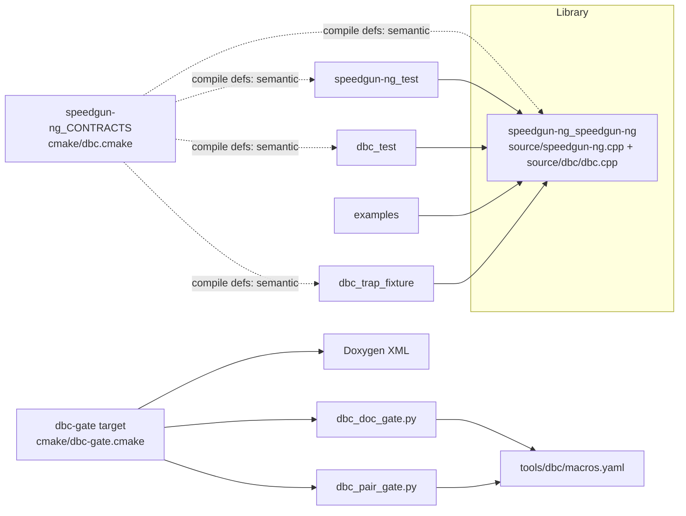

# Implementation Plan: Design By Contract (DBC) Facility

**Branch**: `001-dbc-facility` | **Date**: 2026-09-06 | **Spec**: [spec.md](spec.md)

**Input**: Feature specification from `specs/001-dbc-facility/spec.md`

**Artifacts**: [research.md](research.md) · [data-model.md](data-model.md) · [quickstart.md](quickstart.md) · [contracts/api-contracts.md](contracts/api-contracts.md)

## Summary

Deliver the constitution's Design By Contract facility (Principle II) as a
small, zero-dependency, in-repo C++20 macro layer that documents and enforces
REQUIRE / ENSURE / INVARIANT / assert contracts on functions, loops, and types.
A violation is a fuse: a single global, replaceable violation hook emits a
structured diagnostic (kind, file, line, message, predicate) and terminates by
default. Contract evaluation is selected at build time by one of four
semantics — `ignore` / `observe` / `enforce` / `quick_enforce` — named 1:1 with
C++26 so a future migration to native contracts is a mechanical rename
(FR-035). `ignore` emits no contract code; a dedicated consumer-release CI job
proves the release artifact is contract-free (SC-002). The feature also ships
the Phase 0 DBC coverage gate (documentation-presence + doc-to-enforcement
pairing) in a per-PR `dbc-gate` CI job, with the AST-level hard gate deferred to
feature 002. The pre-existing `exported_class` is conformed to 100% DBC in this
same feature so the gate is green from the landing commit.

Because the facility is intended for **pervasive use**, the call site is a
first-class design target: a standalone header, a lightweight statement-form
macro that evaluates the predicate first, a cold non-inlined `[[noreturn]]`
violation dispatch with no exception machinery at the call site,
`[[likely]]`/`[[unlikely]]` layout hints, and a small **always-on** contract
family that stays enforced even in `ignore`/release builds (FR-036…FR-040;
research R-010/R-011, synthesis + empirical proof R-013).

## Technical Context

**Language/Version**: C++20, `CMAKE_CXX_EXTENSIONS=OFF` (no compiler extensions; constitution Additional Constraints).

**Primary Dependencies**: none. The project has zero external runtime dependencies and this feature introduces none (FR-033). Build-time tooling uses only what CI already ships: Doxygen (for the doc-presence gate over XML) and a CMake-driven Python pairing check.

**Storage**: N/A (no persistent data). The only data artifacts are the machine-readable macro registry (`tools/dbc/macros.yaml`) and the per-interface DBC matrix CI artifact.

**Testing**: CTest (`ctest --preset=dev`), registered under `test/`. TDD mode for the enforcement machinery (recorded below per constitution Principle III).

**Target Platform**: Linux (GCC/Clang), macOS (AppleClang), Windows (MSVC) — the CI matrix that defines the supported platforms.

**Project Type**: C++ library (single `speedgun-ng` library), with developer-mode build/test targets and CI gates.

**Performance Goals**: zero *semantic-gated* contract code in release builds (measurable, SC-002); a **satisfied contract check costs a predicate evaluation plus one predicted branch** on the hot path — no diagnostic-argument evaluation, no EH continuation machinery at the call site (FR-038/039/040); checked-build overhead quantified as a distribution and documented (SC-008, Principle VII); always-on sites (FR-036) are the deliberate, sparing exception and carry a real (small, documented) release cost.

**Constraints**: C++20 without *language* extensions (`CMAKE_CXX_EXTENSIONS=OFF`; the cold-dispatch feature-detected intrinsics are a documented P0 carve-out, R-013, not a `-std` extension); zero external runtime dependencies; contracts are fuses (default response terminates, uncatchable); zero release cost; single source of truth between docs and enforcement; 100% DBC coverage hard gate.

**Scale/Scope**: ~6 new/changed source files (1 public header, 1 implementation TU, 1 registry, 2 gate scripts, 1 cmake module), 3 new test files, 2 new CI jobs. Small, focused facility.

## Constitution Check

*GATE: Must pass before Phase 0 research. Re-checked after Phase 1 design — still passing.*

| Principle | Status | Notes |
|---|---|---|
| I. Standard-First Coding | ✅ PASS | C++20, no *language* extensions (`CMAKE_CXX_EXTENSIONS=OFF`); the cold-dispatch feature-detected builtins/attributes (`__attribute__((cold/noinline))`, `__builtin_unreachable` / MSVC `__assume(0)`) are a documented **P0 critical-path carve-out** (Principle I.1; designated critical-path by FR-037…FR-040), degrade to nothing where unavailable, and compile clean under strict `-std=c++20` (R-013). Pinned Core Guidelines enforced by existing clang-tidy/cppcheck presets. |
| II. Design By Contract | ✅ PASS | Fuse semantics (default terminate, uncatchable — FR-008/FR-010); zero *semantic-gated* release cost (FR-012/FR-018); single source of truth (header documents, source enforces, drift fails the gate — FR-028); REQUIRE/ENSURE/INVARIANT on functions, loops, types (FR-001/005/006); 100% DBC coverage hard gate via Phase 0 (FR-027/028/031). **Always-on (FR-036)**: the always-on carve-out is now in the constitution text — applied directly at the user's direction (plan gate, 2026-09-06; the formal version-bump ceremony is deferred per the user — research R-011). |
| III. R-DCUT Design Process | ✅ PASS | spec → plan → tasks → code; this plan carries both UML views + test plan; TDD mode recorded below. |
| IV. Documentation | ✅ PASS | All new public interfaces documented with doxygen `\pre`/`\post`/`\invariant`; `exported_class` conformed. |
| V. Style and Formatting | ✅ PASS | `.clang-format` / `format-check` applied; no mixed reformat+content commits. |
| VI. Test-Backed Code and Coverage | ✅ PASS | Tests ship with the change; 100% LOC / branch / DBC gates; the facility's own check machinery is gcov-excluded (FR-032) so the gates measure application code. |
| VII. Performance Discipline | ✅ PASS | Zero release cost (SC-002); checked-build overhead measured as a distribution and documented (SC-008). |
| VIII. CI Quality Gates | ✅ PASS (strengthened, not weakened) | All existing gates unchanged. Two new CI jobs **implement already-mandated gates** (see below) — no new gate category, no gate weakening, therefore no constitution amendment required. |

**Gate-set note (Principle VIII)**: The two added CI jobs do not create new gate
categories — they *implement* existing constitutional mandates:
- `dbc-gate` implements Principle II's "100% DBC coverage is a hard gate" /
  "missing or unenforced contracts fail CI".
- `consumer-release` implements Principle II's "contract checks MUST NOT emit
  any code in release builds".

Both are hard and only ever fail on real gaps. No gate is weakened; the gate
set is extended to enforce what the constitution already requires. No P2
exception is taken.

**Resolved governance item (plan gate, 2026-09-06):** Principle II's
"contract checks MUST NOT emit any code in release builds" now carries the
always-on carve-out — applied directly to the constitution text at the
user's direction (research R-011; the formal version-bump ceremony is
deferred per the user). No open governance item blocks landing; the
Principle I P0 carve-out for the cold-dispatch intrinsics is recorded in
Complexity Tracking below.

## Project Structure

### Documentation (this feature)

```text
specs/001-dbc-facility/
├── plan.md              # This file (/speckit.plan)
├── research.md          # Phase 0 output
├── data-model.md        # Phase 1 output
├── quickstart.md        # Phase 1 output
├── contracts/
│   └── api-contracts.md # Public API + per-symbol contracts + migration mapping
└── tasks.md             # Phase 2 output (/speckit.tasks - NOT created here)
```

### Source Code (repository root)

```text
include/speedgun-ng/
├── speedgun-ng.hpp         # MODIFIED: conformed to DBC (\pre/\post on exported_class)
├── dbc.hpp                 # NEW: standalone header — SG_* + SG_*_ALWAYS macros,
│                           #   inline noinline dispatch (default response + observer
│                           #   via function-local static), zero project-header deps (FR-037)
└── speedgun-ng_export.hpp  # (generated, unchanged)

source/
├── speedgun-ng.cpp         # MODIFIED: exported_class enforces its \pre/\post via SG_*
└── dbc/
    └── dbc.cpp             # FALLBACK ONLY: out-of-line dispatch, if the noinline-shim
                            #   shape fails the asm smoke test (see Logical View)

tools/dbc/
├── macros.yaml             # NEW: macro -> (enforcement fn, kind) registry (FR-026)
├── dbc_doc_gate.py         # NEW: Doxygen XML documentation-presence gate (FR-027)
└── dbc_pair_gate.py        # NEW: doc-to-enforcement pairing check (FR-028/031)

cmake/
├── dbc.cmake               # NEW: speedgun-ng_CONTRACTS option -> semantic compile defs (FR-011/017)
└── dbc-gate.cmake          # NEW: developer-mode 'dbc-gate' target (runs both gate scripts)

test/
├── CMakeLists.txt          # MODIFIED: register dbc tests + trap fixture
└── source/
    ├── speedgun-ng_test.cpp   # MODIFIED: existing test + pass/fail contract coverage for exported_class
    ├── dbc_test.cpp           # NEW: primitives, 4 semantics, observer, predicate hygiene
    └── dbc_trap_fixture.cpp   # NEW: trap fixture for the release-clean proof (SC-002)

.github/workflows/
└── ci.yml                  # MODIFIED: + 'dbc-gate' job (per-PR) + 'consumer-release' job
```

**Structure Decision**: Single-library layout (the existing default). The
facility lives in the `speedgun-ng` library, exposed through `include/speedgun-ng/`
only, with implementation in `source/` — exactly the library-first constraint in
the constitution. The gate tooling is developer/CI-only (under `tools/dbc/` and
`cmake/`), never shipped to consumers.

---

## Design — Logical View

*What the feature is and how it behaves. Interfaces are designed with their
contracts before implementation (Principle II/III).*

### Component diagram

```mermaid
graph TD
    subgraph APP[Application code]
        E[exported_class (conformed)]
        U[future benchmark APIs]
    end

    subgraph API[Public API - include/speedgun-ng/dbc.hpp]
        M[Contract macros<br/>SG_REQUIRE / SG_ENSURE<br/>SG_INVARIANT / SG_ASSERT]
        O[sg::dbc::set_observer<br/>+ violation_observer type]
    end

    subgraph CORE[Facility core - source/dbc/dbc.cpp]
        ENF[Enforcement functions<br/>check_precondition / check_postcondition<br/>check_invariant / check_assertion]
        RESP[Violation response<br/>default: structured diagnostic + terminate]
    end

    subgraph SEM[Build-time selection - cmake/dbc.cmake]
        S[Evaluation semantic<br/>ignore / observe / enforce / quick_enforce]
    end

    subgraph CT[Compile-time contract layer]
        C[static_assert / concepts / constexpr validators]
    end

    subgraph GATE[Phase 0 gate - tools/dbc/ + cmake/dbc-gate.cmake]
        R[macros.yaml registry]
        D[Doxygen doc-presence gate]
        P[doc-to-enforcement pairing check]
        X[DBC matrix artifact]
    end

    E -- "SG_* macro (single registered call)" --> M
    U -- "SG_* macro" --> M
    M --> ENF
    ENF -- "predicate == false" --> RESP
    O -. "installs substitute observer" .-> RESP
    S -. "selects emitted code + response" .-> ENF
    S -. "selects response" .-> RESP
    E -- "compile-time constraints" --> C
    R -- consumed by --> D
    R -- consumed by --> P
    D --> X
    P --> X
```

Key logical properties:
- **One registered call per kind** (FR-025): every macro expands to a call of
  exactly one enforcement function, so sites are mechanically detectable.
- **Build-time, not per-site**: the semantic is fixed by the build switch
  (FR-011/FR-017); in `ignore` the macros expand to nothing (no code, no call).
- **Compile-time first** (FR-022/023/024): any constraint evaluable at compile
  time is a `static_assert`/concept/constexpr validator, never a runtime check.
- **Gate is data-driven** (FR-026): both gate halves read `macros.yaml`; none
  hard-codes a macro list.

### Class / interface diagram

```mermaid
classDiagram
    class Kind {
        <<enum>>
        precondition
        postcondition
        invariant
        assertion
    }
    class ViolationRecord {
        kind : Kind
        file : char const*
        line : unsigned
        message : char const*
        predicateText : char const*
    }
    class violation_observer {
        <<callable type (alias)>>
        void operator()(ViolationRecord const&)
    }
    namespace sg::dbc {
        +check_precondition(msg, file, line, pred)
        +check_postcondition(msg, file, line, pred)
        +check_invariant(msg, file, line, pred)
        +check_assertion(msg, file, line, pred)
        +set_observer(violation_observer)
        +default_response(ViolationRecord const&)  [[noreturn]] (terminating semantics)
    }
    ViolationRecord --> Kind : carries
    violation_observer --> ViolationRecord : receives
    sg::dbc ..> ViolationRecord : builds on failure
    sg::dbc ..> violation_observer : invokes (unless quick_enforce)
```

In the primary design the dispatch is **header-only `inline` + noinline**
(feature-detected portable shim: `__attribute__((noinline))` on GCC/Clang,
`__declspec(noinline)` on MSVC, degrading to nothing) so the public header
stays standalone with zero project dependencies. Cold-placement and
unreachability bits (`__attribute__((cold))`, `__builtin_unreachable()` / MSVC
`__assume(0)`) are feature-detected shims confined to the cold dispatch; the
**hot path itself uses only standard C++20** (`[[unlikely]]`, `do-while(0)`,
`#pred`) (research R-013). The dispatch qualifiers are **semantic-dependent**
(R-013, premise correction C5): `[[noreturn]]` in the terminating semantics
(`enforce`, `quick_enforce`); `noexcept` **only** in `quick_enforce` (trap, no
hook — nothing can throw). In `enforce` it is `[[noreturn]]` but **not**
`noexcept`: a substitute observer may throw, and that throw *propagates as the
termination mechanism* (FR-009/FR-014) — `noexcept` would convert it to
`std::terminate`. In `observe` it is neither (the default response reports and
returns; the hook may throw). In `ignore` builds semantic-gated macros expand
to nothing, so the emitted-on-use dispatch is **absent from any TU with no
live call** — exactly what SC-002's symbol-absence proof requires; an
always-compiled `source/dbc/dbc.cpp` dispatch would *not* be absent, which is
why the TU form is the documented **fallback**, not the default (FR-037 form b,
engaged only if the primary shows EH artifacts in the assembly smoke test). An
optional `__FILE_NAME__` / file-static string dedup (`SG_THIS_FILE`) is
available where binary size matters — zero hot-path impact (R-013, rank 7).

**Empirical verification (R-013; GCC 16.2.1 / Clang 22.1.8, `-std=c++20 -O2`,
project warning set):** for
`int hot(int x){ SG_REQUIRE(x > 0, …); return x * 2; }` the satisfied path is
exactly `testl %edi,%edi` (predicate) + `jle` (one predicted branch) + `leal`
(result) + `ret` — **zero `call`s, zero diagnostic-argument evaluation** (the
file/pred/msg/kind loads sit in the physically relocated cold block). The
caller frame carries **no `.cfi_personality` / `.cfi_lsda`** — **no landing
pad at the call site**; all EH machinery (personality reference, LSDA,
`.gcc_except_table`) lives **entirely inside the dispatch**, for both the
terminating and the `observe` variants. The header-inline `noinline` primary
achieves this identical EH-clean caller frame (not inlined; own comdat body),
so it is **expected to pass the assembly smoke test** (SC-008). **Governance**:
the guarded intrinsics are a P0 critical-path optimization (Principle I.1),
designated critical-path by FR-037…FR-040; they compile clean under strict
`-std=c++20` and are not a `CMAKE_CXX_EXTENSIONS=ON` requirement (R-013).

### Call-site design (performance contract — FR-037…FR-040, research R-010)

The facility is extremely performance-sensitive and meant for pervasive use.
The call site is a **statement-form macro**, deliberately *not* a function
call:

```cpp
// semantic-gated: #if on the single numeric semantic compile def set by the
// `speedgun-ng_CONTRACTS` option (FR-011/FR-017). CMake always defines
// SG_CONTRACTS_SEMANTIC (0=ignore, 1=observe, 2=enforce, 3=quick_enforce), so
// this is -Wundef-clean. ignore (== 0) -> ((void)0): predicate NOT evaluated,
// no code emitted (FR-012/FR-018/FR-037). The other three semantics (1/2/3)
// share this identical checked body; their behavioral difference
// (report+return / terminate / trap) is resolved inside the dispatch, which
// branches on the same value — not the macro (libc++ 4-semantics model,
// R-013 rank 9).
#if SG_CONTRACTS_SEMANTIC == 0
#  define SG_REQUIRE(pred, msg) ((void)0)
#else
#  define SG_REQUIRE(pred, msg) \
    do { \
        if (!(pred)) [[unlikely]] { \
            ::sg::dbc::check_precondition(msg, __FILE__, __LINE__, #pred); \
        } \
    } while (false)
#endif

// always-on family: identical body, OUTSIDE the semantic #if — active in
// every configuration including ignore (FR-036)
#define SG_REQUIRE_ALWAYS(pred, msg) \
    do { \
        if (!(pred)) [[unlikely]] { \
            ::sg::dbc::check_precondition(msg, __FILE__, __LINE__, #pred); \
        } \
    } while (false)
```

Design properties, each traceable to a requirement:

| Property | Mechanism | Requirement |
|---|---|---|
| Predicate evaluated **first**; no diagnostic arg evaluated on the satisfied path | `if (!(pred))` guard — C++ evaluates function *arguments* before the call, so a call-form macro would evaluate `msg`/`#pred` even when satisfied; the `if`-form defers them into the failing branch | FR-038 |
| Exactly-once predicate evaluation | predicate appears once, as the condition | FR-019 |
| Hot path = predicate + one predicted branch; cold dispatch out of line | `[[unlikely]]` on the failing branch (the sole hot-path hint — standard C++20 on all four compilers); dispatch `inline` + **noinline** (EH-isolation, no LTO in the repo) + `[[noreturn]]` in the terminating semantics; cold `__attribute__((cold))` + unreachability as feature-detected shims inside the dispatch only (R-013) | FR-040, FR-039 |
| No exception machinery at the call site | dispatch is non-inlined; the only throw-capable edge (a test observer) is *inside* the cold frame; in terminating semantics the failure edge is terminal (`[[noreturn]]`), so the call site needs no landing pad — **empirically verified**: the caller frame carries no `.cfi_personality`/`.cfi_lsda` while all EH machinery lives inside the dispatch (R-013) | FR-039 |
| Dispatch qualifiers are semantic-dependent | `[[noreturn]]` in `enforce`/`quick_enforce`; `noexcept` **only** in `quick_enforce` (trap, no hook — nothing can throw); neither in `observe` (report-and-return; a hook may throw and that throw propagates as the termination mechanism) — so an observer throw in `enforce` is not converted to `std::terminate` (R-013, premise C5; refines FR-039, does not change spec behavior) | FR-013/FR-014/FR-039 |
| Zero code in `ignore` (semantic-gated) | preprocessor elision — `((void)0)`, predicate **not even parsed/evaluated** (spec-literal; the research's Qt `static_cast<void>(false && (pred))` warning-hygiene idiom is **rejected** because it parses/type-checks the predicate and would violate FR-037 — R-013, premise C1; the residual `-Wunused-variable` edge case is a warning only: the project's set is `-Wunused`, not `-Werror`) | FR-012/FR-018/FR-037 |
| Always-on present in every configuration | separate `_ALWAYS` macro family compiled outside the semantic `#if`; compiler cannot eliminate it (observable side effects on violation: diagnostic + termination) | FR-036 |
| Standalone header | `dbc.hpp` depends on no project headers (primary: standard headers only); the guarded intrinsics are feature-detected and compile clean under strict `-std=c++20` — a documented P0 critical-path optimization, not a `CMAKE_CXX_EXTENSIONS=ON` requirement (R-013) | FR-037, FR-034 |

The four per-kind `check_*` functions remain the **single registered
enforcement function per kind** (FR-025): the macro expands to a call of
exactly one of them, so the registry and the gates keep working. `check_*`
forwards to one shared cold `detail::dispatch(kind, msg, file, line, pred)`;
the kind stays part of the stable identity (FR-021).

### Sequence — a precondition check across the four semantics

```mermaid
sequenceDiagram
    participant App as Application code
    participant M as SG_REQUIRE(expr, msg)
    participant C as sg::dbc::check_precondition
    participant R as Violation response

    Note over M: semantic-gated site in ignore -> macro expands to nothing (no code, no call; FR-012/018/037)<br/>always-on site (SG_REQUIRE_ALWAYS) keeps the checked shape in every configuration (FR-036) and always fires the DEFAULT response (diagnostic + terminate) — never the quick_enforce trap — regardless of the global semantic
    App->>M: call guarded function
    alt semantic == ignore AND site is semantic-gated
        Note over M: no code generated; predicate not evaluated
    else predicate == true (any checked site, any semantic; always-on always)
        Note over M: guard is false -> NO dispatch call (FR-038); hot path = predicate eval + one predicted branch (FR-040)
    else predicate == false AND semantic == enforce (also: always-on site under ignore)
        M->>C: check_precondition(msg, __FILE__, __LINE__, #pred)
        C->>R: ViolationRecord{precondition, file, line, msg, pred}
        R->>R: emit structured diagnostic to stderr (or invoke installed observer)
        R-->>App: terminate (std::abort; uncatchable — an observer's throw propagates, FR-009/014)
    else predicate == false AND semantic == quick_enforce
        M->>C: check_precondition(msg, __FILE__, __LINE__, #pred)
        C-->>App: terminate immediately via trap (no hook, no diagnostic; noexcept; FR-013)
    else predicate == false AND semantic == observe
        M->>C: check_precondition(msg, __FILE__, __LINE__, #pred)
        C->>R: ViolationRecord{...}
        R-->>App: diagnostic emitted; execution continues (FR-015)
    end
```

### State — violation handling



Note: in `ignore` the `evaluated` state is never reached at runtime for
**semantic-gated** sites because no code is emitted; always-on sites (FR-036)
run this state machine in every configuration, including `ignore`. An
always-on site always takes the `enforce` (default-response) branch — it
**never** takes the `quick_enforce` (no-hook) branch — so under `quick_enforce`
it still emits the diagnostic and terminates via the default response,
matching the spec's "fires in a release build exactly as in a checked build"
(FR-036).

### Postcondition and invariant placement (logical rule)

- **Postcondition** (`SG_ENSURE`): a named capture of the return value is
  taken once at each return point; the predicate is evaluated against that
  capture (FR-003/FR-004). No implicit `old()`; any pre-call reference is an
  explicit named capture taken at function entry.
- **Class invariant** (`SG_INVARIANT`): checked at constructor exit,
  destructor entry, entry of every public member function, and exit of every
  non-const public member function (FR-006). Const member functions get
  entry-only checks (Edge Case: const member functions).
- **Loop invariant** (`SG_INVARIANT` in a loop): checked at each iteration
  entry (FR-005).

---

## Design — Physical View

*Where the feature lives: module / namespace / file layout, build targets and
link relationships, and the public API surface it adds.*

### Namespace and modules

| Namespace / module | Location | Contents |
|---|---|---|
| `sg::dbc` (public) | `include/speedgun-ng/dbc.hpp` | `SG_REQUIRE` / `SG_ENSURE` / `SG_INVARIANT` / `SG_ASSERT`; the always-on family `SG_*_ALWAYS` (FR-036); `violation_observer`; `set_observer`; `check_*` enforcement functions (inline + noinline, `[[noreturn]]` in terminating semantics); shared cold `detail::dispatch`; observer storage (function-local static) — **standalone: no project headers** (FR-037) |
| `sg::dbc` (internal, fallback only) | `source/dbc/dbc.cpp` | out-of-line `check_*` + `detail::dispatch` behind a dedicated generated export header — only if the header-only noinline-shim design is rejected by the asm smoke test |
| (data) | `tools/dbc/macros.yaml` | macro → (enforcement fn, kind) registry |
| (tooling) | `tools/dbc/dbc_doc_gate.py`, `dbc_pair_gate.py` | Phase 0 gate halves |
| (build) | `cmake/dbc.cmake`, `cmake/dbc-gate.cmake` | semantic option + gate target |

### Build targets and link relationships



- `speedgun-ng_CONTRACTS` (CMake, values `ignore|observe|enforce|quick_enforce`,
  default `enforce` in dev/CI, `ignore` in the consumer-release job) maps to a
  **single numeric compile definition** `SG_CONTRACTS_SEMANTIC`
  (`0`=ignore, `1`=observe, `2`=enforce, `3`=quick_enforce). One definition,
  two consumers (R-013 rank 9 — mirrors the libc++ 4-semantics model): the
  macro `#if` in `dbc.hpp` elides semantic-gated macros only when
  `SG_CONTRACTS_SEMANTIC == 0` (ignore), and the cold dispatch branches on the
  same value to select the violation response for **semantic-gated** sites:
  report+continue (observe), hook+terminate (enforce), or trap (quick_enforce).
  **Always-on sites are the exception: they force the default (checked-build)
  response — the structured diagnostic followed by termination, invoking the
  installed observer — regardless of the global semantic** (FR-036, "fires in
  a release build exactly as in a checked build"; the FR-036 test: an always-on
  violation fires identically in `ignore` / `enforce` / `quick_enforce`).
  Concretely: under `ignore` only always-on sites can reach the dispatch
  (semantic-gated macros are elided) and they fire the default response; under
  `quick_enforce` an always-on site likewise fires the default response rather
  than the trap. The checked-build macro body is identical across the three
  non-ignore semantics. It is independent of `NDEBUG` and of `CMAKE_BUILD_TYPE`
  (FR-017).
- `dbc-gate` is a developer-mode target that builds Doxygen XML and runs both
  gate scripts; it fails the build (and CI) on any gap.
- `dbc_trap_fixture` is a test executable that compiles a contract site that
  aborts in checked builds; the consumer-release CI job runs it under `ignore`
  and requires a silent exit (SC-002).

### Public API surface added

- `include/speedgun-ng/dbc.hpp` (standalone — FR-037):
  - semantic-gated macros: `SG_REQUIRE` / `SG_ENSURE` / `SG_INVARIANT` / `SG_ASSERT`;
  - always-on family: `SG_REQUIRE_ALWAYS` / `SG_ENSURE_ALWAYS` / `SG_INVARIANT_ALWAYS` / `SG_ASSERT_ALWAYS` (FR-036) — active in every configuration, distinct in the registry and in the consumer-release verification;
  - `sg::dbc::violation_observer` + `sg::dbc::set_observer` (observer state: function-local static in the inline accessor — shared across TUs by ODR).
- CMake option `speedgun-ng_CONTRACTS` (consumer-facing; default `enforce` in dev/CI presets, `ignore` for a bare consumer build).
- No new external targets, packages, or dependencies; no new project-header dependencies (the facility header is standalone).

---

## Test Plan

*Constitution Principle III/VI: tests accompany the component; TDD recorded;
100% LOC / branch / DBC coverage.*

### Execution mode: TDD (recorded per Principle III)

**TDD is used for the enforcement machinery** (the header-inline primary,
`include/speedgun-ng/dbc.hpp`; the out-of-line `source/dbc/dbc.cpp` fallback,
if ever engaged, follows the same loop): the violation/semantic tests in
`test/source/dbc_test.cpp` are written first and observed to fail (red), then
the enforcement functions are implemented to make them pass (green), then the
pair is refactored. The macro header and gate scripts follow the same red-green
loop where a deterministic failing test exists (e.g. the seeded-drift gate
tests).

### Coverage strategy

- 100% line and 100% branch coverage on `source/` (Principle VI).
- 100% DBC coverage enforced by the Phase 0 gate on all public headers (FR-027/028/031).
- The facility's own check machinery (the cold dispatch and default response in
  `dbc.hpp`, plus `source/dbc/dbc.cpp` if the fallback is used) is
  **gcov-excluded** (FR-032, `LCOV_EXCL` lines on the cold-dispatch blocks) so
  the line/branch gates measure application code, not the fuse box.
- Every contract site has a **pass-side** test (contract holds) and a
  **fail-side** test (contract fails, violation observed or termination
  verified) — SC-004.

### Test case mapping (user story / FR → test)

| US / FR | Test (in `test/source/`) | Assertion |
|---|---|---|
| US1 / FR-002 | `dbc_test` — precondition violation (observer) | record carries kind=precondition, file, line, message, predicate |
| US1 / FR-003/004 | `dbc_test` — postcondition over named result capture | violation at return point when capture violates; exactly-once evaluation |
| US1 / FR-005 | `dbc_test` — loop invariant | violation at a failing iteration entry; passes when held |
| US1 / FR-006 | `dbc_test` — class invariant (ctor exit, dtor entry, member entry/exit) | violation at each site; const members entry-only |
| US1 / FR-007 | `dbc_test` — `SG_ASSERT` in-body | violation on false assertion |
| US1 / FR-022/023/024 | `dbc_test` — compile-time layer | a compile-time constraint is a `static_assert`/concept; a deliberately runtime-only one fails to compile (negative compile test) |
| US2 / FR-012/018 | `dbc_trap_fixture` under `ignore` | **semantic-gated** trap site runs silently; no semantic-gated `sg::dbc::check_*` code in the artifact; an **always-on** trap site in the same fixture still fires (FR-036 exception proven both ways, SC-002) |
| US2 / FR-036 | `dbc_test` — always-on under `ignore` | an always-on violation fires identically in `ignore`, `enforce`, and `quick_enforce` builds; a semantic-gated violation is silent in `ignore` |
| US2 / FR-037 | `dbc_test` — standalone compile | a TU that includes `dbc.hpp` with **no project include paths** compiles and links (primary design: standard headers only) |
| US2 / FR-038/039/040 | `dbc_test` + `tools/dbc/asm_smoke.sh` (Linux) | (a) satisfied check evaluates the predicate exactly once and no diagnostic arg; (b) assembly of a hot function containing a satisfied check (Linux, `-O2`, GCC/Clang) contains no landing-pad / EH-continuation references attributable to the check (MSVC analog deferred); (c) measured satisfied-check overhead vs uncontracted path reported as a distribution (SC-008) |
| US2 / FR-017 | `dbc_test` (matrix build) | toggling `NDEBUG` does not change contract state; the switch does not change `assert` behavior |
| US2 / FR-013 | `dbc_test` — `quick_enforce` | violation terminates without invoking the observer |
| US2 / FR-015 | `dbc_test` — `observe` | violation reported, execution continues |
| US3 / FR-008/009/010 | `dbc_test` — observer + default response | observer receives full record; default terminates and is uncatchable; single global hook |
| US4 / FR-027 | `dbc_test` / gate fixture — missing `\pre`/`\post` | doc gate fails, naming the interface + missing section |
| US4 / FR-028 | gate fixture — documented-not-enforced + enforced-not-documented | pairing check fails both directions, naming interface + kind |
| US4 / FR-029/030 | gate fixture — exemptions + `none` marker | exempted decls pass; explicit `none` passes; implicit empty fails |
| US4 / FR-031 | gate run | DBC matrix artifact emitted per interface |
| US5 / FR-035 | conformance review (no runtime test) | mapping table covers 100% of constructs (SC-010) |
| R-009 / FR-029 | `speedgun-ng_test` — conformed `exported_class` | `\pre`/`\post` present + enforced; pass and fail sides |

### Determinism and performance

- All tests are deterministic (Principle VI); no timing-dependent asserts.
- The checked-build overhead measurement (SC-008) is a separate, noise-free
  benchmark comparison (checked vs uncontracted path), reported as a
  distribution (min/max/n50/n99) — not a per-PR assertion in 001, but a
  documented measurement (Principle VII).
- The asm smoke test (Linux) is a **evidence** step, not a hard cross-platform
  gate: it guards the no-EH-at-call-site property (FR-039) on the reference
  toolchains; the hard, cross-platform properties are the measured overhead
  (SC-008), the standalone-compile test (FR-037), and the always-on/ignore
  behavior tests (FR-036).

### Gate effectiveness proof (SC-006)

Two committed gate fixtures (or CI-seeded temporary edits) prove the gate:
1. A public function missing a `\pre` or `\post` → doc gate fails.
2. A documented contract with no matching enforcement → pairing check fails.
Both are exercised in the `dbc-gate` CI job so the guarantee is CI-gated.

---

## Complexity Tracking

> **No P2 exceptions taken.** The two added CI jobs implement existing
> constitutional mandates (Principle II) and weaken no gate; no simpler
> alternative (no gate / master-only / allowlist) was selected because each is
> explicitly forbidden by the constitution or the approved spec. (The
> always-on carve-out for Principle II was resolved at the plan gate —
> applied to the constitution text at the user's direction, 2026-09-06;
> formal version-bump ceremony deferred per the user — R-011.) One open
> governance item (not a plan-level violation):
> 1. **Principle I P0 critical-path carve-out for the cold-dispatch
>    feature-detected intrinsics** (`__attribute__((cold/noinline))`,
>    `__builtin_unreachable` / MSVC `__assume(0)`) — invoked per Principle
>    I.1's mechanism (designated critical-path by FR-037…FR-040, documented
>    here and in R-013); the hot path remains pure C++20 and the intrinsics
>    degrade to nothing where unavailable, so the standard-conformance
>    constraint is unchanged. Recorded for the gate; no constitution change
>    required (it is a P0 invocation, not a principle redefinition).
> The P2 exception table is intentionally empty (no P2 deviations).

| Violation | Why Needed | Simpler Alternative Rejected Because |
|---|---|---|
| *(none)* | — | — |
