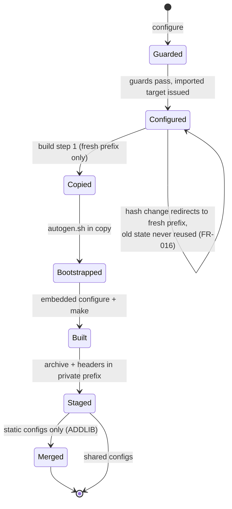
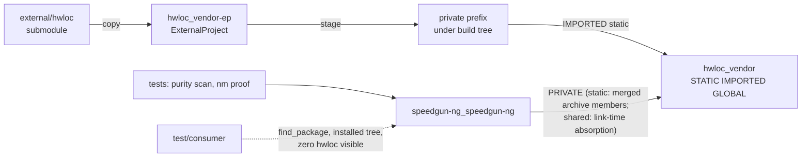

# Implementation Plan: Vendor hwloc as a Private, Pinned Submodule

**Branch**: `003-vendor-hwloc` | **Date**: 2026-09-20 | **Spec**: [spec.md](spec.md)

**Input**: Feature specification from `specs/003-vendor-hwloc/spec.md` (brief: `hwloc.md`)

**Artifacts**: [research.md](research.md) · [data-model.md](data-model.md) · [quickstart.md](quickstart.md) · [contracts/ingestion-module.md](contracts/ingestion-module.md) · [contracts/privacy-contract.md](contracts/privacy-contract.md)

## Summary

hwloc 2.14.0 (pinned commit `b5660dff631a171a96a4b3abf5a170c9cf62d6ef`) enters the tree as a git submodule at `external/hwloc` and builds inside the speedgun-ng build as a strictly internal dependency. A reusable CMake module, `cmake/ImportAutotoolsSubmodule.cmake`, owns the whole ingestion: copy the submodule into the build tree, bootstrap `autogen.sh` in the copy, run hwloc's configure in embedded mode with `--with-hwloc-symbol-prefix=sg_` and the verified optional-feature disable list, build the `libhwloc_embedded.a` convenience archive, stage it under a private prefix inside the build tree, and hand back a `STATIC IMPORTED GLOBAL` target with ordering, byproducts, and system-library wiring attached (FR-011 through FR-020; research R-001, R-003 through R-009). The speedgun-ng library links that target PRIVATE through one wrapper translation unit, `source/hwloc/hwloc_gate.cpp`: the only TU that includes `<hwloc.h>`, home of the compile-time `(2, 14, 0)` version assertion and the `hwloc_get_api_version()` reference that proves the link at object level (FR-003, FR-007, FR-021).

Static builds merge the convenience archive into `libspeedgun-ng.a` through the archiver (the upstream "slurping" pattern), so the installed static library is self-contained while its package files name nothing foreign (R-010); shared builds absorb the archive at link time and hidden visibility keeps every hwloc symbol out of the dynamic table (FR-024). The privacy contract (FR-022 through FR-026) is proven by four CI audits and a downstream consumer job that installs system hwloc on the runner, then configures, builds, and runs `test/consumer/` against the installed tree with zero hwloc resolutions. Nothing in the build consults a system hwloc; a configure-time guard rejects an uninitialized submodule with the init command in the message (FR-002, FR-004).

## Technical Context

**Language/Version**: C++23 for the wrapper TU (`CMAKE_CXX_EXTENSIONS=OFF`); the vendored hwloc builds as C under its own autotools flags, exempt from our gates by FR-009. CMake >= 3.20 (constitution floor; `CONFIGURE_HANDLED_BY_BUILD` needs exactly this floor, R-006).

**Primary Dependencies**: none added to the library's link surface. Build-time host tools: `autoconf`, `automake`, `libtool`, `patch`, `make`, POSIX `sh` (checked at configure with package-name diagnostics, R-011). The vendored hwloc itself is the dependency: static, internal, prefixed, invisible.

**Storage**: N/A. The only data artifacts are the vendored tree, the module's staged private prefix under the build tree, and CI audit output.

**Testing**: CTest under `test/` (purity scan, static-archive nm proof) plus CI audit steps and a downstream consumer job (R-012). TDD mode recorded in the Test Plan (Principle III).

**Target Platform**: Linux (GCC/Clang; enforced CI gate), macOS (AppleClang; developer-local, `ci-macos` preset stays usable, R-015), Windows (unprecluded; per-platform module block, guard message names the `contrib/windows-cmake/` on-ramp, R-014).

**Project Type**: C++ library (existing single `speedgun-ng` library) plus build-infrastructure deliverables (one reusable `cmake/` module, CI jobs, audits).

**Performance Goals**: none claimed in this feature, and none at risk: hwloc crosses zero API boundaries, no runtime code path of speedgun-ng calls into it yet (Scope boundaries). The wrapper contributes no runtime lines (R-010, Test Plan).

**Constraints**: zero hwloc references in any installed artifact or exported symbol (FR-022 through FR-024); pinned SHA is the only hwloc (FR-001/FR-004); submodule worktree pristine after builds (SC-007); sanitizer policy fixed to excluded, consistent across Linux jobs (FR-010); `CMAKE_INSTALL_PREFIX` receives nothing from the ingestion (FR-017).

**Scale/Scope**: 1 new submodule (plus `.gitmodules`), 6 new files across 5 paths (`cmake/ImportAutotoolsSubmodule.cmake`, `source/hwloc/hwloc_gate.cpp`, `tools/hwloc/hwloc_purity_scan.sh`, `tools/hwloc/hwloc_nm_proof.sh`, `test/consumer/` with 2 files), 5 modified files (`CMakeLists.txt`, `test/CMakeLists.txt`, `.codespellrc`, `README.md`, `.github/workflows/ci.yml`). Small, infrastructure-only.

## Constitution Check

*GATE: Must pass before Phase 0 research. Re-checked after Phase 1 design: still passing.*

| Principle | Status | Notes |
|---|---|---|
| I. Standard-First Coding | PASS | The one new C++ TU (`hwloc_gate.cpp`) is C++23, extensions off, and needs no `reinterpret_cast` (the link proof is a `constinit` function-pointer reference, R-010), so no P2 diagnostic-suppression exception is taken. The vendored C archive builds under hwloc's own flags, an exemption FR-009 orders explicitly; clang-tidy/cppcheck are target-scoped and the autotools child is outside both (R-013). |
| II. Design By Contract | PASS | No new public interface exists to contract: hwloc crosses zero API boundaries, and the wrapper defines no public symbol. The module's input validation is a build-time precondition with a hard-fail diagnostic (FR-002, FR-018), the build-system analogue of REQUIRE, consistent with the repo's hard-fail style (`coverage.cmake:7-13`). |
| III. R-DCUT | PASS | spec → plan → this design with logical and physical views plus test plan; TDD mode recorded in the Test Plan. |
| IV. Documentation | PASS | No public API, so no doxygen surface added. The module carries its full input/guarantee documentation as header comments (the house pattern for `cmake/` modules), and the README gains the mandated re-pinning section (FR-006). |
| V. Style and Formatting | PASS | `cmake/lint.cmake` formats a whitelist (`source/ include/ test/ example/`, lines 10-16); `external/` never enters it (R-013). New files in `source/`, `tools/`, `test/` are clang-format clean. |
| VI. Test-Backed Code | PASS | Tests ship in the same change: purity scan and nm proof in CTest, audits in CI, plus the downstream consumer project (FR-026). Coverage extraction (`cmake/coverage.cmake:50-51`) is a whitelist that `external/` never enters, and the vendored archive never sees `--coverage` (R-008/R-013). The wrapper TU holds a compile-time assertion and a `constinit` reference: zero runtime lines, so the 100% line/branch gate is met with no executable lines to miss (Test Plan). |
| VII. Performance Discipline | PASS | No critical path is designated or touched; no baseline changes. The feature adds zero runtime work (Constraints). |
| VIII. CI Quality Gates | PASS: extended; no gate weakened | Every existing gate and preset is untouched, sanitizer presets included. Four of the five analysis gates (clang-tidy, cppcheck, coverage, format) exclude `external/` structurally (R-013); codespell is the one gate needing the explicit skip, the exemption FR-009 mandates. The new audits and jobs implement the spec's mandates. The single gate-configuration edit is `.codespellrc` skip adding `*/external`, the exemption FR-009 requires with its rationale in the spec. New jobs (`shared-audit`, `downstream-consumer`) add proof surfaces; they never relax a verdict. Windows (MSVC): preset-build conformance is suspended for this feature's lifetime by constitution amendment 2.7.0; the module's unsupported-platform guard names the `contrib/windows-cmake/` on-ramp (R-014), and landing that port reinstates the gate. |
| IX. Spec-Driven Development | PASS | This artifact set under `specs/003-vendor-hwloc/`; `tasks.md` follows via `/speckit.tasks`. Touching build configuration is exactly what IX refuses to let bypass the workflow; this plan is that compliance. |
| X. Anti-Slop | PASS | The module's generality is a spec deliverable (FR-011: "reusable capability"): the inputs are the spec's five plus `MERGE_INTO`, the sixth input R-010 requires for the static-archive merge that keeps FR-007, SC-011, and FR-023 satisfiable together; zero further knobs. The call site is inputs-only by contract (SC-010). `ponytail`-ladder note: staging exists because FR-017 names a private prefix; consuming the raw build tree was the shorter alternative and loses that contract (R-004). |
| XI. Discourse and Prose | PASS | Generated docs in this directory follow XI; the prose-lint job covers `specs/` markdown (verified `prose_gate.py` MD roots) over the PR range. |

**Gate-set note (Principle VIII)**: nothing weakens. The FR-009 exemptions (lint/tidy/cppcheck/coverage/sanitizer for the vendored path) are spec-mandated, evidence-backed (R-008, R-013: three of five gates exclude `external/` structurally), and recorded in the spec's Clarifications. The `.codespellrc` edit is the one mechanical consequence.

## Project Structure

### Documentation (this feature)

```text
specs/003-vendor-hwloc/
├── plan.md                        # This file (/speckit.plan)
├── research.md                    # Phase 0 output (R-001 through R-015)
├── data-model.md                  # Phase 1 output (entities, build-state model)
├── quickstart.md                  # Phase 1 output (validation runs, SC mapping)
├── contracts/
│   ├── ingestion-module.md        # Phase 1 output (module input/guarantee contract)
│   └── privacy-contract.md        # Phase 1 output (surfaces + audit commands)
└── tasks.md                       # Phase 2 output (/speckit.tasks, NOT created here)
```

### Source Code (repository root)

```text
external/hwloc                      # NEW git submodule @ b5660dff... (tag hwloc-2.14.0);
                                    #   never built in place; exempt from all gates (FR-001);
                                    #   BSD 3-Clause COPYING stays in-tree and ships with
                                    #   source distributions (FR-005)
.gitmodules                         # NEW (submodule record)

cmake/
└── ImportAutotoolsSubmodule.cmake  # NEW: the reusable ingestion module.
                                    #   Guard: missing/empty vendored tree -> FATAL_ERROR naming
                                    #   `git submodule update --init` (FR-002).
                                    #   Tool probe: autoconf automake libtool patch make sh
                                    #   with apt/dnf/brew names (FR-018, R-011).
                                    #   Hash-keyed vendor prefix (FR-016, R-006);
                                    #   copy -> autogen.sh -> out-of-tree configure -> make ->
                                    #   stage private prefix (FR-014/015/017);
                                    #   STATIC IMPORTED GLOBAL + BUILD_BYPRODUCTS + ordering
                                    #   (FR-013/015, R-009); merge helper for static archives
                                    #   (R-010); per-platform blocks (FR-019, R-014).

CMakeLists.txt                      # MODIFY: after the library target and export header:
                                    #   module include + one import_autotools_submodule(...)
                                    #   call with the hwloc inputs (configure args per R-003/
                                    #   R-004/R-005); add source/hwloc/hwloc_gate.cpp to the
                                    #   target sources; target_link_libraries(... PRIVATE
                                    #   hwloc_vendor); post-build archive merge when STATIC
                                    #   (R-010). No PUBLIC edge, no find_package(hwloc)
                                    #   anywhere (FR-004/FR-007).

source/hwloc/
└── hwloc_gate.cpp                  # NEW: the single wrapper TU (FR-021). Includes <hwloc.h>
                                    #   only. static_assert on (HWLOC_VERSION_MAJOR,
                                    #   HWLOC_VERSION_MINOR, HWLOC_VERSION_RELEASE) ==
                                    #   (2, 14, 0) with the expected-version diagnostic
                                    #   (FR-003, R-002); [[maybe_unused]] constinit
                                    #   function-pointer reference to hwloc_get_api_version()
                                    #   as the object-level link proof (FR-007, SC-011).

tools/hwloc/
├── hwloc_purity_scan.sh            # NEW: ctest-registered audit (SC-009, FR-004, FR-021):
                                    #   zero `find_package(hwloc` / `pkg_check_modules(hwloc`
                                    #   in build files; zero hwloc includes under include/;
                                    #   exits 1 naming every hit. Modeled on
                                    #   tools/dbc/dependency_scan.sh.
└── hwloc_nm_proof.sh               # NEW: ctest-registered static-archive proof (FR-007,
                                    #   SC-011, R-010): nm on libspeedgun-ng.a lists the
                                    #   vendored members with the gate object's
                                    #   sg_hwloc_get_api_version reference resolving into
                                    #   them; red on a thin pre-merge archive.

test/
├── CMakeLists.txt                  # MODIFY: register hwloc_purity_scan and the static
│                                   #   nm-archive proof (SC-011) as CTest tests.
└── consumer/
    ├── CMakeLists.txt              # NEW: downstream consumer project (FR-026): plain
    │                               #   find_package(speedgun-ng) + link + run; never names
    │                               #   hwloc. Driven by the CI job and the quickstart.
    └── main.cpp

.codespellrc                        # MODIFY: skip += */external (FR-009; R-013).

.github/workflows/ci.yml            # MODIFY (R-012): submodules: true on every checkout;
                                    #   apt/dnf toolchain packages in Linux jobs;
                                    #   install-tree + package-config + nm audits on test;
                                    #   new shared-audit job (shared build, install,
                                    #   nm -D + ldd on the installed library);
                                    #   new downstream-consumer job (installs libhwloc-dev,
                                    #   find_package consumer against the installed tree,
                                    #   log greps).

README.md                           # MODIFY: re-pinning section (check out tag, commit
                                    #   pointer, bump assertion; FR-006) + host-toolchain
                                    #   note (apt/dnf/brew names, R-011).
```

**Structure Decision**: the existing single-library layout stands. All new code sits in the two sanctioned implementation roots (`source/`, `tools/`) plus `cmake/`; the vendored tree lives at `external/`, the root fixed by clarification (never mixed with `third_party/`), outside `include/`, `source/`, `test/` as FR-001 demands. `include/` gains nothing: hwloc crosses zero public boundaries.

---

## Design: Logical View

*What the feature is and how it behaves. No runtime interface is added; the design objects are build-time components and the contracts between them.*

### Component diagram

```mermaid
graph TD
    subgraph CS[Call site - CMakeLists.txt]
        A[import_autotools_submodule call<br/>inputs only: path, invocation, args,<br/>archive, target name - SC-010]
    end

    subgraph MOD[cmake/ImportAutotoolsSubmodule.cmake]
        G[configure guards<br/>submodule present FR-002<br/>toolchain probe FR-018]
        H[hash-keyed prefix<br/>compiler, version, build type,<br/>sanitizer state, configure args - FR-016]
        P[ExternalProject steps<br/>copy - autogen - configure - make<br/>offline, out-of-tree FR-014/015]
        S[stage private prefix<br/>archive + headers, build tree only<br/>FR-017]
        T[imported static target<br/>GLOBAL, byproducts, ordering<br/>dl/thread wiring FR-013 R-009]
        PL[per-platform blocks<br/>POSIX implemented, Windows additive<br/>FR-019]
    end

    subgraph SG[speedgun-ng library]
        W[source/hwloc/hwloc_gate.cpp<br/>version assert R-002 + link proof<br/>FR-003/FR-007]
        M[post-build merge (static)<br/>ADDLIB embedded archive into<br/>libspeedgun-ng.a - R-010]
    end

    subgraph AUD[Audits - ctest + CI]
        PU[purity scan SC-009/FR-004/021]
        NM[nm static proof SC-011]
        IT[install-tree + pkg-config audit SC-002/003]
        SY[shared symbol audit SC-004]
        DC[downstream consumer test<br/>FR-026, authoritative]
    end

    A --> G --> H --> P --> S --> T
    MOD -. structure .- PL
    T -- "PRIVATE link only" --> W
    W --> M
    A -. proven by .-> PU
    M -. proven by .-> NM
    SG -. proven by .-> IT
    SG -. proven by .-> SY
    SG -. proven by .-> DC
```

### Sequence: a cold build (fresh hash)

```mermaid
sequenceDiagram
    participant D as cmake --preset (configure)
    participant M as module
    participant B as build (make/ninja)

    D->>M: import_autotools_submodule(inputs)
    M->>M: guard: external/hwloc/VERSION present?<br/>no -> FATAL_ERROR naming submodule init (FR-002)
    M->>M: probe autoconf/automake/libtool/patch/make/sh<br/>miss -> FATAL_ERROR naming apt/dnf/brew packages (FR-018)
    M->>M: hash(compiler, version, build type, sanitizer state, args)<br/>select fresh vendor prefix dir (FR-016)
    M-->>D: imported target hwloc_vendor + ordering edges (FR-013)
    B->>B: copy external/hwloc -> prefix/src (pristine submodule, FR-014, SC-007)
    B->>B: autogen.sh in the copy (autoreconf -ivf + Big Sur patch)
    B->>B: configure --enable-embedded-mode<br/>--with-hwloc-symbol-prefix=sg_<br/>--disable-libxml2 ... --disable-plugin-ltdl (R-003..R-005)<br/>curated CFLAGS, no sanitizers, no -Werror (FR-010, R-008)
    B->>B: make (hwloc/ subdir only; tools/tests/docs absent in embedded mode)
    B->>B: stage prefix/include + prefix/lib/libhwloc_embedded.a (FR-017, R-004)
    B->>B: compile hwloc_gate.cpp (static_assert fires here on drift, SC-006)
    B->>B: static: ar -M ADDLIB merge into libspeedgun-ng.a (R-010)
```

Warm builds: `CONFIGURE_HANDLED_BY_BUILD` keeps configure and everything downstream parked unless the vendor step's stamps demand it (FR-015, R-006). An input change moves the hash, selects a new prefix, and the whole chain runs again, visibly (SC-008).

### State: vendor build states and invalidation



There is no path from any state to a system hwloc: no discovery call exists in the module or call site, and the guard rejects the uninitialized-submodule case with the init command (FR-004, edge case).

---

## Design: Physical View

*Where it lives: files, targets, link relationships, and the (empty) public API surface.*

### Files and their duties

| Path | Duty | Requirements |
|---|---|---|
| `external/hwloc` | Vendored sources @ `b5660dff...`; input only, never built in place | FR-001, FR-014, SC-007 |
| `cmake/ImportAutotoolsSubmodule.cmake` | All ingestion mechanics; documented inputs and guarantees as header comments; per-platform blocks | FR-011 through FR-019, R-001/R-004 through R-011/R-014 |
| `CMakeLists.txt` | One module call (inputs only) + PRIVATE link + static merge wiring; wrapper in target sources | FR-007, FR-011, SC-010, R-009/R-010 |
| `source/hwloc/hwloc_gate.cpp` | Sole `<hwloc.h>` includer; `(2,14,0)` static_assert; constinit link-proof reference | FR-003, FR-007, FR-021, R-002 |
| `tools/hwloc/hwloc_purity_scan.sh` | Grep audits over build files and `include/` | FR-004, FR-021, SC-009 |
| `test/consumer/` | Downstream `find_package` consumer, hwloc-blind | FR-026, SC-005 |
| `.github/workflows/ci.yml` | Submodule checkouts, toolchain packages, audits, `shared-audit`, `downstream-consumer` | FR-008, FR-009, FR-024, FR-026, SC-002..SC-005, SC-009, SC-011 |
| `.codespellrc` | `skip += */external` | FR-009, R-013 |
| `README.md` | Re-pinning section + toolchain names | FR-006, R-011 |

### Build targets and link relationships



Key properties, each traced: the only link edge to `hwloc_vendor` is PRIVATE (FR-007); the installed export set (`speedgun-ngTargets`, `cmake/install-rules.cmake:25`) sees no hwloc target, path, or call, so `speedgun-ngConfig.cmake` and `speedgun-ngTargets.cmake` carry zero references (FR-023); the static archive is self-contained by merge (R-010); the shared library's dynamic table exports zero hwloc symbols behind the existing `CXX_VISIBILITY_PRESET hidden` (`CMakeLists.txt:38-39`, FR-024); the wrapper's prefixed references (`sg_hwloc_*`, R-003) still match every `grep -i hwloc` audit, so both the static presence proof (SC-011) and the export-absence audits (SC-004) read one pattern.

### Public API surface added

None. `include/` gains nothing, no new option beyond the internal machinery, no new package file, no exported symbol. This section is empty by design: the feature's contract is invisibility (Scope boundaries; FR-021).

---

## Test Plan

*Principle III/VI: tests accompany the component. Verification is binary throughout (X.4).*

### Execution mode: TDD (recorded per Principle III)

TDD applies where a code seam exists: `tools/hwloc/hwloc_purity_scan.sh` (seed a violation fixture line, watch the test fail, implement, pass) and the CTest nm-archive test (run against a thin archive first: red; merge lands: green, mirroring the merge's necessity). The module itself is build configuration: its red-green discipline runs at the surface level, quickstart sections 3 (tripwire), 4 (pristine worktree), 9 (stamp invalidation), and 10 (toolchain diagnostic) written as failing-before/after runs against the pre-change tree, captured per X.4. Prose artifacts take review plus the prose-lint gate, no test pinning their text.

### Coverage strategy

- `external/` stays outside every measurement: coverage extraction whitelist (`cmake/coverage.cmake:50-51`), tidy/cppcheck target scope, lint globs (`cmake/lint.cmake:10-16`), codespell skip (R-013).
- `source/hwloc/hwloc_gate.cpp` contains a `static_assert` (compile-time, no gcov lines) and a `constinit` reference (static initialization, no executed code): the file has zero runtime lines, so the 100% line/branch gate holds vacuously and truthfully (verified at implement via the coverage trace listing the file with 0 lines).
- The sanitizer preset is unchanged; the vendored archive is never instrumented (R-008), and `ci-sanitize` stays green by policy.

### Scenario and check mapping

| US / FR / SC | Check (surface) | Pass condition |
|---|---|---|
| US1 / FR-001/008 / SC-001 | Clean clone with submodules; every Linux CI job (`ci.yml` after R-012 edits); macOS developer run | All jobs exit 0; submodule SHA equals `b5660dff...` |
| US1 / FR-002 | Empty submodule dir; `cmake --preset` | Configure exits non-zero; message contains `git submodule update --init` |
| US1 / FR-003, SC-006 | `git checkout` the submodule to another tag; build | Compile fails; diagnostic names expected 2.14.0 |
| US1 / FR-004, SC-009 | `ctest -R hwloc_purity_scan` + CI grep | Zero `find_package(hwloc` / `pkg_check_modules(hwloc` hits; zero hwloc includes under `include/` |
| US1 / FR-007, SC-011 | `ctest -R hwloc_nm_proof` (static build tree) | `nm libspeedgun-ng.a` lists hwloc objects; the gate object's reference resolves into them |
| US1 / SC-007 | Full build, then `git status` inside `external/hwloc` | Worktree reports unmodified |
| US1 / FR-010 | `ci-sanitize` job | Green; module header states the exclusion policy and rationale |
| US2 / SC-002 | CI test-job step after install | `find prefix/ -iname '*hwloc*'` empty |
| US2 / SC-003 | CI test-job step | `grep -i hwloc prefix/lib/cmake/speedgun-ng/*.cmake` empty |
| US2 / FR-024, SC-004 | `shared-audit` job: shared build, installed | `nm -D --defined-only` on the installed `.so` greps zero hwloc; `ldd` names no hwloc object (privacy-contract A5 targets the installed library) |
| US2 / FR-026, SC-005 | `downstream-consumer` job with `libhwloc-dev` installed | Consumer configure/build/run exit 0; its configure log and link command grep zero hwloc |
| US3 / FR-011..FR-020, SC-010 | Structure review against [contracts/ingestion-module.md](contracts/ingestion-module.md); call-site review | Call site holds inputs + imported-target use, zero build commands; platform code inside per-platform blocks only |
| US3 / SC-008 | Change compiler version / build type / sanitizer flags / configure args, rebuild | Full vendor chain re-runs visibly in the build log; no stale archive reused |
| US3 / FR-018 | Host without autoconf (CI container probe or `PATH` trim) | Configure fails early naming `autoconf automake libtool patch` + apt/dnf/brew |
| US4 / FR-006 | README re-pinning section followed on a scratch clone against a newer tag, assertion bumped | Build green after bump; build red when tag moves with the assertion untouched |
| Gates / VIII | Existing `lint`, `coverage`, `sanitize`, `test`, `test-rocky`, `consumer-release`, `dbc-gate`, `prose-lint`, `docs` jobs | All stay green with submodules fetched (FR-008) |

### Determinism and regression

Every check is a command exit code, a grep verdict, or a diff, no judgment calls (X.4). The FR-020 disable list plus embedded mode makes the archive host-independent, so runner package drift cannot flip audits. Existing `test/consumer`-adjacent behavior is untouched: the `consumer-release` job keeps its DBC asserts; the new `downstream-consumer` job is additive.

## Complexity Tracking

> **No P2 exceptions taken.** The module's reusable shape is a spec deliverable (FR-011), its inputs are the spec's five plus the R-010 merge hook `MERGE_INTO`, and the call site is inputs-only by SC-010. The archive-merge step (R-010) looks exotic and is the minimum that satisfies FR-007 and SC-011 while keeping FR-023; the rejected alternatives and their evidence sit in R-010.

| Violation | Why Needed | Simpler Alternative Rejected Because |
|---|---|---|
| *(none)* | *(none)* | *(none)* |
