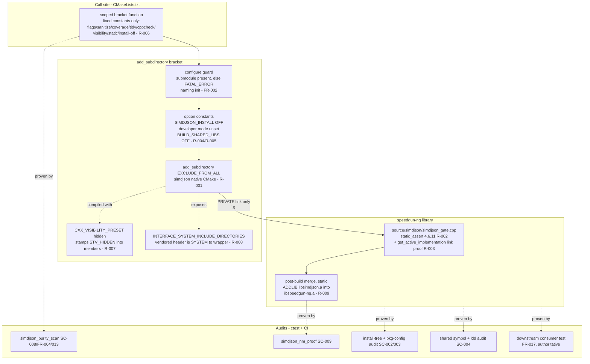
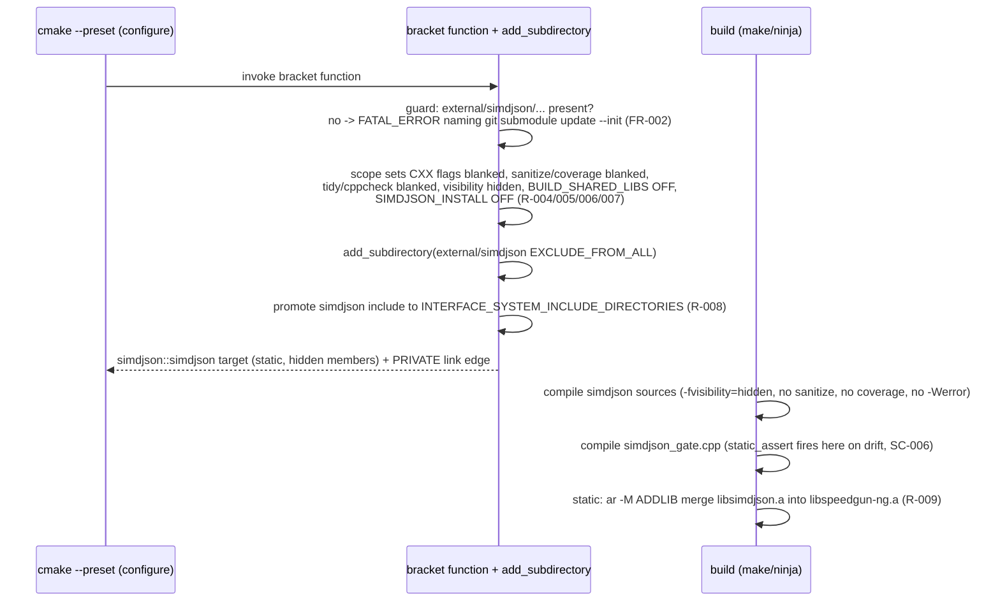
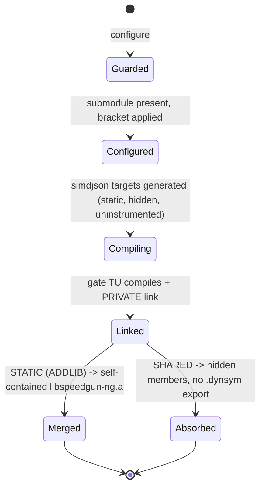
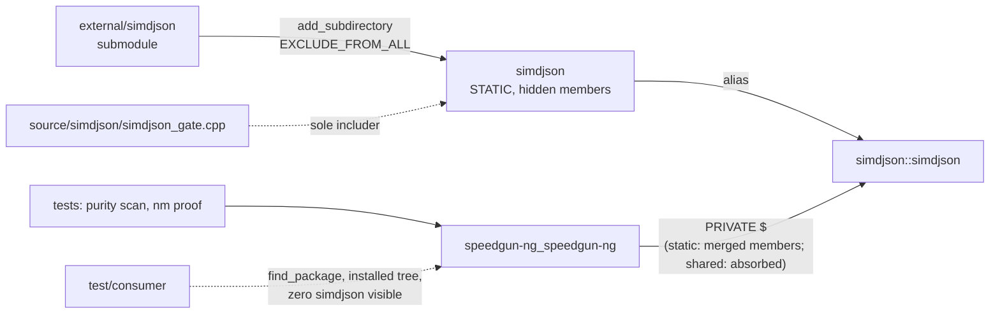

# Implementation Plan: Vendor simdjson as a Private, Pinned Submodule

**Branch**: `004-vendor-simdjson` | **Date**: 2026-09-23 | **Spec**: [spec.md](spec.md)

**Input**: Feature specification from `specs/004-vendor-simdjson/spec.md`

**Artifacts**: [research.md](research.md) · [data-model.md](data-model.md) · [quickstart.md](quickstart.md) · [contracts/build-integration.md](contracts/build-integration.md) · [contracts/privacy-contract.md](contracts/privacy-contract.md)

## Summary

simdjson 4.6.11 (pinned commit `f5de14f09256982933af2849beb43778bd421ca7`, the commit the annotated tag `v4.6.11` points to (tag object `e153ffadd9ae29b00c90bedc76f65d25a993d2b5`), re-verified 2026-09-23) enters the tree as a git submodule at `external/simdjson` and builds inside the speedgun-ng build as a strictly internal, statically absorbed dependency. Unlike the hwloc import (specs/003-vendor-hwloc), simdjson is a native CMake library: it is consumed through `add_subdirectory(external/simdjson ... EXCLUDE_FROM_ALL)` with the `ImportAutotoolsSubmodule` module left unused, and no autotools bootstrap or host autoconf/automake/libtool/patch is introduced (FR-011; research R-001). The central engineering fact is an inheritance asymmetry: a CMake `add_subdirectory` child inherits the parent's compile flags, sanitizer flags, coverage instrumentation, clang-tidy, and cppcheck, while an `ExternalProject` autotools child inherits none. Every exemption the spec mandates (FR-009 warning/tidy/cppcheck/coverage, FR-010 sanitizer exclusion, FR-016 hidden visibility, R-004 install-off, R-005 forced static) is therefore built explicitly, through one scoped variable-reset bracket that wraps the `add_subdirectory` call (R-006).

The speedgun-ng library links `simdjson::simdjson` PRIVATE through one wrapper translation unit, `source/simdjson/simdjson_gate.cpp`: the only TU that includes `<simdjson.h>`, home of the compile-time `static_assert(simdjson::SIMDJSON_VERSION_{MAJOR,MINOR,REVISION} == (4,6,11))` version tripwire and the `&simdjson::get_active_implementation` reference that proves the link at object level (FR-003, FR-007, FR-013; R-002, R-003). Static builds merge `libsimdjson.a` into `libspeedgun-ng.a` through the archiver, so the installed static library is self-contained while its package files name nothing foreign (R-009); shared builds absorb the archive at link time with the vendored objects compiled hidden (simdjson ships no symbol prefix, so `-fvisibility=hidden` is stamped at the vendored compile; R-007), keeping every simdjson symbol out of the dynamic table (FR-016). The privacy contract (FR-013 through FR-017) is proven by audits and the downstream consumer test on a machine that carries simdjson. Nothing in the build consults a system simdjson; a configure-time guard rejects an uninitialized submodule with the init command in the message (FR-002, FR-004).

## Technical Context

**Language/Version**: C++23 for the wrapper TU (`CMAKE_CXX_EXTENSIONS=OFF`); the vendored simdjson builds under its own CMake, whose library floor is `cxx_std_11` (`CMakeLists.txt:335` at master), and is exempt from our gates by FR-009. CMake >= 3.20 (constitution floor; the SYSTEM-include mechanism in R-008 is chosen to stay at that floor).

**Primary Dependencies**: none added to the library's link surface. No new host build tool: simdjson is CMake-native, so the autoconf/automake/libtool/patch set the hwloc import demanded (specs/003 R-011) is not introduced here. The vendored simdjson itself is the dependency: static, internal, hidden, invisible.

**Storage**: N/A. The only data artifacts are the vendored tree and CI audit output.

**Testing**: CTest under `test/` (purity scan, static-archive nm proof) plus CI audits and the downstream consumer test (R-010). TDD mode recorded in the Test Plan (Principle III).

**Target Platform**: Linux (GCC/Clang; enforced CI gate), macOS (AppleClang; developer-local, `ci-macos` preset stays usable), Windows (unprecluded; simdjson is a CMake project with upstream MSVC support, so nothing here blocks a later Windows build beyond the hwloc autotools suspension already recorded in constitution amendment 2.7.0).

**Project Type**: C++ library (existing single `speedgun-ng` library) plus build-infrastructure deliverables (one wrapper TU, one CMake `add_subdirectory` bracket, CI audit steps, audit scripts).

**Performance Goals**: none claimed in this feature, and none at risk: simdjson crosses zero API boundaries, and no runtime code path of speedgun-ng calls into it yet (Scope boundaries). The wrapper contributes no runtime lines (R-003, Test Plan).

**Constraints**: zero simdjson references in any installed artifact or exported symbol (FR-013 through FR-017); pinned SHA is the only simdjson (FR-001/FR-004); submodule worktree pristine after builds (SC-007); sanitizer policy fixed to excluded, consistent across Linux jobs (FR-010); `CMAKE_INSTALL_PREFIX` receives nothing from the ingestion (FR-014); a shared speedgun-ng resolves no `libsimdjson` runtime object (SC-004).

**Scale/Scope**: 1 new submodule (plus a `.gitmodules` record), new files across 4 paths (`source/simdjson/simdjson_gate.cpp`, `tools/simdjson/simdjson_purity_scan.sh`, `tools/simdjson/simdjson_nm_proof.sh`; the downstream consumer `test/consumer/` already exists and is reused), modified files: `CMakeLists.txt`, `test/CMakeLists.txt`, `CMakePresets.json` (the tidy header-filter, R-008), `tools/dbc/dependency_scan.sh` (vendored-private classifier, R-010), `.github/workflows/ci.yml` (simdjson audit steps), `README.md` (re-pinning section). `.codespellrc` needs no edit (`*/external` already skipped by specs/003). Infrastructure-only.

## Constitution Check

*GATE: Must pass before Phase 0 research. Re-checked after Phase 1 design: still passing.*

| Principle | Status | Notes |
|---|---|---|
| I. Standard-First Coding | PASS | The one new C++ TU (`simdjson_gate.cpp`) is C++23, extensions off, and needs no `reinterpret_cast` (the link proof is a `constinit` function-pointer reference to `simdjson::get_active_implementation`, R-003), so no P2 diagnostic-suppression exception is taken. The vendored simdjson builds under its own CMake flags, an exemption FR-009 orders explicitly; tidy/cppcheck are neutralized for it by the scoped bracket (R-006). |
| II. Design By Contract | PASS | No new public interface exists to contract: simdjson crosses zero API boundaries, and the wrapper defines no public symbol. The version assertion is a compile-time `static_assert` (the build analogue of a hard invariant), and the submodule guard is a configure-time precondition with a hard-fail diagnostic (FR-002), consistent with the repo's hard-fail style (`coverage.cmake:7-13`). |
| III. R-DCUT | PASS | spec → plan → this design with logical and physical views plus test plan; TDD mode recorded in the Test Plan. |
| IV. Documentation | PASS | No public API, so no doxygen surface added. The `add_subdirectory` bracket and the wrapper carry their rationale as adjacent comments (the house pattern), and the README gains the mandated re-pinning section (FR-006). |
| V. Style and Formatting | PASS | `cmake/lint.cmake` formats a whitelist (`source/*.cpp include/*.hpp test/* example/*`, lines 10-16); `external/` never enters it (R-010). The new files in `source/` and `tools/` are clang-format clean. |
| VI. Test-Backed Code | PASS | Tests ship in the same change: purity scan and nm proof in CTest, audits in CI, plus the reused downstream consumer project (FR-017). Coverage extraction (`cmake/coverage.cmake:50-51`) is a whitelist that `external/` never enters, and the bracket additionally blanks `CMAKE_CXX_FLAGS_COVERAGE` so the vendored archive never sees `--coverage` (R-006). The wrapper TU holds a compile-time assertion and a `constinit` reference: zero runtime lines, so the 100% line/branch gate is met with no executable lines to miss (Test Plan). |
| VII. Performance Discipline | PASS | No critical path is designated or touched; no baseline changes. The feature adds zero runtime work (Constraints). |
| VIII. CI Quality Gates | PASS: extended; no gate weakened | Every existing gate and preset is untouched except one FR-009-mandated narrowing: the clang-tidy header-filter excludes `external/` so vendored headers reached through the wrapper are exempt (R-008). That is a spec-mandated vendored exemption. The gate applied to speedgun-ng code is unchanged and stays fully analyzed. The wrapper's own lines remain gated (R-008). New audit steps implement the spec's mandates; none relaxes a verdict. Windows (MSVC): preset-build conformance remains suspended for the hwloc autotools lifetime (amendment 2.7.0); simdjson via `add_subdirectory` introduces no new Windows blocker, and its upstream MSVC support keeps the port unprecluded. |
| IX. Spec-Driven Development | PASS | This artifact set under `specs/004-vendor-simdjson/`; `tasks.md` follows via `/speckit.tasks`. Touching build configuration is exactly what IX refuses to let bypass the workflow; this plan is that compliance. |
| X. Anti-Slop | PASS | The `add_subdirectory` bracket carries no knob beyond the fixed constants the spec's exemptions require (R-006); it exposes no options and serves exactly one call site (X.2). The static-archive merge (R-009) is the minimum that satisfies FR-007 and SC-009 while keeping FR-015; rejected alternatives and their evidence sit in R-009. `--exclude-libs` was considered and rejected as redundant complexity given the objects are compiled hidden in-tree (R-007). No speculative abstraction: there is no reusable "simdjson module" invented here, only a scoped bracket, because unlike the hwloc autotools child the exemption cannot be structural and must be explicit. |
| XI. Discourse and Prose | PASS | Generated docs in this directory follow XI; the prose-lint job covers `specs/` markdown over the PR range. |

**Gate-set note (Principle VIII)**: nothing weakens. The FR-009/FR-010 exemptions are spec-mandated and constructed for a CMake child (R-006), the mirror of what is structural for the hwloc autotools child. The single gate-configuration edit is the tidy header-filter narrowing `external/`, which removes vendored code from analysis while leaving speedgun-ng code fully held.

## Project Structure

### Documentation (this feature)

```text
specs/004-vendor-simdjson/
├── plan.md                        # This file (/speckit.plan)
├── research.md                    # Phase 0 output (R-001 through R-010)
├── data-model.md                  # Phase 1 output (entities, build-state model)
├── quickstart.md                  # Phase 1 output (validation runs, SC mapping)
├── contracts/
│   ├── build-integration.md       # Phase 1 output (the add_subdirectory bracket contract)
│   └── privacy-contract.md        # Phase 1 output (surfaces + audit commands)
└── tasks.md                       # Phase 2 output (/speckit.tasks, NOT created here)
```

### Source Code (repository root)

```text
external/simdjson                   # NEW git submodule @ f5de14f0... (tag v4.6.11);
                                    #   consumed via add_subdirectory, never built in a
                                    #   copy; exempt from all gates (FR-001, FR-009);
                                    #   MIT and Apache-2.0 license files stay in-tree and
                                    #   ship with source distributions (FR-005)
.gitmodules                         # MODIFY: add the external/simdjson submodule record

CMakeLists.txt                      # MODIFY: after the library target and export header,
                                    #   next to the existing hwloc block: a scoped bracket
                                    #   function that resets CXX flags / sanitize /
                                    #   coverage / tidy / cppcheck / visibility /
                                    #   BUILD_SHARED_LIBS / SIMDJSON_INSTALL and calls
                                    #   add_subdirectory(external/simdjson ... EXCLUDE_FROM_ALL)
                                    #   (R-004, R-005, R-006); promote simdjson's include to
                                    #   INTERFACE_SYSTEM_INCLUDE_DIRECTORIES (R-008); register
                                    #   source/simdjson/simdjson_gate.cpp on the target; link
                                    #   $<BUILD_INTERFACE:simdjson::simdjson> PRIVATE;
                                    #   post-build ar -M merge when STATIC (R-009). No PUBLIC
                                    #   edge, no find_package(simdjson) (FR-004/FR-007).

source/simdjson/
└── simdjson_gate.cpp               # NEW: the single wrapper TU (FR-013). Includes
                                    #   <simdjson.h> only (via SYSTEM include, R-008).
                                    #   static_assert on simdjson::SIMDJSON_VERSION_{MAJOR,
                                    #   MINOR,REVISION} == (4,6,11) with the expected-version
                                    #   diagnostic (FR-003, R-002); [[maybe_unused]] constinit
                                    #   function-pointer reference to
                                    #   simdjson::get_active_implementation as the object-level
                                    #   link proof (FR-007, SC-009, R-003).

tools/simdjson/
├── simdjson_purity_scan.sh         # NEW: ctest-registered audit (SC-008, FR-004, FR-013),
│                                   #   modeled on tools/hwloc/hwloc_purity_scan.sh: zero
│                                   #   find_package(simdjson / pkg_check_modules(simdjson in
│                                   #   build files; zero simdjson includes under include/;
│                                   #   exits 1 naming every hit.
└── simdjson_nm_proof.sh            # NEW: ctest-registered static-archive proof (FR-007,
                                    #   SC-009, R-009), modeled on tools/hwloc/hwloc_nm_proof.sh:
                                    #   nm on libspeedgun-ng.a lists simdjson objects with the
                                    #   gate object's simdjson::get_active_implementation
                                    #   reference resolving into them; red on a thin archive.

test/
├── CMakeLists.txt                  # MODIFY: register simdjson_purity_scan and the static
│                                   #   nm-archive proof as CTest tests (same pattern as the
│                                   #   hwloc_purity_scan / hwloc_nm_proof registrations).
└── consumer/                       # REUSED: the downstream find_package consumer (FR-017)
                                    #   already exists from specs/003; it never names simdjson,
                                    #   so it proves simdjson invisibility with no change.

CMakePresets.json                   # MODIFY: narrow the clang-tidy header-filter (line 43) so
                                    #   it does not match external/ (FR-009, R-008).

tools/dbc/dependency_scan.sh        # MODIFY: classify a simdjson PRIVATE link on the library
                                    #   target as vendored-private, alongside the existing
                                    #   hwloc_vendor branch (lines 94-97), so dbc_dependency_scan
                                    #   stays green (R-010).

.github/workflows/ci.yml            # MODIFY (R-010): install-tree and package-config simdjson
                                    #   audits on the test job (beside the hwloc ones, lines
                                    #   121-124); an nm -D shared-symbol simdjson audit on
                                    #   shared-audit (line 173); a grep -i simdjson over the
                                    #   downstream-consumer logs (line 202). Every checkout
                                    #   already carries submodules: true, so the new submodule
                                    #   is fetched unchanged; no new host toolchain (simdjson
                                    #   needs no autoconf).

README.md                           # MODIFY: re-pinning section (checkout the tag, commit the
                                    #   submodule pointer, bump the version assertion in
                                    #   source/simdjson/simdjson_gate.cpp; FR-006), beside the
                                    #   existing hwloc re-pinning section.
```

**Structure Decision**: the existing single-library layout stands. All new code sits in the two sanctioned implementation roots (`source/`, `tools/`) plus a `CMakeLists.txt` bracket; the vendored tree lives at `external/`, the root fixed by the spec assumption (never mixed with `third_party/`), outside `include/`, `source/`, `test/` as FR-001 demands. `include/` gains nothing: simdjson crosses zero public boundaries.

---

## Design: Logical View

*What the feature is and how it behaves. No runtime interface is added; the design objects are build-time components and the contracts between them.*

### Component diagram



### Sequence: a cold build



Warm builds: CMake's own target dependencies order the vendored compile before the library; a submodule SHA change reconfigures and rebuilds the vendored target. No external project stamp machinery is needed because the vendored code is a first-class target in this build (contrast specs/003 R-006, where the autotools child required hash-keyed prefixes).

### State: build configuration and the privacy invariant



There is no path from any state to a system simdjson: no discovery call exists in the bracket or call site, and the guard rejects the uninitialized-submodule case with the init command (FR-004, edge case).

---

## Design: Physical View

*Where it lives: files, targets, link relationships, and the (empty) public API surface.*

### Files and their duties

| Path | Duty | Requirements |
|---|---|---|
| `external/simdjson` | Vendored sources @ `f5de14f0...`; consumed via add_subdirectory, built in-tree | FR-001, FR-011 |
| `CMakeLists.txt` (bracket) | Scoped flag/option reset + `add_subdirectory` + SYSTEM-include promotion + PRIVATE link + static merge | FR-007, FR-009, FR-010, FR-011, FR-016, R-004/R-005/R-006/R-007/R-008/R-009 |
| `source/simdjson/simdjson_gate.cpp` | Sole `<simdjson.h>` includer (SYSTEM); `(4,6,11)` static_assert; constinit link-proof reference | FR-003, FR-007, FR-013, R-002/R-003 |
| `tools/simdjson/simdjson_purity_scan.sh` | Grep audits over build files and `include/` | FR-004, FR-013, SC-008 |
| `tools/simdjson/simdjson_nm_proof.sh` | Static-archive presence + gate-reference resolution proof | FR-007, SC-009, R-009 |
| `test/consumer/` | Downstream `find_package` consumer, simdjson-blind (reused) | FR-017, SC-005 |
| `CMakePresets.json` | tidy header-filter excludes `external/` | FR-009, R-008 |
| `tools/dbc/dependency_scan.sh` | classify simdjson link vendored-private | FR-004, R-010 |
| `.github/workflows/ci.yml` | simdjson audits on existing jobs | FR-008, FR-016, FR-017, SC-002..SC-005, SC-008/SC-009 |
| `README.md` | Re-pinning section | FR-006 |

### Build targets and link relationships



Key properties, each traced: the only link edge to `simdjson::simdjson` is PRIVATE, wrapped in `BUILD_INTERFACE` so the name never enters the exported set (FR-007); the installed export set (`cmake/install-rules.cmake:24`) sees no simdjson target, path, or call, so `speedgun-ngConfig.cmake` and `speedgun-ngTargets.cmake` carry zero references (FR-015); the static archive is self-contained by merge (R-009); the shared library's dynamic table exports zero simdjson symbols behind hidden-visibility vendored objects (FR-016); the wrapper's references to mangled `simdjson` symbols match every `grep -i simdjson` audit, so both the static presence proof (SC-009) and the export-absence audits (SC-004) read one pattern.

### Public API surface added

None. `include/` gains nothing, no new option beyond the internal bracket, no new package file, no exported symbol. This section is empty by design: the feature's contract is invisibility (Scope boundaries; FR-013).

---

## Test Plan

*Principle III/VI: tests accompany the component. Verification is binary throughout (X.4).*

### Execution mode: TDD (recorded per Principle III)

TDD applies where a code seam exists: `tools/simdjson/simdjson_purity_scan.sh` (seed a violation fixture line, watch the test fail, implement, pass) and the CTest nm-archive test (run against a thin archive first: red; the merge lands: green, mirroring the merge's necessity). The `add_subdirectory` bracket is build configuration: its red-green discipline runs at the surface level, quickstart sections 3 (version tripwire), 4 (pristine worktree), 5 (nm/purity), and 11 (uninitialized-submodule guard) written as failing-before/after runs against the pre-change tree, captured per X.4. Prose artifacts take review plus the prose-lint gate, no test pinning their text.

### Coverage strategy

- `external/` stays outside every measurement: coverage extraction whitelist (`cmake/coverage.cmake:50-51`), tidy/cppcheck neutralized by the bracket (R-006), lint globs (`cmake/lint.cmake:10-16`), codespell skip (already `*/external`). The bracket additionally blanks `CMAKE_CXX_FLAGS_COVERAGE`, so the vendored archive never sees `--coverage`.
- `source/simdjson/simdjson_gate.cpp` contains a `static_assert` (compile-time, no gcov lines) and a `constinit` reference (static initialization, no executed code): the file has zero runtime lines, so the 100% line/branch gate holds vacuously and truthfully (verified at implement via the coverage trace listing the file with 0 lines).
- The sanitizer preset is unchanged; the vendored archive is never instrumented (bracket blanks `CMAKE_CXX_FLAGS_SANITIZE`), and `ci-sanitize` stays green by policy (FR-010).

### Scenario and check mapping

| US / FR / SC | Check (surface) | Pass condition |
|---|---|---|
| US1 / FR-001/008 / SC-001 | Clean clone with submodules; every Linux CI job; macOS developer run | All jobs exit 0; submodule SHA equals `f5de14f0...` |
| US1 / FR-002 | Empty submodule dir; `cmake --preset` | Configure exits non-zero; message contains `git submodule update --init` |
| US1 / FR-003, SC-006 | `git checkout` the submodule to another tag; build | Compile fails at `simdjson_gate.cpp`; the `static_assert` diagnostic names expected 4.6.11 and the mismatching enum values |
| US1 / FR-004, SC-008 | `ctest -R simdjson_purity_scan` + CI grep | Zero `find_package(simdjson` / `pkg_check_modules(simdjson` hits; zero simdjson includes under `include/` |
| US1 / FR-007, SC-009 | `ctest -R simdjson_nm_proof` (static build tree) | `nm libspeedgun-ng.a` lists simdjson objects; the gate object's `simdjson::get_active_implementation` reference resolves into them |
| US1 / SC-007 | Full build, then `git status` inside `external/simdjson` | Worktree reports unmodified (out-of-source `add_subdirectory` build dir) |
| US1 / FR-010 | `ci-sanitize` job | Green; the vendored compile carries no `-fsanitize` (bracket), consistent across every Linux job |
| US2 / FR-005 / SC-002 | CI test-job step after install | `find prefix/ -iname '*simdjson*'` empty (SIMDJSON_INSTALL OFF) |
| US2 / FR-015 / SC-003 | CI test-job step | `grep -i simdjson prefix/lib/cmake/speedgun-ng/*.cmake` empty |
| US2 / FR-016, SC-004 | `shared-audit` job: shared build, installed | `nm -D --defined-only` on the installed `.so` greps zero simdjson; `ldd` names no `libsimdjson` object (forced-static vendored build, hidden members) |
| US2 / FR-017, SC-005 | `downstream-consumer` job with system simdjson present | Consumer configure/build/run exit 0; its configure log and link command grep zero simdjson |
| US3 / FR-006 | README re-pinning section followed on a scratch clone against a newer tag, assertion bumped | Build green after bump; build red when the tag moves with the assertion untouched |
| Gates / VIII | Existing `lint`, `coverage`, `sanitize`, `test`, `test-rocky`, `consumer-release`, `dbc-gate`, `prose-lint`, `docs` jobs | All stay green with submodules fetched (FR-008); `dbc_dependency_scan` stays green via the classifier edit (R-010) |

### Determinism and regression

Every check is a command exit code, a grep verdict, or a diff, no judgment calls (X.4). Developer mode off plus `EXCLUDE_FROM_ALL` make the built archive library-only, so runner package drift cannot flip audits. The existing `downstream-consumer`/`consumer-release` behavior is untouched; the simdjson audits are additive. The reused `test/consumer/` carries no simdjson reference, so a simdjson path leaking into the package files surfaces as its configure failure or an audit grep hit.

## Complexity Tracking

> **No P2 exceptions taken.** The `add_subdirectory` bracket carries only the fixed constants the spec's exemptions require and serves exactly one call site (X.2). The static-archive merge (R-009) looks exotic and is the minimum that satisfies FR-007 and SC-009 while keeping FR-015; `--exclude-libs` was considered and rejected as redundant given in-tree hidden compilation (R-007). The one gate-configuration edit (the tidy header-filter, R-008) is the FR-009 vendored exemption; analysis of speedgun-ng code is unchanged.

| Violation | Why Needed | Simpler Alternative Rejected Because |
|---|---|---|
| *(none)* | *(none)* | *(none)* |
