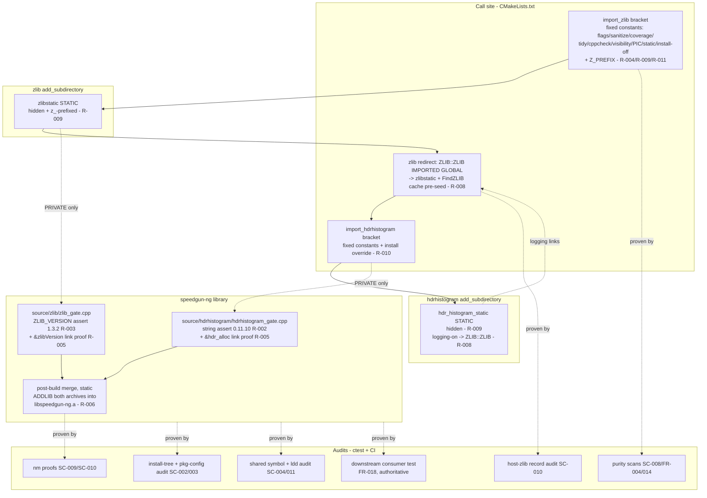
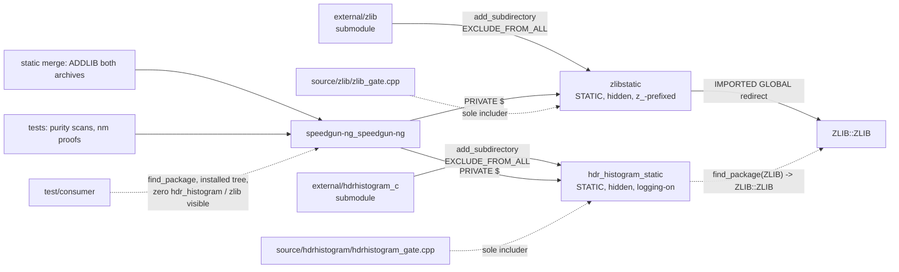

# Implementation Plan: Vendor HdrHistogram_c as a Private, Pinned Submodule

**Branch**: `005-vendor-hdrhistogram` | **Date**: 2026-09-23 | **Spec**: [spec.md](spec.md)

**Input**: Feature specification from `specs/005-vendor-hdrhistogram/spec.md`

**Artifacts**: [research.md](research.md) · [data-model.md](data-model.md) · [quickstart.md](quickstart.md) · [contracts/build-integration.md](contracts/build-integration.md) · [contracts/privacy-contract.md](contracts/privacy-contract.md)

## Summary

HdrHistogram_c 0.11.10 (pinned commit `18c7a324383dded1451d15621cd018b0048057d0`, the commit the lightweight tag `0.11.10` names directly, re-verified 2026-09-23) enters the tree as a git submodule at `external/hdrhistogram_c` and builds inside the speedgun-ng build as a strictly internal, statically absorbed dependency. Its logging component stays enabled (Clarifications 2026-09-23), and the zlib requirement that component carries is met by a second vendored submodule: zlib v1.3.2 (annotated tag peeling to commit `da607da739fa6047df13e66a2af6b8bec7c2a498`) at `external/zlib`. Both are native CMake libraries, so both are consumed through `add_subdirectory(... EXCLUDE_FROM_ALL)` in scoped brackets, the mechanism specs/004-vendor-simdjson established, and `ImportAutotoolsSubmodule` stays unused for both (FR-011; research R-001). No autotools bootstrap or host autoconf/automake/libtool/patch is introduced.

Two facts make this larger than the simdjson import. First, a companion dependency: HdrHistogram_c calls `find_package(ZLIB)` unconditionally, so the build ingests zlib first and publishes a parent-scope `ZLIB::ZLIB` redirect plus a `FindZLIB` cache pre-seed before HdrHistogram_c runs, forcing the search to the vendored copy and selecting a host zlib zero times (FR-020; research R-008). Second, HdrHistogram_c applies three install rules unconditionally (package-config `.cmake`, pkg-config `.pc`, public headers) that no option disables; the ingestion neutralizes them with a scope-limited `install()` override, while zlib's install block is wholly gated by `ZLIB_INSTALL OFF` (FR-012; research R-010).

The speedgun-ng library links `hdr_histogram_static` and `zlibstatic` PRIVATE through two wrapper translation units, `source/hdrhistogram/hdrhistogram_gate.cpp` and `source/zlib/zlib_gate.cpp`: the only TUs that include `<hdr/hdr_histogram.h>` and `<zlib.h>`, home of the compile-time version assertions (the `HDR_HISTOGRAM_VERSION == "0.11.10"` string assert and the `ZLIB_VERSION == "1.3.2"` / `ZLIB_VERNUM == 0x1320` assert) and the `&hdr_alloc` / `&zlibVersion` references that prove the links at object level (FR-003, FR-007, FR-014; research R-002, R-003, R-005). Static builds merge both vendored archives into `libspeedgun-ng.a` through the archiver, so the installed static library is self-contained while its package files name nothing foreign (research R-006); shared builds absorb both at link time with the vendored objects compiled hidden and zlib additionally renamed via `Z_PREFIX`, keeping every `hdr_` and every `inflate`/`deflate`/`compress`/`uncompress` symbol out of the dynamic table (FR-017, FR-022; research R-009). The privacy contract (FR-014 through FR-022) is proven by audits using the FR-019 patterns `hdr[-_]?histogram` and `zlib`/`libz`, plus the downstream consumer test on a machine that carries both dependencies. Nothing in the build consults a system HdrHistogram_c, and no path resolves zlib away from the vendored copy; a configure-time guard rejects an uninitialized submodule with the init command in the message (FR-002, FR-004).

## Technical Context

**Language/Version**: C++23 for the two wrapper TUs (`CMAKE_CXX_EXTENSIONS=OFF`); both vendored libraries are C, built under their own CMake. HdrHistogram_c's library targets and zlib v1.3.2's targets set no C++ standard requirement on us; both are exempt from our C++ gates by FR-009. CMake >= 3.20 (constitution floor; the SYSTEM-include and `IMPORTED GLOBAL` mechanisms used here exist at that floor).

**Primary Dependencies**: none added to the library's link surface. No new host build tool: both trees are CMake-native, so the autoconf/automake/libtool/patch set the hwloc import demanded (specs/003 R-011) is not introduced. The two vendored libraries are the dependencies: static, internal, hidden, invisible.

**Storage**: N/A. The only data artifacts are the vendored trees and CI audit output.

**Testing**: CTest under `test/` (purity scans, static-archive nm proofs) plus CI audits and the downstream consumer test (research R-013). TDD mode recorded in the Test Plan (Principle III).

**Target Platform**: Linux (GCC/Clang; enforced CI gate), macOS (AppleClang; developer-local, `ci-macos` preset stays usable), Windows (unprecluded; both are CMake projects with upstream Windows code paths, and zlib ships its own `CMakeLists.txt`, so neither needs an autotools bootstrap and nothing here blocks a later Windows build beyond the hwloc autotools suspension recorded in constitution amendment 2.7.0).

**Project Type**: C++ library (the existing single `speedgun-ng` library) plus build-infrastructure deliverables (two wrapper TUs, two CMake `add_subdirectory` brackets, a zlib redirect, a generalized archive-merge module, CI audit steps, audit scripts).

**Performance Goals**: none claimed in this feature, and none at risk: HdrHistogram_c crosses zero API boundaries, and no runtime code path of speedgun-ng calls into it or zlib yet (Scope boundaries). The wrappers contribute no runtime lines (research R-005, Test Plan).

**Constraints**: zero HdrHistogram_c and zero zlib/libz references in any installed artifact or exported symbol (FR-014 through FR-022); the pinned SHAs are the only copies (FR-001/FR-001a/FR-004); zlib resolved only to the vendored copy (FR-020); both submodule worktrees pristine after builds (SC-007); sanitizer policy fixed to excluded, consistent across Linux jobs (FR-010); `CMAKE_INSTALL_PREFIX` receives nothing from either ingestion (FR-012); a shared speedgun-ng resolves no `hdr_histogram` and no `libz` runtime object and exports no `hdr_`/`inflate`/`deflate`/`compress`/`uncompress` symbol (SC-004, SC-010, SC-011).

**Scale/Scope**: 2 new submodules (plus two `.gitmodules` records). New files: `source/hdrhistogram/hdrhistogram_gate.cpp`, `source/zlib/zlib_gate.cpp`, `cmake/VendoredArchiveMerge.cmake`, `tools/hdrhistogram/hdrhistogram_purity_scan.sh`, `tools/hdrhistogram/hdrhistogram_nm_proof.sh`, `tools/zlib/zlib_purity_scan.sh`, `tools/zlib/zlib_nm_proof.sh`. Modified files: `CMakeLists.txt` (two brackets, redirect, links, merge call), `test/CMakeLists.txt` (four test registrations), `tools/dbc/dependency_scan.sh` (vendored-private classifier branches), `cmake/SimdjsonArchiveMerge.cmake` (generalized into the shared merge module, behavior-preserving), `.github/workflows/ci.yml` (audit steps on the existing jobs), `README.md` (two re-pinning sections). `CMakePresets.json` needs no change (its clang-tidy preset already excludes `external/`); `.codespellrc` needs no change (`*/external` already skipped). Infrastructure-only.

## Constitution Check

*GATE: Must pass before Phase 0 research. Re-checked after Phase 1 design: still passing.*

| Principle | Status | Notes |
|---|---|---|
| I. Standard-First Coding | PASS | The two new C++ TUs are C++23, extensions off, and need no `reinterpret_cast` (the link proofs are `constinit` function-pointer references, research R-005), so no P2 diagnostic-suppression exception is taken. The vendored C builds under its own CMake flags, an exemption FR-009 orders explicitly; tidy/cppcheck are neutralized by the scoped brackets (research R-011). |
| II. Design By Contract | PASS | No new public interface exists to contract: both libraries cross zero API boundaries and the wrappers define no public symbol. The version assertions are compile-time `static_assert`s (the build analogue of a hard invariant), and the submodule guards are configure-time preconditions with hard-fail diagnostics (FR-002), consistent with the repo's hard-fail style. |
| III. R-DCUT | PASS | spec → plan → this design with logical and physical views plus test plan; TDD mode recorded in the Test Plan. |
| IV. Documentation | PASS | No public API, so no doxygen surface added. The brackets and the wrappers carry their rationale as adjacent comments (the house pattern), and the README gains the mandated re-pinning sections (FR-006). |
| V. Style and Formatting | PASS | `cmake/lint.cmake` formats a whitelist (`source/*.cpp include/*.hpp test/* example/*`, lines 10-16); `external/` never enters it. The new files in `source/` and `tools/` are clang-format clean. |
| VI. Test-Backed Code | PASS | Tests ship in the same change: four purity/nm scripts in CTest, audits in CI, plus the reused downstream consumer project (FR-018). Coverage extraction (`cmake/coverage.cmake`) is a whitelist `external/` never enters, and the brackets blank `CMAKE_C_FLAGS_COVERAGE` so the vendored archives never see `--coverage` (research R-011). Each wrapper TU holds a compile-time assertion and a `constinit` reference: zero runtime lines, so the 100% line/branch gate is met with no executable lines to miss (Test Plan). |
| VII. Performance Discipline | PASS | No critical path is designated or touched; no baseline changes. The feature adds zero runtime work (Constraints). |
| VIII. CI Quality Gates | PASS: extended; no gate weakened | Every existing gate and preset is untouched. The clang-tidy preset already carries `--exclude-header-filter=^${sourceDir}/external/`, so both new vendored trees are exempt with no preset edit (research R-013); the vendored-code exemptions are constructed in the bracket scopes, the mirror of what is structural for the hwloc autotools child. New audit steps implement the spec's mandates; none relaxes a verdict. Windows (MSVC): preset-build conformance remains suspended for the hwloc autotools lifetime (amendment 2.7.0); both CMake-native ingestions introduce no new Windows blocker and keep the port unprecluded. |
| IX. Spec-Driven Development | PASS | This artifact set under `specs/005-vendor-hdrhistogram/`; `tasks.md` follows via `/speckit.tasks`. Touching build configuration is exactly what IX refuses to let bypass the workflow; this plan is that compliance. |
| X. Anti-Slop | PASS | The brackets carry no knob beyond the fixed constants the spec's exemptions require (research R-011); they expose no options and serve exactly one call site (X.2). The archive merge is generalized into one module serving both archives (research R-006); one module is smaller than two copies. `--exclude-libs` was considered and rejected as redundant given the objects compile hidden in-tree (research R-009). No speculative abstraction: there is no reusable "histogram module" invented here, only scoped brackets, because unlike the hwloc autotools child the exemption cannot be structural. |
| XI. Discourse and Prose | PASS | Generated docs in this directory follow XI; the prose-lint job covers `specs/` markdown over the PR range. |

**Gate-set note (Principle VIII)**: nothing weakens. The FR-009/FR-010 exemptions are spec-mandated and constructed for CMake children (research R-011), the mirror of what is structural for the hwloc autotools child. The single design mechanism that touches a built-in command is the `install()` override (research R-010), which removes vendored install rules while leaving speedgun-ng's own install behavior unchanged; it is a spec-mandated neutralization of an optionless rule set, and its scope discipline is verified empirically at implement (quickstart section 6).

## Project Structure

### Documentation (this feature)

```text
specs/005-vendor-hdrhistogram/
├── plan.md                        # This file (/speckit.plan)
├── research.md                    # Phase 0 output (R-001 through R-013)
├── data-model.md                  # Phase 1 output (entities, build-state model)
├── quickstart.md                  # Phase 1 output (validation runs, SC mapping)
├── contracts/
│   ├── build-integration.md       # Phase 1 output (the two brackets + the zlib redirect contract)
│   └── privacy-contract.md        # Phase 1 output (surfaces + audit commands, two patterns)
└── tasks.md                       # Phase 2 output (/speckit.tasks, NOT created here)
```

### Source Code (repository root)

```text
external/hdrhistogram_c             # NEW git submodule @ 18c7a324... (tag 0.11.10);
                                    #   consumed via add_subdirectory, never built in a copy;
                                    #   exempt from all gates (FR-001, FR-009); MIT license
                                    #   files stay in-tree and ship with source distributions (FR-005)
external/zlib                       # NEW git submodule @ da607da7... (tag v1.3.2); the
                                    #   logging component's zlib provider; consumed via
                                    #   add_subdirectory, exempt from all gates (FR-001a, FR-009);
                                    #   zlib license file stays in-tree (FR-005)
.gitmodules                         # MODIFY: add both submodule records

CMakeLists.txt                      # MODIFY: after the library target and the existing
                                    #   hwloc/simdjson blocks: import_zlib() (scoped bracket:
                                    #   C-family flags/sanitize/coverage/tidy/cppcheck blanked,
                                    #   visibility hidden, PIC on, BUILD_SHARED_LIBS OFF, zlib
                                    #   options; add_subdirectory EXCLUDE_FROM_ALL; include
                                    #   promoted to SYSTEM) (R-004/R-009/R-011); the zlib redirect
                                    #   (parent ZLIB::ZLIB IMPORTED GLOBAL -> zlibstatic plus
                                    #   FindZLIB cache pre-seed) (R-008); import_hdrhistogram()
                                    #   (bracket with the install() override) (R-010); register
                                    #   both gate TUs; link each $<BUILD_INTERFACE:...> PRIVATE;
                                    #   post-build merge of both archives when STATIC (R-006). No
                                    #   PUBLIC edge, no find_package(hdr_histogram) (FR-004/FR-007).

source/hdrhistogram/
└── hdrhistogram_gate.cpp           # NEW: the sole HdrHistogram_c header includer:
                                    #   <hdr/hdr_histogram.h> plus <hdr/hdr_histogram_version.h>
                                    #   (the macro lives only in that configure-generated header,
                                    #   verified 0.11.10) (FR-014).
                                    #   static_assert(std::string_view{HDR_HISTOGRAM_VERSION}
                                    #   == "0.11.10") with the expected-version diagnostic (FR-003,
                                    #   R-002); [[maybe_unused]] constinit reference to &hdr_alloc
                                    #   as the object-level link proof (FR-007, SC-009, R-005).

source/zlib/
└── zlib_gate.cpp                   # NEW: the single <zlib.h> includer (FR-014).
                                    #   static_assert(ZLIB_VERSION == "1.3.2" && ZLIB_VERNUM
                                    #   == 0x1320) with the expected-version diagnostic (FR-003,
                                    #   R-003); constinit reference to &zlibVersion (renamed
                                    #   z_zlibVersion under Z_PREFIX) as the link proof (FR-021,
                                    #   SC-010, R-005).

cmake/
└── VendoredArchiveMerge.cmake      # NEW: vendored_archive_merge(<target> <archived-target>...)
                                    #   generalizing SimdjsonArchiveMerge.cmake; the ar -M ADDLIB
                                    #   post-build step merging both vendored archives into
                                    #   libspeedgun-ng.a, static only (R-006). SimdjsonArchiveMerge
                                    #   routes its existing function through the shared core.

tools/hdrhistogram/
├── hdrhistogram_purity_scan.sh     # NEW: ctest audit (SC-008, FR-004, FR-014): zero discovery
│                                   #   calls naming hdr[-_]?histogram in build files, zero
│                                   #   hdr[-_]?histogram under include/ (modeled on tools/simdjson).
└── hdrhistogram_nm_proof.sh        # NEW: ctest static-archive proof (FR-007, SC-009): nm lists
                                    #   hdr_ members with the gate's hdr_alloc reference resolving.

tools/zlib/
├── zlib_purity_scan.sh             # NEW: ctest audit (FR-014): zero zlib/libz under include/;
│                                   #   asserts no host-zlib discovery under any zlib/libz spelling.
└── zlib_nm_proof.sh                # NEW: ctest static-archive proof (FR-021, SC-010): nm lists
                                    #   z_-prefixed zlib members with the gate's zlibVersion
                                    #   reference resolving.

test/
├── CMakeLists.txt                  # MODIFY: register the four scripts as CTest tests (same
│                                   #   pattern as the simdjson pair).
└── consumer/                       # REUSED: the downstream find_package consumer (FR-018)
                                    #   already exists from specs/003; it names no vendored
                                    #   dependency, so it proves both invisibilities unchanged.

tools/dbc/dependency_scan.sh        # MODIFY: classify hdr_histogram* and zlib*/ZLIB::ZLIB
                                    #   PRIVATE links on the library target as vendored-private,
                                    #   alongside the existing hwloc_vendor/simdjson branches
                                    #   (lines 96-103), so dbc_dependency_scan stays green (R-013).

.github/workflows/ci.yml            # MODIFY (R-013): install-tree and package-config audits for
                                    #   both on the test job; nm -D shared-symbol audits (plus the
                                    #   hdr_ prefix and the inflate/deflate absence checks) and ldd
                                    #   audits on shared-audit; a host-zlib-resolution record check
                                    #   and grep over the downstream-consumer logs for both
                                    #   patterns, with libhdrhistogram-c-dev and zlib1g-dev present.
                                    #   Every checkout already carries submodules: true, so both
                                    #   submodules are fetched unchanged; no new host toolchain.

README.md                           # MODIFY: two re-pinning sections (one per dependency: checkout
                                    #   the tag, commit the submodule pointer, bump that dependency's
                                    #   version assertion in its gate file; FR-006), beside the
                                    #   existing hwloc and simdjson sections.
```

**Structure Decision**: the existing single-library layout stands. All new code sits in the two sanctioned implementation roots (`source/`, `tools/`) plus `cmake/` for the merge module and a `CMakeLists.txt` bracket pair; the vendored trees live at `external/`, the root fixed by the spec assumption (never mixed with `third_party/`), outside `include/`, `source/`, `test/` as FR-001 demands. `include/` gains nothing: both libraries cross zero public boundaries.

---

## Design: Logical View

*What the feature is and how it behaves. No runtime interface is added; the design objects are build-time components and the contracts between them.*

### Component diagram



### Sequence: a cold build

```mermaid
sequenceDiagram
    participant D as cmake --preset (configure)
    participant Z as import_zlib + redirect
    participant H as import_hdrhistogram
    participant K as build (make/ninja)

    D->>Z: invoke import_zlib
    Z->>Z: guard: external/zlib/CMakeLists.txt present? no -> FATAL_ERROR naming init (FR-002)
    Z->>Z: scope blank C/CXX flags, sanitize, coverage, tidy, cppcheck;<br/>visibility hidden; PIC on; BUILD_SHARED_LIBS OFF;<br/>ZLIB_BUILD_SHARED OFF, ZLIB_BUILD_STATIC ON, ZLIB_INSTALL OFF,<br/>ZLIB_BUILD_TESTING OFF, ZLIB_PREFIX ON (R-004/007/009/011)
    Z->>Z: add_subdirectory(external/zlib EXCLUDE_FROM_ALL)
    Z-->>D: zlibstatic target (static, hidden, z_-prefixed)
    D->>D: publish ZLIB::ZLIB IMPORTED GLOBAL -> zlibstatic;<br/>pre-seed ZLIB_INCLUDE_DIR/ZLIB_LIBRARY/ZLIB_FOUND cache (R-008)
    D->>H: invoke import_hdrhistogram
    H->>H: guard; scope blanks + visibility + static + HDR options;<br/>install() override active (R-004/007/010/011)
    H->>H: add_subdirectory(external/hdrhistogram_c EXCLUDE_FROM_ALL)
    H->>H: hdrhistogram find_package(ZLIB) hits pre-seed,<br/>binds ZLIB::ZLIB -> zlibstatic (R-008)
    H-->>D: hdr_histogram_static target (static, hidden, logging-on)
    K->>K: compile zlibstatic (-fvisibility=hidden, -DZ_PREFIX, no sanitize/coverage)
    K->>K: compile hdr_histogram_static (hidden, logging vs vendored zlib)
    K->>K: compile both gate TUs (assertions fire here on drift, SC-006)
    K->>K: static: ar -M ADDLIB merge both archives into libspeedgun-ng.a (R-006)
```

Warm builds: CMake's own target dependencies order the vendored compiles before the library; a submodule SHA change reconfigures and rebuilds the vendored target. No external project stamp machinery is needed because the vendored code is a first-class target in this build (contrast specs/003 R-006).

### State: build configuration and the privacy invariant

```mermaid
stateDiagram-v2
    [*] --> Guarded : configure
    Guarded --> ZlibConfigured : zlib bracket applied
    ZlibConfigured --> ZlibRedirected : ZLIB::ZLIB published + cache pre-seeded
    ZlibRedirected --> HdrConfigured : hdrhistogram bracket applied, find_package bound vendored
    HdrConfigured --> Compiling : both vendored targets generated (static, hidden, uninstrumented)
    Compiling --> Linked : gate TUs compile + PRIVATE links
    Linked --> Merged : STATIC (ADDLIB both) -> self-contained libspeedgun-ng.a
    Linked --> Absorbed : SHARED -> hidden/prefixed members, no .dynsym export
    Merged --> [*]
    Absorbed --> [*]
```

There is no path from any state to a system HdrHistogram_c: no discovery call exists in the brackets or call site. There is no path to a host zlib: the cache pre-seed forces `FindZLIB` before any search, and the redirect is published before the HdrHistogram_c bracket runs (FR-004, FR-020, edge cases).

---

## Design: Physical View

*Where it lives: files, targets, link relationships, and the (empty) public API surface.*

### Files and their duties

| Path | Duty | Requirements |
|---|---|---|
| `external/hdrhistogram_c` | Vendored sources @ `18c7a324...`; consumed via add_subdirectory, built in-tree | FR-001, FR-011 |
| `external/zlib` | Vendored sources @ `da607da7...`; the logging zlib provider; consumed via add_subdirectory | FR-001a, FR-011, FR-020 |
| `CMakeLists.txt` (brackets + redirect) | Scoped flag/option reset ×2 + zlib redirect + `add_subdirectory` ×2 + SYSTEM-include promotion + PRIVATE links + static merge | FR-007, FR-009, FR-010, FR-011, FR-012, FR-017, FR-020, FR-021, FR-022, R-004/R-006/R-007/R-008/R-009/R-010/R-011 |
| `cmake/VendoredArchiveMerge.cmake` | Generalized `ar -M` merge of both vendored archives into the static library | FR-007, FR-021, SC-009, SC-010, R-006 |
| `source/hdrhistogram/hdrhistogram_gate.cpp` | Sole `<hdr/hdr_histogram.h>` includer (SYSTEM); `0.11.10` string assert; constinit link-proof reference | FR-003, FR-007, FR-014, R-002/R-005 |
| `source/zlib/zlib_gate.cpp` | Sole `<zlib.h>` includer (SYSTEM); `1.3.2`/`0x1320` assert; constinit link-proof reference | FR-003, FR-021, FR-014, R-003/R-005 |
| `tools/hdrhistogram/*` | Grep audits + nm proof for the HdrHistogram_c surface | FR-004, FR-007, FR-014, SC-008, SC-009 |
| `tools/zlib/*` | Grep audits + nm proof for the zlib surface | FR-014, FR-021, SC-010 |
| `test/consumer/` | Downstream `find_package` consumer, dependency-blind (reused) | FR-018, SC-005 |
| `tools/dbc/dependency_scan.sh` | classify both private links vendored-private | FR-004, R-013 |
| `.github/workflows/ci.yml` | both audits on existing jobs; host-zlib record check | FR-008, FR-015 through FR-022, SC-002 through SC-005, SC-008 through SC-011 |
| `README.md` | two re-pinning sections | FR-006 |

### Build targets and link relationships



Key properties, each traced: the only link edges to `hdr_histogram_static` and `zlibstatic` are PRIVATE, wrapped in `BUILD_INTERFACE` so neither name enters the exported set (FR-007, FR-021); the installed export set (`cmake/install-rules.cmake:24`) sees neither dependency, so `speedgun-ngConfig.cmake` and `speedgun-ngTargets.cmake` carry zero references (FR-016); the static archive is self-contained by merge (research R-006); the shared library's dynamic table exports zero `hdr_` symbols and zero zlib symbols behind hidden-visibility vendored objects with zlib additionally `Z_PREFIX`-renamed (FR-017, FR-022); each wrapper's reference matches its audit pattern, so both presence proofs (SC-009, SC-010) and export-absence audits (SC-004, SC-011) read one pattern per dependency.

### Public API surface added

None. `include/` gains nothing, no new option beyond the internal brackets, no new package file, no exported symbol. This section is empty by design: the feature's contract is invisibility (Scope boundaries; FR-014).

---

## Test Plan

*Principle III/VI: tests accompany the component. Verification is binary throughout (X.4).*

### Execution mode: TDD (recorded per Principle III)

TDD applies where a code seam exists: the four `tools/` scripts (seed a violation fixture line, watch the test fail, implement, pass) and the CTest nm-archive tests (run against a thin archive first: red; the merge lands: green, mirroring the merge's necessity). The two `add_subdirectory` brackets and the redirect are build configuration: their red-green discipline runs at the surface level, quickstart sections 3 (version tripwires), 4 (pristine worktrees), 5 (nm proofs), 6 (install-tree audit and the `install()` override), 9 (vendored zlib wins), and 12 (uninitialized-submodule guard) written as failing-before/after runs against the pre-change tree, captured per X.4. The install-rule override is the one mechanism whose correctness a run proves. Quickstart section 6 is its red-until-implemented gate. Prose artifacts take review plus the prose-lint gate, no test pinning their text.

### Coverage strategy

- `external/` stays outside every measurement: coverage extraction whitelist (`cmake/coverage.cmake`), tidy/cppcheck neutralized by the brackets (research R-011), lint globs (`cmake/lint.cmake:10-16`), codespell skip (already `*/external`). The brackets additionally blank `CMAKE_C_FLAGS_COVERAGE`, so the vendored archives never see `--coverage`.
- Each wrapper TU contains a `static_assert` (compile-time, no gcov lines) and a `constinit` reference (static initialization, no executed code): the files have zero runtime lines, so the 100% line/branch gate holds vacuously and truthfully (verified at implement via the coverage trace listing each file with 0 lines).
- The sanitizer preset is unchanged; the vendored archives are never instrumented (the brackets blank `CMAKE_C_FLAGS_SANITIZE`), and `ci-sanitize` stays green by policy (FR-010).

### Scenario and check mapping

| US / FR / SC | Check (surface) | Pass condition |
|---|---|---|
| US1 / FR-001/001a/008 / SC-001 | Clean clone with submodules; every Linux CI job; macOS developer run | All jobs exit 0; submodule SHAs equal `18c7a324...` and `da607da7...` |
| US1 / FR-002 | Empty submodule dir (either); `cmake --preset` | Configure exits non-zero; message contains `git submodule update --init` |
| US1 / FR-003, SC-006 | `git checkout` each submodule to another tag; build | Compile fails at the matching gate TU; the `static_assert` diagnostic names the expected version (HdrHistogram_c `0.11.10`; zlib `1.3.2`/`0x1320`) and the mismatch |
| US1 / FR-004, SC-008 | `ctest -R hdrhistogram_purity_scan` + CI grep | Zero `hdr[-_]?histogram` discovery calls; zero `hdr[-_]?histogram` under `include/` |
| US1 / FR-007, SC-009 | `ctest -R hdrhistogram_nm_proof` (static build tree) | `nm libspeedgun-ng.a` lists `hdr_` objects; the gate object's `hdr_alloc` reference resolves into them |
| US1 / FR-021, SC-010 | `ctest -R zlib_nm_proof` (static build tree) + CI record check | `nm` lists `z_`-prefixed zlib members with the gate `zlibVersion` reference resolved; the configure cache records the vendored zlib path, host resolved zero times |
| US1 / SC-007 | Full build, then `git status` inside both submodules | Both worktrees report unmodified (out-of-source build dirs; zlib generates `zconf.h` in its binary dir) |
| US1 / FR-010 | `ci-sanitize` job | Green; the vendored compiles carry no `-fsanitize` (brackets), consistent across every Linux job |
| US2 / FR-005 / SC-002 | CI test-job step after install | `find prefix/` matches no `hdr[-_]?histogram` and no `zlib`/`libz` |
| US2 / FR-016 / SC-003 | CI test-job step | `grep -riE 'hdr[-_]?histogram\|zlib\|libz' prefix/lib/cmake/speedgun-ng/*.cmake` empty |
| US2 / FR-017, SC-004 | `shared-audit`: shared build, installed | `nm -D` greps zero `hdr[-_]?histogram` and zero `hdr_`-prefixed; `ldd` names no `hdr` object |
| US2 / FR-022, SC-011 | `shared-audit`: shared build, installed | `nm -D` greps zero `zlib`/`libz` and zero bare `inflate`/`deflate`/`compress`/`uncompress`; `ldd` names no `libz` object |
| US2 / FR-012 | quickstart section 6 (install-tree audit) | The three unconditional HdrHistogram_c rules (config `.cmake`, `.pc`, `include/hdr/*.h`) leave nothing in the prefix via the `install()` override |
| US2 / FR-018, SC-005 | `downstream-consumer` job with both system deps present | Consumer configure/build/run exit 0; its configure log and link command grep zero for both patterns |
| US3 / FR-006 | README re-pinning sections followed on a scratch clone against a different release tag of either dep (`0.11.9`, `v1.3.1`), assertion bumped | Build green after bump; build red when a tag moves with the assertion untouched |
| Gates / VIII | Existing `lint`, `coverage`, `sanitize`, `test`, `test-rocky`, `consumer-release`, `dbc-gate`, `prose-lint`, `docs` jobs | All stay green with submodules fetched (FR-008); `dbc_dependency_scan` stays green via the classifier edit (research R-013) |

### Determinism and regression

Every check is a command exit code, a grep verdict, or a diff, no judgment calls (X.4). Developer mode off plus `EXCLUDE_FROM_ALL` make the built archive library-only, so runner package drift cannot flip audits. The existing `downstream-consumer`/`consumer-release` behavior is untouched; the new audits are additive. The reused `test/consumer/` carries no vendored reference, so a path leaking into the package files surfaces as its configure failure or an audit grep hit.

## Complexity Tracking

> **No P2 exceptions taken.** The two brackets carry only the fixed constants the spec's exemptions require and serve exactly one call site (X.2). The archive merge is generalized into one module serving both archives (research R-006); `--exclude-libs` was considered and rejected as redundant given in-tree hidden compilation (research R-009). The one mechanism that touches a built-in command is the `install()` override for HdrHistogram_c's three optionless install rules (research R-010): it is a spec-mandated neutralization (FR-012) with a written justification at the site, its scope confined to the ingestion function so speedgun-ng's own installs are unchanged, and it is verified empirically by the install-tree audit (quickstart section 6) with a scratch-directory fallback recorded if a generator resists it. The generalization of `SimdjsonArchiveMerge.cmake` is behavior-preserving, so 004's green gates are not regressed (X.3).

| Violation | Why Needed | Simpler Alternative Rejected Because |
|---|---|---|
| *(none)* | *(none)* | *(none)* |
