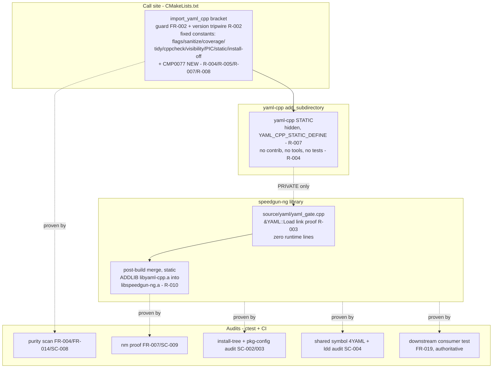
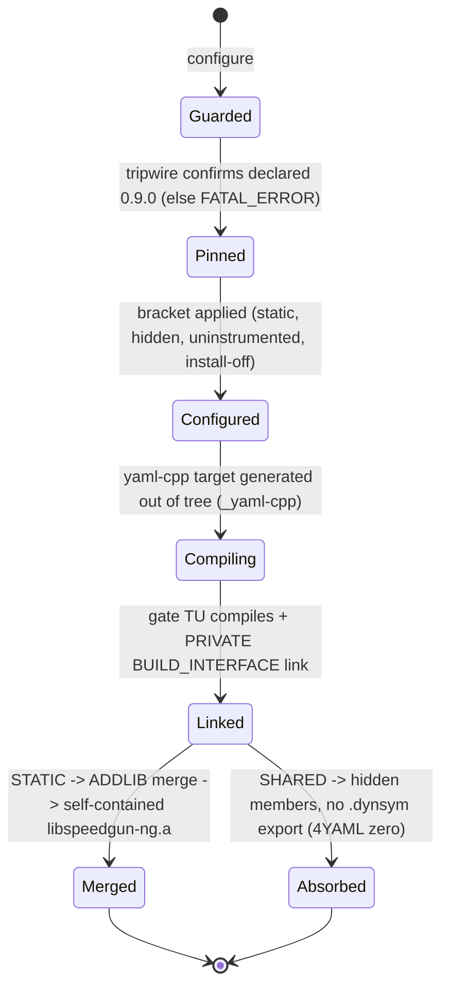
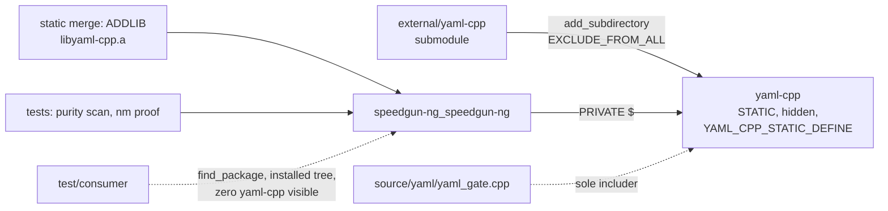

# Implementation Plan: Vendor yaml-cpp as a Private, Pinned Submodule

**Branch**: `006-vendor-yaml-cpp` | **Date**: 2026-09-25 | **Spec**: [spec.md](spec.md)

**Input**: Feature specification from `specs/006-vendor-yaml-cpp/spec.md`

**Artifacts**: [research.md](research.md) · [data-model.md](data-model.md) · [quickstart.md](quickstart.md) · [contracts/build-integration.md](contracts/build-integration.md) · [contracts/privacy-contract.md](contracts/privacy-contract.md)

## Summary

yaml-cpp 0.9.0 (pinned commit `56e3bb550c91fd7005566f19c079cb7a503223cf`, the commit the lightweight tag `yaml-cpp-0.9.0` names directly, re-verified 2026-09-25 via `git ls-remote`; newest upstream release) enters the tree as a git submodule at `external/yaml-cpp` and builds inside the speedgun-ng build as a strictly internal, statically absorbed dependency, the fourth after hwloc, simdjson, and HdrHistogram_c (plus zlib). It is a native CMake library with zero sub-dependencies, so it is consumed through `add_subdirectory(... EXCLUDE_FROM_ALL)` in one scope-isolated bracket, the mechanism specs/004 established, and `ImportAutotoolsSubmodule` stays unused (FR-011; research R-001). No companion submodule, no autotools bootstrap, no new host tool.

Two upstream facts shape the design. First, the version tripwire: the pinned tree exposes no version macro in any header, so the check is a configure-time version-string read of the `project(YAML_CPP VERSION 0.9.0 ...)` line in the submodule's own `CMakeLists.txt`, aborting with a readable diagnostic on any other declared version; revisions that still declare 0.9.0 pass, no git metadata consulted (FR-003; Clarifications 2026-09-25; research R-002). Second, the shared switch: yaml-cpp's `YAML_BUILD_SHARED_LIBS` option defaults to `${BUILD_SHARED_LIBS}`, so a shared-parent build would build it shared by default; the bracket forces `OFF` under a `CMP0077 NEW` default (upstream declares `cmake_minimum_required(VERSION 3.5...3.30)`), and `YAML_CPP_BUILD_CONTRIB`, `YAML_CPP_BUILD_TOOLS`, `YAML_CPP_BUILD_TESTS`, `YAML_CPP_INSTALL`, `YAML_CPP_FORMAT_SOURCE` all switch off (FR-011; research R-004, R-005). Every upstream install rule sits behind `YAML_CPP_INSTALL` (verified line by line), so switching it off suffices: no `install()` override macro of the specs/005 kind is needed, and the `uninstall` and package/pkg-config generation stay out of reach (FR-012; research R-006).

The speedgun-ng library links `yaml-cpp::yaml-cpp` PRIVATE through one wrapper translation unit, `source/yaml/yaml_gate.cpp`: the only TU that includes `<yaml-cpp/yaml.h>`, holding the `&YAML::Load` reference that proves the link at object level (FR-007, FR-014; research R-003). Static builds merge `libyaml-cpp.a` into `libspeedgun-ng.a` through the existing variadic `vendored_archive_merge` call, so the installed static archive is self-contained while its package files name nothing foreign (research R-010). Shared builds absorb the archive at link time with the vendored objects compiled hidden: the static target propagates `YAML_CPP_STATIC_DEFINE` PUBLIC, which resolves `YAML_CPP_API` to nothing on every declaration, so hidden visibility plus static absorption keep every `YAML::` symbol out of the dynamic table (FR-017; research R-007). The privacy contract (FR-014 through FR-019) is proven by audits using the FR-018 pattern `yaml[-_]?cpp`, plus the `4YAML` namespace marker on symbol dumps, and the downstream consumer test on a machine that carries yaml-cpp. Nothing consults a system yaml-cpp, and a configure-time guard rejects an uninitialized submodule with the init command in the message (FR-002, FR-004).

## Technical Context

**Language/Version**: C++23 for the wrapper TU (`CMAKE_CXX_EXTENSIONS=OFF`); yaml-cpp is `LANGUAGES CXX` under its own CMake. Its C++11 fallback (`if (NOT DEFINED CMAKE_CXX_STANDARD)`) never fires: the presets define `CMAKE_CXX_STANDARD: 23` in the cache, so the vendored sources inherit the project's C++23 setting, and the compile outcome is recorded by the CI jobs at implement (spec edge case; research R-008). The wrapper is exempt from nothing; the vendored tree is exempt from our C++ gates by FR-009. CMake >= 3.20 (constitution floor).

**Primary Dependencies**: none added to the library's link surface. No new host build tool: the tree is CMake-native, so the autoconf/automake/libtool/patch set the hwloc import demanded stays hwloc-only. The vendored yaml-cpp is the dependency: static, internal, hidden, invisible, carrying zero runtime dependencies of its own (no companion submodule; spec Assumptions).

**Storage**: N/A. The only data artifacts are the vendored tree and CI audit output.

**Testing**: CTest under `test/` (purity scan, static-archive nm proof) plus CI audits and the downstream consumer test (research R-011). TDD mode recorded in the Test Plan (Principle III).

**Target Platform**: Linux (GCC/Clang; enforced CI gate), macOS (AppleClang; developer-local, `ci-macos` preset stays usable), Windows (unprecluded: yaml-cpp is a portable CMake project with upstream Windows code paths, so nothing here blocks a later build beyond the hwloc autotools suspension recorded in constitution amendment 2.7.0; spec edge case).

**Project Type**: C++ library (the existing single `speedgun-ng` library) plus build-infrastructure deliverables (one wrapper TU, one CMake bracket, audit scripts, CI audit steps, one classifier branch).

**Performance Goals**: none claimed in this feature, and none at risk: yaml-cpp crosses zero API boundaries, and no runtime code path of speedgun-ng calls into it yet (spec Scope boundaries). The wrapper contributes no runtime lines (research R-003, Test Plan).

**Constraints**: zero `yaml[-_]?cpp` references in any installed artifact or exported symbol, and zero exported symbols containing `4YAML` (FR-014 through FR-019); the pinned SHA is the only copy (FR-001/FR-004); the build tree contains no shared yaml-cpp object (FR-011); the submodule worktree pristine after builds (SC-007, R-012); sanitizer policy fixed to excluded, consistent across Linux jobs (FR-010); `CMAKE_INSTALL_PREFIX` receives nothing from the ingestion (FR-012, R-006); no option, preset, or cache variable excludes any of the five vendored dependencies (FR-013a); a shared speedgun-ng resolves no yaml-cpp runtime object (SC-004).

**Scale/Scope**: 1 new submodule (plus one `.gitmodules` record). New files: `source/yaml/yaml_gate.cpp`, `tools/yaml/yaml_purity_scan.sh`, `tools/yaml/yaml_nm_proof.sh`. Modified files: `.gitmodules` (submodule record), `CMakeLists.txt` (the `import_yaml_cpp()` bracket, gate registration, PRIVATE link, merge-call extension), `test/CMakeLists.txt` (two test registrations), `tools/dbc/dependency_scan.sh` (one classifier branch), `.github/workflows/ci.yml` (audit steps on the existing jobs), `README.md` (one re-pinning section). `CMakePresets.json` needs no change (its clang-tidy preset already excludes `external/`); `.codespellrc` needs no change (`*/external` already skipped); `cmake/VendoredArchiveMerge.cmake` needs no change (already variadic). Infrastructure-only.

## Constitution Check

*GATE: Must pass before Phase 0 research. Re-checked after Phase 1 design: still passing.*

| Principle | Status | Notes |
|---|---|---|
| I. Standard-First Coding | PASS | The new C++ TU is C++23, extensions off, no cast of any kind (the link proof is a `constinit` function-pointer reference, research R-003), so no P2 diagnostic-suppression exception is taken. The vendored compile runs under its own CMake flags with the parent's cleared in the bracket scope, the exemption FR-009 orders explicitly (research R-008); tidy/cppcheck neutralized by the bracket. |
| II. Design By Contract | PASS | No new public interface exists to contract: yaml-cpp crosses zero API boundaries and the wrapper defines no public symbol. The version tripwire is a configure-time precondition with a hard-fail diagnostic naming expected and found (FR-002, FR-003; research R-002), consistent with the repo's hard-fail style; the guard and the tripwire abort like fuses, never log-and-continue. |
| III. R-DCUT | PASS | spec to plan to this design with logical and physical views plus test plan; TDD mode recorded in the Test Plan. |
| IV. Documentation | PASS | No public API, so no doxygen surface added. The bracket and the wrapper carry their rationale as adjacent comments (the house pattern), and the README gains the mandated re-pinning section (FR-006). |
| V. Style and Formatting | PASS | `cmake/lint.cmake` formats a whitelist (`source/*.cpp include/*.hpp test/* example/*`); `external/` never enters it. The new files in `source/` and `tools/` are clang-format clean. |
| VI. Test-Backed Code | PASS | Tests ship in the same change: two scripts in CTest, audits in CI, plus the reused downstream consumer project (FR-019). Coverage extraction (`cmake/coverage.cmake`) is a whitelist `external/` never enters, and the bracket blanks `CMAKE_CXX_FLAGS_COVERAGE` so the vendored archive never sees `--coverage` (research R-008). The wrapper TU holds a `constinit` reference and zero runtime lines, so the 100% line/branch gate is met with no executed lines to miss (Test Plan). |
| VII. Performance Discipline | PASS | No critical path is designated or touched; no baseline changes. The feature adds zero runtime work (Constraints). |
| VIII. CI Quality Gates | PASS: extended; no gate weakened | Every existing gate and preset is untouched. The clang-tidy preset already carries `--exclude-header-filter=^${sourceDir}/external/`, so the new vendored tree is exempt with no preset edit (research R-008, R-011); the vendored exemptions are constructed in the bracket scope. New audit steps implement the spec's mandates; none relaxes a verdict. Windows (MSVC): preset-build conformance remains suspended for the hwloc autotools lifetime (amendment 2.7.0); this CMake-native ingestion introduces no new Windows blocker and keeps the port unprecluded. |
| IX. Spec-Driven Development | PASS | This artifact set under `specs/006-vendor-yaml-cpp/`; `tasks.md` follows via `/speckit.tasks`. Touching build configuration is exactly what IX refuses to let bypass the workflow; this plan is that compliance. |
| X. Anti-Slop | PASS | The bracket carries no knob beyond the fixed constants the spec's exemptions require; it exposes no options and serves exactly one call site (X.2). No new module: the merge is the existing variadic call with one more argument (research R-010). The specs/005 `install()` override was considered for yaml-cpp and rejected as dead machinery, since every upstream rule is already guarded (research R-006). No speculative abstraction: there is no reusable "yaml module" invented here, only a scoped bracket. |
| XI. Discourse and Prose | PASS | Generated docs in this directory follow XI; the prose-lint job covers `specs/` markdown over the PR range. |

**Gate-set note (Principle VIII)**: nothing weakens. The FR-009/FR-010 exemptions are spec-mandated and constructed for the CMake child (research R-008), the mirror of what is structural for the hwloc autotools child. This feature introduces no mechanism that touches a built-in command: install suppression rides upstream's own option (research R-006), one simplification relative to specs/005.

## Project Structure

### Documentation (this feature)

```text
specs/006-vendor-yaml-cpp/
├── plan.md                        # This file (/speckit.plan)
├── research.md                    # Phase 0 output (R-001 through R-012)
├── data-model.md                  # Phase 1 output (entities, build-state model)
├── quickstart.md                  # Phase 1 output (validation runs, SC mapping)
├── contracts/
│   ├── build-integration.md       # Phase 1 output (the bracket + link + merge contract)
│   └── privacy-contract.md        # Phase 1 output (surfaces + audit commands, FR-018 pattern + 4YAML)
└── tasks.md                       # Phase 2 output (/speckit.tasks, NOT created here)
```

### Source Code (repository root)

```text
external/yaml-cpp                   # NEW git submodule @ 56e3bb55... (tag yaml-cpp-0.9.0);
                                    #   consumed via add_subdirectory, never built in a copy;
                                    #   exempt from all gates (FR-001, FR-009); MIT LICENSE
                                    #   file stays in-tree and ships with source distributions (FR-005)
.gitmodules                         # MODIFY: add the submodule record (url
                                    #   https://github.com/jbeder/yaml-cpp.git)

CMakeLists.txt                      # MODIFY: after the existing HdrHistogram_c block: import_yaml_cpp()
                                    #   (scoped bracket: CXX flags/sanitize/coverage/tidy/cppcheck
                                    #   blanked, visibility hidden + inlines-hidden, PIC on,
                                    #   CMP0077 NEW, BUILD_SHARED_LIBS OFF, YAML_BUILD_SHARED_LIBS
                                    #   OFF, CONTRIB/TOOLS/TESTS/INSTALL/FORMAT_SOURCE OFF,
                                    #   add_subdirectory EXCLUDE_FROM_ALL with binary dir
                                    #   _yaml-cpp, include promoted to SYSTEM; guard +
                                    #   configure-time version tripwire) (R-002/R-004/R-005/
                                    #   R-006/R-007/R-008/R-009/R-012); register the gate TU; link
                                    #   $<BUILD_INTERFACE:yaml-cpp::yaml-cpp> PRIVATE; extend the
                                    #   vendored_archive_merge call with the yaml-cpp target (R-010).
                                    #   No PUBLIC edge, no find_package(yaml-cpp) (FR-004/FR-007).

source/yaml/
└── yaml_gate.cpp                   # NEW: the sole yaml-cpp header includer: <yaml-cpp/yaml.h>
                                    #   as a SYSTEM include (FR-014, R-009). The version tripwire
                                    #   lives at configure time (R-002); this file carries the
                                    #   [[gnu::used]] constinit reference to &YAML::Load as the
                                    #   object-level link proof (FR-007, SC-009, R-003). Zero
                                    #   runtime lines.

tools/yaml/
├── yaml_purity_scan.sh             # NEW: ctest audit (FR-004, FR-014, SC-008): zero discovery
│                                   #   calls naming yaml[-_]?cpp in build files, zero yaml[-_]?cpp
│                                   #   under include/ (modeled on tools/simdjson).
└── yaml_nm_proof.sh                # NEW: ctest static-archive proof (FR-007, SC-009): nm lists
                                    #   members defining 4YAML symbols with the gate's
                                    #   _ZN4YAML4Load reference resolving in-archive.

test/
├── CMakeLists.txt                  # MODIFY: register the two scripts as CTest tests (same
│                                   #   pattern as the simdjson/hdrhistogram/zlib pairs).
└── consumer/                       # REUSED: the downstream find_package consumer already exists
                                    #   from specs/003; it names no vendored dependency, so it
                                    #   proves the yaml-cpp invisibility unchanged.

tools/dbc/dependency_scan.sh        # MODIFY: classify the yaml-cpp PRIVATE link on the library
                                    #   target as vendored-private, alongside the existing
                                    #   hwloc_vendor/simdjson/hdr_histogram/zlibstatic branches,
                                    #   so dbc_dependency_scan stays green (R-011).

.github/workflows/ci.yml            # MODIFY (R-011): install-tree and package-config audits on the
                                    #   test job; nm -D shared-symbol audits (yaml[-_]?cpp and the
                                    #   4YAML marker) and ldd audit on shared-audit; a system
                                    #   yaml-cpp premise step (vendored tree built out-of-tree into
                                    #   /usr/local, the sys-hdr pattern) and greps over the
                                    #   downstream-consumer logs. Every checkout already carries
                                    #   submodules: true, so the new submodule is fetched unchanged;
                                    #   no new host toolchain.

README.md                           # MODIFY: one re-pinning section (checkout the tag, commit the
                                    #   submodule pointer, bump the version assertion in the
                                    #   import_yaml_cpp bracket of CMakeLists.txt; FR-006), beside
                                    #   the existing four sections; the section notes this
                                    #   tripwire is configure-time, since 0.9.0 exposes no
                                    #   version macro.
```

**Structure Decision**: the existing single-library layout stands. All new code sits in the two sanctioned implementation roots (`source/`, `tools/`) plus a `CMakeLists.txt` bracket; the vendored tree lives at `external/`, the root fixed by the spec assumption (never mixed with `third_party/`), outside `include/`, `source/`, `test/` as FR-001 demands. `include/` gains nothing: yaml-cpp crosses zero public boundaries.

---

## Design: Logical View

*What the feature is and how it behaves. No runtime interface is added; the design objects are build-time components and the contracts between them.*

### Component diagram



### Sequence: a cold build

```mermaid
sequenceDiagram
    participant D as cmake --preset (configure)
    participant Y as import_yaml_cpp
    participant K as build (make/ninja)

    D->>Y: invoke import_yaml_cpp
    Y->>Y: guard: external/yaml-cpp/CMakeLists.txt present? no -> FATAL_ERROR naming init (FR-002)
    Y->>Y: tripwire: file(READ) + regex on the project(YAML_CPP VERSION ...) line;<br/>version != 0.9.0 -> FATAL_ERROR naming expected and found (FR-003, R-002)
    Y->>Y: scope blank CXX flags, sanitize, coverage, tidy, cppcheck;<br/>visibility hidden + inlines hidden; PIC on;<br/>CMP0077 NEW; BUILD_SHARED_LIBS OFF; YAML_BUILD_SHARED_LIBS OFF;<br/>CONTRIB/TOOLS/TESTS/INSTALL/FORMAT_SOURCE OFF (R-004/R-005/R-007/R-008)
    Y->>Y: add_subdirectory(external/yaml-cpp _yaml-cpp EXCLUDE_FROM_ALL)
    Y-->>D: yaml-cpp target (static, hidden, YAML_CPP_STATIC_DEFINE PUBLIC)
    D->>D: SYSTEM include promotion; PRIVATE BUILD_INTERFACE link;<br/>merge call extended with yaml-cpp (R-009/R-010)
    K->>K: compile yaml-cpp (-fvisibility=hidden, no sanitize/coverage, C++23 inherited R-008)
    K->>K: compile gate TU (the &YAML::Load reference emits the archive dependency)
    K->>K: static: ar -M ADDLIB merge libyaml-cpp.a into libspeedgun-ng.a (R-010)
```

Warm builds: CMake's own target dependencies order the vendored compile before the library; a submodule SHA change reconfigures and rebuilds the vendored target. The version tripwire re-reads the submodule file on every configure. No external-project stamp machinery is needed because the vendored code is a first-class target in this build (contrast specs/003 R-006).

### State: build configuration and the privacy invariant



There is no path from any state to a system yaml-cpp: no discovery call exists in the bracket or call site (FR-004, SC-008 grep audit), and the guard at the entry edge refuses an empty submodule with the init command (FR-002).

---

## Design: Physical View

*Where it lives: files, targets, link relationships, and the (empty) public API surface.*

### Files and their duties

| Path | Duty | Requirements |
|---|---|---|
| `external/yaml-cpp` | Vendored sources @ `56e3bb55...`; consumed via add_subdirectory, built in-tree | FR-001, FR-011 |
| `.gitmodules` | Submodule record | FR-001 |
| `CMakeLists.txt` (bracket) | Guard + configure-time tripwire + scoped flag/option reset + `add_subdirectory` + SYSTEM-include promotion + PRIVATE link + merge-call extension | FR-002, FR-003, FR-007, FR-009, FR-010, FR-011, FR-012, FR-013, FR-017, FR-013a, R-002/R-004/R-005/R-006/R-007/R-008/R-009/R-010/R-012 |
| `source/yaml/yaml_gate.cpp` | Sole `<yaml-cpp/yaml.h>` includer (SYSTEM); constinit link-proof reference to `&YAML::Load` | FR-007, FR-014, SC-009, R-003/R-009 |
| `tools/yaml/yaml_purity_scan.sh` | Grep audit: zero discovery calls, zero yaml-cpp under `include/` | FR-004, FR-014, FR-018, SC-008 |
| `tools/yaml/yaml_nm_proof.sh` | Static-archive proof: `4YAML` members present, gate `_ZN4YAML4Load` reference resolves in-archive | FR-007, FR-018, SC-009, R-003/R-011 |
| `test/CMakeLists.txt` | Two `add_test` registrations | FR-009, VI |
| `test/consumer/` | Downstream `find_package` consumer, dependency-blind (reused) | FR-019, SC-005 |
| `tools/dbc/dependency_scan.sh` | Classify the private link vendored-private | FR-004, R-011 |
| `.github/workflows/ci.yml` | Audits on existing jobs; system yaml-cpp premise for the consumer test | FR-008, FR-015 through FR-019, SC-002 through SC-005, SC-008, SC-009 |
| `README.md` | Re-pinning section | FR-006 |

### Build targets and link relationships



Key properties, each traced: the only link edge to `yaml-cpp` is PRIVATE, wrapped in `BUILD_INTERFACE` so the name never enters the exported set (FR-007); the installed export set (`cmake/install-rules.cmake`) sees no dependency, so `speedgun-ngConfig.cmake` and `speedgun-ngTargets.cmake` carry zero references (FR-016); the static archive is self-contained by merge (research R-010); the shared library's dynamic table exports zero yaml-cpp symbols and zero `4YAML` symbols behind hidden-visibility vendored objects whose export macro resolved to nothing (FR-017, SC-004); the wrapper's reference matches the audit pattern, so the presence proof (SC-009) and the export-absence audit (SC-004) read one namespace marker.

### Public API surface added

None. `include/` gains nothing, no new option beyond the internal bracket, no new package file, no exported symbol. This section is empty by design: the feature's contract is invisibility (spec Scope boundaries; FR-014).

---

## Test Plan

*Principle III/VI: tests accompany the component. Verification is binary throughout (X.4).*

### Execution mode: TDD (recorded per Principle III)

TDD applies where a code seam exists: the two `tools/` scripts (seed a violation fixture line, watch the test fail, implement, pass) and the CTest nm-archive test (run against a thin archive first: red; the merge argument lands: green, mirroring the merge's necessity). The bracket is build configuration: its red-green discipline runs at the surface level, quickstart sections 3 (version tripwire), 4 (pristine worktree), 5 (nm proof), 6 (install-tree audit), 9 (forced static under a shared parent), and 11 (uninitialized-submodule guard) written as failing-before/after runs against the pre-change tree, captured per X.4. The configure-time tripwire is the one mechanism whose failure contract (readable diagnostic naming 0.9.0) a run proves directly: quickstart section 3 is its red-until-implemented gate. Prose artifacts take review plus the prose-lint gate, no test pinning their text.

### Coverage strategy

- `external/` stays outside every measurement: coverage extraction whitelist (`cmake/coverage.cmake`), tidy/cppcheck neutralized by the bracket (research R-008), lint globs (`cmake/lint.cmake`), codespell skip (already `*/external`). The bracket additionally blanks `CMAKE_CXX_FLAGS_COVERAGE`, so the vendored archive never sees `--coverage`.
- The wrapper TU contains a `constinit` reference and nothing else (static initialization, no executed code): the file has zero runtime lines, so the 100% line/branch gate holds vacuously and truthfully (verified at implement via the coverage trace listing the file with 0 lines).
- The sanitizer preset is unchanged; the vendored archive is never instrumented (the bracket blanks `CMAKE_CXX_FLAGS_SANITIZE`), and `ci-sanitize` stays green by policy (FR-010).

### Scenario and check mapping

| US / FR / SC | Check (surface) | Pass condition |
|---|---|---|
| US1 / FR-001/FR-008 / SC-001 | Clean clone with submodules; every Linux CI job; macOS developer run | All jobs exit 0; `git submodule status` SHA equals `56e3bb550c91fd7005566f19c079cb7a503223cf` |
| US1 / FR-002 | Empty submodule dir; `cmake --preset` | Configure exits non-zero; message contains `git submodule update --init external/yaml-cpp` |
| US1 / FR-003, SC-006 | `git -C external/yaml-cpp checkout` another release tag; configure | Configure exits non-zero; the diagnostic names the expected version `0.9.0` and the version found, readable in one glance; a revision still declaring 0.9.0 configures clean (Clarifications 2026-09-25) |
| US1 / FR-004, SC-008 | `ctest -R yaml_purity_scan` + CI grep | Zero `find_package(`/`pkg_check_modules(` calls naming `yaml[-_]?cpp` in build files; zero `yaml[-_]?cpp` under `include/` |
| US1 / FR-007, SC-009 | `ctest -R yaml_nm_proof` (static build tree) | `nm libspeedgun-ng.a` lists members defining `4YAML` symbols; the gate member's `_ZN4YAML4Load` `U` reference resolves into them |
| US1 / SC-007 | Full build, then `git status` inside the submodule | Worktree reports unmodified (out-of-source build dir `_yaml-cpp`) |
| US1 / FR-010 | `ci-sanitize` job | Green; the vendored compile carries no `-fsanitize` (bracket), consistent across every Linux job |
| US2 / FR-005 / SC-002 | CI test-job step after install | `find prefix/ -iname '*yaml*cpp*'` empty |
| US2 / FR-016 / SC-003 | CI test-job step | `grep -riE 'yaml[-_]?cpp' prefix/lib/cmake/speedgun-ng/*.cmake` empty |
| US2 / FR-017, SC-004 | `shared-audit`: shared build, installed | `nm -D` greps zero `yaml[-_]?cpp` and zero `4YAML`; `ldd` names no yaml-cpp object |
| US2 / FR-012 | quickstart section 6 (install-tree audit) | `YAML_CPP_INSTALL OFF` leaves nothing in the prefix; no speedgun-ng export set entry |
| US2 / FR-019, SC-005 | `downstream-consumer` job with system yaml-cpp present | Consumer configure/build/run exit 0; its configure log and link command grep zero with the FR-018 pattern |
| US3 / FR-006 | README re-pinning section followed on a scratch clone against a different release tag, assertion bumped | Build green after bump; build red when the tag moves with the assertion untouched |
| Gates / VIII | Existing `lint`, `coverage`, `sanitize`, `test`, `test-rocky`, `consumer-release`, `dbc-gate`, `prose-lint`, `docs` jobs | All stay green with submodules fetched (FR-008); `dbc_dependency_scan` stays green via the classifier edit (research R-011) |

### Determinism and regression

Every check is a command exit code, a grep verdict, or a diff, no judgment calls (X.4). Developer mode off plus `EXCLUDE_FROM_ALL` make the built archive library-only, so runner package drift cannot flip audits. The existing `downstream-consumer`/`consumer-release` behavior is untouched; the new audits are additive. The reused `test/consumer/` carries no vendored reference, so a path leaking into the package files surfaces as its configure failure or an audit grep hit.

## Complexity Tracking

> **No P2 exceptions taken.** The bracket carries only the fixed constants the spec's exemptions require and serves exactly one call site (X.2). No new module: the archive merge is the existing variadic call with one added target (research R-010). The specs/005 `install()` override was considered for yaml-cpp and rejected as dead machinery, since every upstream rule is guarded by `YAML_CPP_INSTALL` (research R-006); the HdrHistogram_c override, positioned earlier in the file, aborts loudly on any rule that would hypothetically escape the guard, defense in depth at zero added cost. `--exclude-libs` was considered and rejected for the reasons specs/005 R-009 records, and the `YAML_CPP_STATIC_DEFINE` propagation closes the export-macro gap that hidden compilation alone leaves open (research R-007).

| Violation | Why Needed | Simpler Alternative Rejected Because |
|---|---|---|
| *(none)* | *(none)* | *(none)* |
