# Implementation Plan: Standalone Counters Library

**Branch**: `007-counters-and-timers` | **Date**: 2026-09-25 | **Spec**: [spec.md](spec.md)

**Input**: Feature specification from `specs/007-counters-and-timers/spec.md`, grounded in the closed design journal [sg_counters.md](sg_counters.md) (A1–A29, resolved scope statement).

**Artifacts**: [research.md](research.md) · [data-model.md](data-model.md) · [quickstart.md](quickstart.md) · [contracts/system-contract.md](contracts/system-contract.md) · [contracts/provider-contract.md](contracts/provider-contract.md) · [contracts/measurement-contract.md](contracts/measurement-contract.md)

## Summary

007 ships the measurement primitives layer: a standalone counters library where the system is a tree of named countable objects, every object owns a catalog of named described counters, counters compose under a compile-time `time^T x events^C` dimension algebra, a recorder's `sample()` appends one column of cumulative `uint64` points on the hot path, and composites fold recorded point columns into metrics later, with ratio disclosure and per-leaf provenance structurally attached ([data-model.md](data-model.md)). One concept covers timers and counters alike: a timer is a counter whose events are clock ticks (A8). The organizing principle is the provider contract (A22): four shipped providers (clock, push, fake, linux_pmu) plus an out-of-tree giraffe example prove that everything below the contract (kernel clocks, hot-path increments, vendored-table PMU reads, scripted test data) is an interchangeable implementation detail, and the core vocabulary carries no platform terms (FR-010).

The engineering spine is the hard construction/read split (A19, FR-021, FR-026): name resolution, dimension checking, group layout, mode probing, arena allocation, and fold-program compilation all happen once in the untimed region; `sample()` is one flat pass over compiled read descriptors (`noexcept`, zero allocation, zero lock), landing in the tens-of-cycles regime where the platform permits (`fast_tsc`, `fast_rdpmc` via the mapped-page protocol) with `syscall` (one group read per PMU leader, vDSO clocks) as the fallback, and `push_load` in-instruction by construction. Folds run whenever the caller asks, over recorded columns only, and a scope (`start`/`finish`/`metric`) is exactly a two-point recorder (FR-030). Overflow is a compile-time policy type (`hard_stop` default with always-enforced bounds; `ring` opt-in, branchless, drop-accounted) chosen through one constexpr-tag factory with CTAD, so call sites carry no templates (FR-025..FR-029).

The linux_pmu provider consumes a new vendored data tree: `external/pmu-events`, a byte-exact path snapshot of the kernel's `tools/perf/pmu-events` x86 tables plus `mapfile.csv`, under a configure-time version gate in the house tripwire pattern, with `tools/pmu_events/update_pmu_events.py` as the first-class upgrade and `--check` utility (FR-043..FR-045, R-012, R-013). Table semantics (JSON event codes, descriptions, units) compose with the running kernel's sysfs `format/` bit layouts; availability is probed per entry, so CI at `perf_event_paranoid=2` stays green on fake, clock, and push alone while hardware entries report `permission_blocked` (FR-039, SC-002). 007 is standalone in the binding sense (FR-049, FR-050): public headers plus std compile, run, and fold a metric; zero benchmarking-framework code appears anywhere in the feature.

## Technical Context

**Language/Version**: C++23 (`CMAKE_CXX_STANDARD=23` in presets, `cxx_std_23` PUBLIC on the target, `CMAKE_CXX_EXTENSIONS=OFF`). CMake >= 3.20.

**Primary Dependencies**: zero new runtime dependencies (constitution Additional Constraints). The vendored simdjson (specs/004, private, statically absorbed) parses the PMU event-table JSON inside `source/counters/linux_pmu/` only. New vendored data (not code): `external/pmu-events` (R-012). hwloc, HdrHistogram_c, yaml-cpp, zlib stay untouched by 007.

**Storage**: N/A at runtime (fixed-capacity point arenas, all construction-time). One committed data tree: `external/pmu-events` plus its `RECORD` provenance manifest.

**Testing**: the repo's frameworkless convention: hand-rolled `check()`/`fail()` executables in `test/source/`, plain `add_test` registration in `test/CMakeLists.txt`; cross-process trap-fixture pairs for abort semantics; `test/compile-fail/` for negative compilation; python gate fixtures for the table tool. No test framework may be added (the dependency-scan test forbids it).

**Target Platform**: Linux (GCC/Clang) is the full feature (PMU provider, fast modes). macOS (AppleClang, developer-local per the constitution deferral) and Windows (MSVC suspension in force per 2.7.0) carry the reduced catalog (clocks, push, fake) behind the identical interface, zero API difference (FR-042).

**Project Type**: C++ library feature: the first substantive public surface of `speedgun-ng` beyond the DBC facility, delivered through the existing single library target (`speedgun-ng_speedgun-ng`, alias `speedgun-ng::speedgun-ng`), plus one vendored data tree, one python tool, examples, and CI wiring.

**Performance Goals**: designated critical paths: `recorder::sample()` (tens-of-cycles regime for a fast-mode plan where the probe passes; `noexcept`, zero allocation, zero lock) and push `add()` (plain non-atomic increment). Budgets published as min/median/max distributions per platform (VII): fast and syscall regimes side by side, clock-only ns distribution stated (SC-004, SC-010, `docs/pages/counters-overhead.md`; the `docs/pages/dbc-overhead.md` precedent).

**Constraints**: read path free of expression tree and name lookup, entered through the direct-call thunk each window installs in its constructor, so the five shipped windows dispatch nothing while a provider window that installs no thunk pays one vtable lookup per sampling action on the seam's documented fallback (FR-022); bounds check `SG_REQUIRE_ALWAYS` under `hard_stop` (memory safety never semantic-gated); per-thread plans/recorders with binding checked in dev/CI; dimensions erased before the buffer; catalog immutable after open; standalone example link manifest names this library alone (FR-049); the committed `flags-gcc-clang` warning set governs every configuration the project builds with no class demoted: `dev` (Debug, contracts `enforce`), `ci-coverage` (`Coverage`, contracts `enforce`), `ci-sanitize` (`Sanitize`, contracts `enforce`), `ci-ubuntu` and `ci-rocky` (Release, contracts `enforce`), the `shared-audit` and `downstream-consumer` trees (`ci-linux-audit`, Release, contracts `enforce`, developer mode off, the first one shared), and both `consumer-release` configurations (Release, contracts `ignore`, developer mode off and on), because an elided contract leaves its operand unreferenced and a strict unused warning turns that into a build failure (T174, T186).

**Scale/Scope**: 9 new public headers (`include/speedgun-ng/counters*.hpp`), `source/counters/` (~8 TUs plus provider-private internals), 4 built-in providers, ~11 new test executables plus compile-fail cases and fixtures, 2 example targets, 1 python tool with fixtures, `external/pmu-events` data tree plus gate bracket, CI step, README re-pinning section, one docs overhead page. Infrastructure: root `CMakeLists.txt`, `test/CMakeLists.txt`, `cmake/lint.cmake` (glob reach into `source/counters/`), `.github/workflows/ci.yml`.

## Constitution Check

*GATE: Must pass before Phase 0 research. Re-checked after Phase 1 design: still passing.*

| Principle | Status | Notes |
|---|---|---|
| I. Standard-First Coding | PASS | C++23, extensions off. P0 invoked (documented, designated in spec FR-026/FR-035 and [contracts/measurement-contract.md](contracts/measurement-contract.md)): `sample()` and push `add()` carry the P0 techniques (register-resident push load, branchless ring mask, dispatch-free flat read loop). Two P2 exceptions anticipated and recorded here for written justification at the site: x86 intrinsics (`__rdtsc`, `_rdpmc`) and the `static_cast` of a `void*` mapping base to the provider-local mirror of the kernel's published perf page, both confined inside provider implementations where the probe plus kernel ABI make them sound (FR-034, FR-040; R-007, R-011). The cast is the standard `void*`-to-object-pointer conversion; the exception is the read of a mapping through a hand-declared struct, which the published ABI and the probe make sound. |
| II. Design By Contract | PASS | Every new public interface carries doxygen `\pre`/`\post`/`\invariant` plus runtime enforcement (dbc-gate covers `include/speedgun-ng/` automatically). Tier mapping per FR-046 (R-002): dimensions and result shape in types; `std::expected<T, error>` for resolution/registration/construction-input failures; `SG_REQUIRE` for misuse sequences, `SG_REQUIRE_ALWAYS` for the `hard_stop` bounds. Contracts state each rule once (header doc pairs one enforcement site). |
| III. R-DCUT | PASS | spec → plan (this artifact set, logical and physical views, test plan) → tasks → code+tests. TDD mode recorded in the Test Plan. |
| IV. Documentation | PASS | Full doxygen on the nine public headers (docs target picks them up); the unit-to-dimension switch, the 2^53 exactness note, the cadence idiom, and the fold-endpoint-cost statement are documented behavior per spec, per Principle IV. The overhead page and README re-pinning section complete the written surface. |
| V. Style and Formatting | PASS | `.clang-format` governs new files; `cmake/lint.cmake`'s glob gains reach into `source/counters/` (verify at implement; the hwloc/simdjson gate subdirs prove the pattern the glob needs to match). Formatting-only changes commit separately. |
| VI. Test-Backed Code | PASS | Tests ship with every component (Test Plan table covers US1–US8, all FR tiers, SC-001..SC-010). 100% line/branch/DBC gates apply to the new `include/`+`source/` code; contract-macro lines stay excluded by the existing `--omit-lines` mechanism; the fake provider makes fold/provenance exactness testable with zero tolerance (SC-006). Measurement correctness (wrap, drop accounting, ratio products, endpoint cost) is the safety property of this feature and carries the fixtures. |
| VII. Performance Discipline | PASS | Critical paths designated and documented (Constraints). The feature ships the measurement artifacts: per-plan overhead calibration (FR-032), probe-gated fast/syscall regime benchmark with distributions published side by side (`docs/pages/counters-overhead.md`, following the `docs/pages/dbc-overhead.md` precedent). The open deferral (baseline infrastructure absent) stays open: this plan delivers baselines as published data; regression-gate wiring lands with the baseline spec. |
| VIII. CI Quality Gates | PASS: extended; no gate weakened | Existing gates untouched; one additive CI step (`update_pmu_events.py --check`, no network, FR-045). Suite green unprivileged at paranoid 2 (SC-002); sanitizer and coverage presets unchanged; `consumer-release` semantics preserved (the always-on bounds check is deliberate, spec-mandated, and release-artifact-verified as an exception to semantic-gating). Windows MSVC: suspension in force (2.7.0), and the reduced-catalog design keeps the port unprecluded; macOS: developer-local evidence per the 2.8.0 deferral. |
| IX. Spec-Driven Development | PASS | This artifact set under `specs/007-counters-and-timers/`; `tasks.md` via `/speckit.tasks` next. Public API work: no bypass possible or attempted. |
| X. Anti-Slop | PASS | The provider abstraction answers to the spec's organizing principle (A22, FR-011/012): four implementations plus an out-of-tree proof exist. No knobs beyond spec-named ones: one factory, two policies, no `recorder_opts` struct until a second knob appears (A27). The scope class is sugar over the recorder (FR-030): one mechanism, two spellings. `MetricExpr` rows ship as dead catalog data for 008 (A14); no string-grammar machinery here. |
| XI. Discourse and Prose | PASS | Generated prose in this directory follows XI; prose-lint covers `specs/` over the PR range. |

**Gate-set note (Principle VIII)**: nothing weakens. The single build-configuration addition is the vendored-data gate bracket (configure-time tripwire, yaml-cpp precedent) and the CI check step. The one deliberate always-on contract code in release (`hard_stop` bounds) is spec-mandated (FR-027) and lands in the dbc facility's `SG_*_ALWAYS` registry, so the release-artifact verification distinguishes it correctly.

## Project Structure

### Documentation (this feature)

```text
specs/007-counters-and-timers/
├── plan.md                        # This file (/speckit.plan)
├── spec.md                        # Feature spec (clarifications session 2026-09-25)
├── sg_counters.md                 # Closed design journal (authoritative record)
├── research.md                    # Phase 0 output (R-001 through R-015)
├── data-model.md                  # Phase 1 output (E-01 through E-11)
├── quickstart.md                  # Phase 1 output (validation runs, SC mapping)
├── contracts/
│   ├── system-contract.md         # Phase 1: system, objects, catalog, resolution
│   ├── provider-contract.md       # Phase 1: provider obligations, point yield, read modes
│   └── measurement-contract.md    # Phase 1: algebra, plan, recorder, folds, scope
└── tasks.md                       # Phase 2 output (/speckit.tasks, NOT created here)
```

### Source Code (repository root)

```text
include/speedgun-ng/
├── counters.hpp                   # NEW umbrella: the documented single include (R-001)
├── counters_core.hpp              # NEW dim<T,C>, unit + closed mapping, availability,
│                                  #   read_mode, catalog_entry, metric_result, error
├── counters_provider.hpp          # NEW provider concept + registration base,
│                                  #   window_reader, point/metadata shapes (FR-011)
├── counters_system.hpp            # NEW system, object, selection, resolution (FR-001..009)
├── counters_measurement.hpp       # NEW counter<D>/expression<D>, compile<plan>,
│                                  #   recorder factory + handle, folds, scope sugar,
│                                  #   push counter handle (inline add(), FR-035)
├── counters_fake.hpp              # NEW fake provider control surface (FR-036)
├── counters_clock.hpp             # NEW clock_provider: monotonic, thread CPU and
│                                  #   process CPU leaves plus the calibrated tsc
│                                  #   leaf (FR-033/034, R-007)
├── counters_push.hpp              # NEW push_provider: thread-confined user
│                                  #   counters sampled by plain load (FR-035, R-008)
└── counters_pmu.hpp               # NEW pmu_provider: the merged hardware event
                                   #   catalog and its probed availability
                                   #   (FR-037..FR-042, R-010)

source/counters/                   # NEW implementation dir (root CMakeLists owns
│   │                              #   every addition via target_sources PRIVATE)
├── system.cpp                     # object tree, registration, resolution, selection,
│   │                              #   did-you-mean diagnostics
├── clock_provider.cpp             # CLOCK_MONOTONIC / _THREAD_CPUTIME_ID /
│   │                              #   _PROCESS_CPUTIME_ID leaves; tsc leaf: sysfs
│   │                              #   tsc_khz + CPUID calibration, scaled flag (R-007)
├── push_provider.cpp              # confinement bookkeeping; counter creation
├── fake_provider.cpp              # scripted deterministic point sequences (R-009)
├── plan.cpp                       # compile(): slots, group layout + target/clock
│   │                              #   validation, mode assignment, arena geometry,
│   │                              #   fold programs, overhead calibration (FR-032)
├── fold.cpp                       # modular deltas, ratio products, drop-aware fold,
│   │                              #   series fold helpers (template entry points inline)
├── detail/                        # NEW provider-private headers (never installed)
└── linux_pmu/                     # NEW Linux-only provider (FR-037..FR-040)
    ├── provider.cpp               # enumerate: vendored tables x sysfs merge, kernel
    │                              #   wins; availability probe (FR-037, FR-039)
    ├── table_parse.cpp            # sole vendored-table JSON reader via private simdjson
    │                              #   (specs/004 seam); lazy, one CPUID-matched dir
    ├── encode.cpp                 # JSON semantic codes composed with sysfs format/
    │                              #   bit layouts; missing field -> not_encodable
    ├── group_io.cpp               # syscall mode: group fds, one read(PERF_FORMAT_GROUP)
    │                              #   per PMU leader per action; enabled/running leaves
    └── fast_read.cpp              # mapped-page protocol (R-011): mmap page access
                                   #   (P2: reinterpret_cast at the ABI boundary,
                                   #   justification written at site), seqcount retry,
                                   #   cap/index gates, offset, 48-bit mask, attribution

external/pmu-events/               # NEW vendored data tree: byte-exact path snapshot of
│   │                              #   kernel tools/perf/pmu-events x86 dirs + mapfile.csv
│   └── RECORD                     # NEW provenance: ref, date, URL, per-file sha256,
                                   #   exclusions (FR-044); verified by --check

CMakeLists.txt                     # MODIFY: target_sources for source/counters/**;
                                   #   pmu-events configure-time gate bracket (gate
                                   #   constant vs RECORD; yaml-cpp precedent, R-012)

tools/pmu_events/
└── update_pmu_events.py           # NEW: --to <ref> fetch/strip/validate/replace/
                                   #   RECORD/gate-bump/digest; --check drift exit 1
                                   #   (FR-044/045, R-013)

example/
├── counters_standalone_example.cpp # NEW: public headers + std only; composes and
│                                   #   folds a metric over clock+fake (SC-001)
└── counters_giraffe_example.cpp    # NEW: out-of-tree provider ~100 lines (US5, SC-003)

test/source/                       # NEW executables (frameworkless check/fail):
├── counters_core_test.cpp          # dims, unit switch, error shape
├── counters_fake_test.cpp          # US1 spine: resolution, folds exact, provenance,
│                                   #   repeated .metric() with frozen reads (SC-006/008)
├── counters_recorder_test.cpp      # capacity/ring/wrap/drop/fold_pairs/range tiers
├── counters_objects_test.cpp       # US3: tree, alias, selection, fan-out, duplicates
├── counters_clock_push_test.cpp    # US4: tolerance bands, exact push totals, modes
├── counters_provider_ext_test.cpp  # US5 in-suite conformance: mini provider, no
│                                   #   internals (FR-012)
├── counters_pmu_test.cpp           # US6: paranoid-2 permission_blocked vs
│                                   #   countable; merge + encodability states
├── counters_trap_fixture.cpp       # NEW aborting fixture (registered indirectly)
├── counters_trap_checked_test.cpp  # NEW tier-3 traps incl. hard_stop overrun in a
│                                   #   release-configured checker (FR-027)
├── counters_noalloc_test.cpp       # SC-005: counting operator new/delete around
│                                   #   sample()
└── counters_overhead.cpp           # SC-004/SC-010 benchmark; probe-gated sections,
                                    #   CTest SKIP_RETURN_CODE, distributions printed

test/compile-fail/                 # MODIFY: dimension-violation cases (bytes+monotonic,
                                   #   mismatched tags) into the existing harness
test/pmu-events-gate-fixture/      # NEW synthetic table trees: check pass + drift fail
test/CMakeLists.txt                # MODIFY: register every executable above + the
                                   #   fixture scripts (plain add_test convention)
cmake/lint.cmake                   # MODIFY (verify): format glob reaches source/counters/
.github/workflows/ci.yml           # MODIFY: pmu-events --check step (no network); the
                                   #   counters tests ride every existing test job
docs/pages/counters-overhead.md    # NEW: published distributions (lands with measurements)
README.md                          # MODIFY: pmu-events re-pinning section beside the
                                   #   existing vendored-dep sections
```

**Structure Decision**: the existing single-library layout stands unchanged. Public surface is flat `include/speedgun-ng/counters*.hpp` per house convention (R-001); implementation lives in `source/counters/` attached through the root CMakeLists `target_sources` pattern the vendored gate dirs already establish; the vendored input is data under `external/` (outside the compiled-tree conventions, gated at configure time); the tool follows `tools/prose/` precedent; examples join `example/` under `add_example()`; tests follow the flat `test/source/*_test.cpp` plus trap-pair plus compile-fail conventions exactly. The umbrella `speedgun-ng.hpp` stays untouched: 007 advertises `counters.hpp` as the standalone entry point (FR-049).

---

## Design: Logical View

*What the feature is and how it behaves: one ontology (points, deltas, folds), one seam (providers), two phases (compile, sample; fold later).*

### Class diagram (public surface)

```mermaid
classDiagram
  direction LR
  class provider_iface { <<registration base>>
    +enumerate(object_sink&) const
    +open(leaf_set, target) window_reader }
  class window_reader {
    +read_points(point_sink&) noexcept }
  class system {
    +local() system&
    +register_provider(p) expected~void,error~
    +object(path) expected~object&,error~
    +objects(kind, filters) object_range }
  class object {
    +path() string_view canonical
    +alias() optional~string_view~
    +kind() string_view
    +counters() counter_catalog
    +counter(name) expected~resolved_leaf,error~ }
  class catalog_entry {
    +name, description
    +unit to dim
    +availability
    +read_mode achieved }
  class "counter~D~" as counter { <<resolved leaf>> }
  class "expression~D~" as expression {
    +operator+ - / scalar
    +fold(rec,i,j) metric_result
    +fold_pairs(rec) series
    +raw(obj,leaf) points_view }
  class plan {
    +recorder(cap) handle~hard_stop~
    +recorder(cap, ring) handle~ring~
    +overhead min/median/max }
  class "recorder_handle~P~" as recorder {
    +sample() noexcept }
  class metric_result {
    +value, running_ratio, scaled }
  class scope {
    +start() +finish() +metric(expr) }
  system "1" *-- "*" object : tree
  object "1" *-- "*" catalog_entry
  catalog_entry ..> counter : resolution
  expression o-- counter : leaves
  plan ..> expression : fold programs
  recorder --> plan : arena buffer
  scope ..> recorder : two-point sugar
  expression ..> recorder : fold
  provider_iface <|.. clock_provider
  provider_iface <|.. push_provider
  provider_iface <|.. fake_provider
  provider_iface <|.. linux_pmu_provider
  provider_iface ..> window_reader : open
```

### Sequence: one measurement window (syscall-mode PMU + push + clock)

```mermaid
sequenceDiagram
    participant U as user code (thread T)
    participant R as recorder_handle
    participant RD as compiled read descriptors
    participant G as PMU group leader (one per PMU)
    participant C as vDSO clock / push cell

    Note over U,G: setup region: compile(), recorder(cap), binding to T
    U->>R: sample()
    R->>RD: flat loop, thunk call, no lookup
    RD->>G: read(PERF_FORMAT_GROUP): all member points + enabled + running
    RD->>C: clock_gettime points; plain load of push cell
    Note over RD: one column appended: FR-047 invariant holds
    U->>U: work
    U->>R: sample()
    U->>U: later, any number of times, off the measurement path:
    U->>U: expr.fold(rec, 0, 1) -> value + ratio product + scaled flag
    U->>U: expr.raw("package-1/core-3","instructions") -> provenance
```

### State: recorder lifecycle (per policy)

```mermaid
stateDiagram-v2
    [*] --> empty : factory allocates columns (untimed region)
    empty --> filling : sample()
    filling --> full : head reaches capacity
    full --> ABORT : hard_stop sample past capacity (SG_REQUIRE_ALWAYS, every config)
    full --> wrapped : ring sample (idx &= cap-1; dropped++)
    wrapped --> wrapped : further samples, branchless
    note right of wrapped : folds over wrapped consult dropped (FR-028)
```



The system's own transition closes provider registration at open and freezes the catalog (FR-009); plan binding to a thread or cpu happens at open and never moves (FR-031). Scope misuse sequences (`metric` before `finish`, double `start`, use-after-finish) are terminal contract violations in dev/CI (FR-046), the A6 tier assignment applied to the two-point-recorder sugar.

### Cross-cutting correctness promises

1. One window, one truth: per-column `SG_INVARIANT` that all leaf values came from one sampling action under one binding (FR-047); cross-metric agreement is structural (spec promise 1).
2. No number without provenance: `metric_result` fields cannot be omitted; composites expose raw columns with full E-10 records (FR-019, FR-020; spec promise 2).
3. Availability under privilege pressure: availability probing at paranoid 2 reports `permission_blocked` and the suite stays green (FR-039, SC-002).

---

## Design: Physical View

*Where it lives: files, targets, link relationships, and the public API surface added.*

### Files and their duties

| Path | Duty | Requirements |
|---|---|---|
| `include/speedgun-ng/counters*.hpp` (9 files) | Entire public surface; doxygen contracts; inline hot-path pieces (push `add()`, `sample()` core loop) | FR-001..FR-035, FR-046..FR-050; R-001 |
| `source/counters/{system,plan,fold}.cpp` | Tree/resolution, plan compile + arena + calibration, fold kernels | FR-008, FR-018..FR-024, FR-032 |
| `source/counters/{clock,push,fake}_provider.cpp` | Three built-in providers | FR-033..FR-036; R-007..R-009 |
| `source/counters/linux_pmu/` (5 TUs) | The rich Linux backend: table merge, encode, probe, group I/O, fast read | FR-037..FR-041; R-010, R-011 |
| `external/pmu-events/` + `RECORD` | Vendored event-table data + provenance | FR-037, FR-038, FR-043, FR-044; R-012 |
| `CMakeLists.txt` | target_sources; configure-time data gate bracket | FR-043; R-012 |
| `tools/pmu_events/update_pmu_events.py` | Upgrade + `--check` | FR-044, FR-045; R-013 |
| `example/counters_{standalone,giraffe}_example.cpp` | SC-001 standalone proof in the FR-050 fixed-iteration loop shape; SC-003 provider extensibility proof | FR-012, FR-049, FR-050 |
| `test/source/counters_*.cpp`, `test/compile-fail/`, `test/pmu-events-gate-fixture/` | Full test plan coverage (next section) | SC-001..SC-010 |
| `.github/workflows/ci.yml`, `README.md`, `docs/pages/counters-overhead.md`, `cmake/lint.cmake` | Gate wiring, re-pinning doc, published budgets, format reach | FR-045, FR-032; VII, V |

### Build targets and link relationships

```mermaid
graph LR
    L[speedgun-ng_speedgun-ng] -- target_sources PRIVATE --> C[source/counters/**]
    C -- PRIVATE BUILD_INTERFACE --> SJD[simdjson::simdjson<br/>(linux_pmu table parse only,<br/>specs/004 privacy preserved)]
    PD[external/pmu-events data] -- configure-time gate --> L
    X1[example: standalone] -- PUBLIC include + link<br/>speedgun-ng::speedgun-ng --> L
    X2[example: giraffe] -- public headers only --> L
    T[tests: counters_*] -- speedgun-ng::speedgun-ng --> L
```

Key properties, each traced: the public link surface stays `speedgun-ng::speedgun-ng` alone (FR-049; the standalone example's manifest is the evidence); simdjson remains private to `source/counters/linux_pmu/table_parse.cpp`, preserving the 004 privacy audits unchanged; the vendored tree is data (no target, no link edge), gated at configure; `counters.hpp` does not enter `speedgun-ng.hpp`, keeping 007's standalone claim visible in the include graph; export uses the existing `generate_export_header` machinery (`SPEEDGUN_NG_EXPORT` on non-template public classes).

### Public API surface added

Namespace `sg::counters`: `system`, `object`, `catalog_entry`, `unit`, `availability`, `read_mode`, `error`, `dim<T,C>`, `counter<D>`, `expression<D>`, `metric_result`, `plan`, `recorder` factory + `recorder_handle<P>`, `hard_stop`/`ring` tags, `scope`, `push counter` handle, `fake_provider`, `clock_provider`, `push_provider`, `pmu_provider`, `provider_iface` + `provider` concept, `compile()`. This is the entire contract surface of the feature ([contracts/](contracts/)); nothing else becomes public. The nine public headers carry it: `counters.hpp` (umbrella), `counters_core.hpp`, `counters_provider.hpp`, `counters_system.hpp`, `counters_measurement.hpp`, `counters_fake.hpp`, `counters_clock.hpp`, `counters_push.hpp`, `counters_pmu.hpp`.

---

## Test Plan

*Principle III/VI: tests accompany the component. Verification is binary throughout (X.4). Quickstart sections 1–13 are the runnable form.*

### Execution mode: TDD (recorded per Principle III)

TDD applies at every seam that a test can fail first: dimension compile-fail cases (written against the pre-implementation headers: red), fake-provider fold exactness fixtures including the crafted `2^64` wrap and drop accounting (hand-computed expected values committed with the tests, red before the fold kernels), recorder policy traps (red before the arena), and the giraffe/mini-provider conformance tests (red before the provider base stabilizes). The table-tool fixtures (`--check` pass/drift) precede the tool. Probe-gated benchmark sections arrive with their skip paths (skip-before-measure, measure-where-capable).

### Coverage strategy

- All new public code sits inside the coverage extraction globs (`include/speedgun-ng/*`, `source/*`); the 100% line/branch/DBC gates apply unchanged. `source/counters/detail/` internals are extracted and measured like any source file.
- Contract-macro lines drop via the existing `--omit-lines` filter; the `SG_REQUIRE_ALWAYS` bounds site is exercised by the release-configured trap checker (its abort branch covered by the out-of-process fixture pair).
- Linux-only provider code compiles (and is measured) on Linux CI; on other platforms it is excluded from the build, so the reduced-catalog path carries the macOS/Windows developer evidence.
- Fast-mode hardware reads are probe-gated: hosts failing the probe skip with the reason named (CTest `SKIP_RETURN_CODE`), the skip reports, and the suite stays green everywhere (SC-002).
- The fast read is the product. FR-040's tens-of-cycles regime is the reason the library exists, and SC-004 is its acceptance criterion. The fast path therefore has its own subsection below and its own open tasks, and no host may report SC-004 as met on syscall-mode evidence.
- Coverage of probe-gated and privileged code: the mapped-page protocol logic (capability gate, one-based index gate, seqlock comparison, offset, width mask) and the fold ratio arithmetic are implemented as pure functions over injected page values, so CI covers them with synthetic-page fixtures without privileges. The kernel glue (`perf_event_open`, `mmap`, the `rdpmc` instruction) runs for real on any host that lets a caller open a per-process user event, which includes the CI matrix, so the fast window, the fast branch of the open, and the catalog's `fast_rdpmc` disclosure are all measured rather than excluded. T137..T140 withdrew the blanket kernel-gate exclusion this row used to carry: the probe had been reading a scalar sysfs attribute as a perf page, so the path never executed. The markers that survive name a kernel gate, a cited-callers-guaranteed invariant, or a compiler-emitted block, and each states which at its own site (VI, VIII: the exception is recorded, nothing weakens).
- The frameworkless convention holds: the dependency-scan test keeps zero external test deps.

### The fast read path

FR-040 and SC-004 are the point of the library: a sampling action that
costs tens of cycles is what separates this from a syscall-mode counter
wrapper, and every other story in this spec is a consumer of the leaves
the fast path provides. The path is therefore held to a stricter
standard than the rest, in three respects.

First, the protocol is the kernel's, taken from
`/usr/include/linux/perf_event.h` and nothing else. A caller opens one
`perf_event_attr` per leaf with `exclude_kernel` and `exclude_hv` set,
maps exactly one page, and reads the seqlock loop the header documents:
`lock` for the sequence, `index` and `offset` for the counter, the
`cap_user_rdpmc` bit of `capabilities` for the permission, and
`pmc_width` for the value width. The instruction issued is
`rdpmc(index - 1)` and the value is `(raw + offset)` masked to
`pmc_width`. No sysfs attribute takes part in the read.

Second, the width comes from `pmc_width` and never from a constant. A
hardcoded mask encodes one host's counter width and silently truncates on
any host that differs.

Third, the path is measured. A host that reports
`cap_user_rdpmc` set and a non-zero `index` is fast-capable by the
kernel's own account, and the suite measures the fast regime there
rather than skipping. A skip is correct only when the kernel refuses, and
the refusal must be the reason printed.

This subsection exists because the path was shipped unexercised, and
the reason was a defect in the probe, and no hardware limit was involved. The probe obtained
the `cap_user_rdpmc` capability by `mmap`ing
`/sys/bus/event_source/devices/cpu/rdpmc` and reading the mapping as a
perf user-access page. That attribute is a scalar sysfs file; its
content on this host is the single character `1`. A mapping of it can
never hold a perf page, and the probe guarded the attempt with a demand
that the file's value fall in `12..21`, treating it as a page-size
shift. The gate therefore refused, and the library reported no fast
mechanism on a host where the fast mechanism works.

A standalone probe following the header's protocol on that same host
opened the event with `perf_event_open`, mapped one page of the returned
file descriptor, and read `capabilities` with `cap_user_rdpmc` set,
`pmc_width` 48, `index` 1, and `offset` 140737488355327, then took a real
`rdpmc` reading. The kernel grants the path. The probe, not the kernel,
was the obstacle, and the runtime reader inherited the same wrong page:
`fast_context_read` reads its capability bit from the same bogus mapping,
so the defect would have survived a relaxed band check as well.

Two consequences follow for the design. The capability bit and the value
width come from the event's own mapping, so the `user_access_page` mirror
and the sysfs attribute both leave the file, and the kernel's own
`<linux/perf_event.h>` supplies the page type, which retires the
hand-mirrored struct and the version-matching arithmetic that justified
it. The width mask comes from `pmc_width`, so a host whose counter width
differs from this one's is measured correctly.

Landed 2026-09-27 as T131..T141, with two findings this section did not
predict. First, the fast path ignored the plan's target: `open_fast_window`
discarded it, so a cpu-pinned plan would have counted the calling thread
instead. The fix binds the event through the same `leader_pid` the group
path uses, so both read modes bind alike (FR-024, FR-031). Second, a
mapped-page read takes the enabled/running pair from the event page, and
the kernel rewrites that page when it schedules the event, so a window
containing no syscall and no context switch can read the same page value
twice. The staleness stays disclosed, which is what FR-041 and T055
already required of the fast mode.

The measurement the fix unblocked is T133, and its result is the opposite
of what the section above expects. The mapped-page read does not beat a
vDSO clock read on this host: `docs/pages/counters-overhead.md` publishes
both, and the fast-mode median sits above the syscall-mode one. The
comparison is not between two readings of the same counter, because the
only syscall-mode counterpart this host can offer is a clock leaf, and a
`clock_gettime` through the vDSO is the cheapest read available anywhere
in the library. The kernel-granted fraction that does matter is published
beside it: with 64 events open against this PMU's counters the kernel ran
them about a tenth of the enabled time, and the fold discloses that
shortfall (T134).

### Scenario and check mapping

| US / FR / SC | Check (test / quickstart §) | Pass condition |
|---|---|---|
| US1 / FR-005/008/015-021 / SC-006, SC-008 | `counters_core_test`, `counters_fake_test`, `counters_compile_fail` (§3, §4) | Resolution carries name/desc/unit/avail; near-miss diagnostics; `a/b` tag arithmetic; `bytes+monotonic` fails compile; folds equal hand-computed quotients incl. ratio fields; ten `.metric()` calls identical with provider reads frozen; unknown unit names the unit; raw view complete |
| US2 / FR-013/018/025-029 / SC-006, SC-010 | `counters_recorder_test`, traps (§3, §5) | Construction allocates all columns; hard_stop overrun aborts incl. release config; ring mask, wrapped+dropped recorded, non-power-of-two fails construction recoverably; crafted wrap delta exact; `fold_pairs` per-interval series; bad ranges trap (the push-decrement trap lands with US4) |
| US3 / FR-001-004, FR-008 / SC-007 | `counters_objects_test` (§9) | Enumeration fields complete; alias and canonical resolve to one object; selection exact; cross-object fold from one action; fan-out IPC reconciles per core against shared total; duplicate path/name recoverable |
| US4 / FR-033-035 / SC-002 | `counters_clock_push_test` (§7) | Three clocks positive, mutual tolerance on CPU-bound work; `add(1000)` folds exactly 1000 with plain non-atomic ops; fold-time push decrement traps (US4 scenario 6); `bytes/monotonic` rate + disclosure; catalog lists modes; tsc provenance/scaled flag on calibrated hosts |
| US5 / FR-012, FR-049 / SC-001, SC-003 | giraffe example + `counters_provider_ext_test` (§2, §6) | Out-of-tree provider registers through public headers; `honks/monotonic` folds from one action; example exit 0; link manifest this library alone; core tree unmodified |
| US6 / FR-037-042 / SC-002 | `counters_pmu_test` (§10) | Merge with kernel-wins conflicts; every entry described; unencodable marked; paranoid 2: hardware `permission_blocked`, clocks/push `countable`, suite green; privileged-host evidence (developer): group read delivers members + enabled/running; multiplexed ratio < 1 with scaled flag |
| US7 / FR-023/026/031/040 / SC-004 | `counters_overhead` (§12) | Achieved modes disclosed per entry; fast-mode read follows the full protocol sequence; fast plan tens-of-cycles vs syscall microseconds published side by side, distributions min/median/max; skip names the failing probe |
| US8 / FR-043-045 / SC-009 | `pmu_events_check` fixtures + CI step (§11) | Clean tree exit 0; drifted hash names file exit 1; gate/RECORD disagreement exit 1; fixtures both directions green; drifted fixture red; check performs zero network calls |
| Contracts / FR-010 | header purity scan (ctest): platform terms absent from `include/speedgun-ng/counters*` | exit 0; violations named |
| Threading / FR-031, FR-035, FR-047 | trap pair: cross-thread plan/recorder/push use | aborts in dev/CI build; release carries no check (semantic-gated) |
| FR-025/FR-027 memory safety | `counters_trap_checked` release-configured checker | overrun aborts with contracts at `ignore` semantics |
| Gates / VIII | full matrix: dev, ci-sanitize, coverage, dbc-gate, prose-lint, consumer-release | all green; dbc-gate pairs every new interface; prose-lint clean; consumer-release carries only the mandated always-on site |

### Determinism and regression

Every assertion is a value equality, a command exit, a grep verdict, or an exit-code-gated skip (X.4). The fake provider removes all timing from the correctness spine: no sleeps, no tolerance bands outside the documented clock-vs-clock comparison (tolerance bands come from calibration data; no fixed wall constants). Sanitizer runs exercise group-fd lifetimes and the arena under ASan/UBSan. The pmu-events check makes vendored drift a red build without network. Published budgets land in the docs page per platform; regression wiring awaits the baseline-infrastructure spec (recorded deferral, no weakening).

## Complexity Tracking

> **No gate weakened; two P2 exceptions registered, one further exception anticipated** (written justification lands at each site per X.2, previewed here and in R-007/R-011). The provider abstraction, the two-tier phase model, and the policy types are all spec-mandated structures with multiple live implementations, with the spec-mandated justification.

| Violation | Why Needed | Simpler Alternative Rejected Because |
|---|---|---|
| P2: x86 intrinsics (`__rdtsc`, `_rdpmc`) and the `static_cast` of a `void*` mapping base to the kernel's own `perf_event_mmap_page` from `<linux/perf_event.h>`, inside provider implementations only (`source/counters/linux_pmu/fast_read.cpp`) | FR-034, FR-040 mandate the exact hardware mechanisms, and the read protocol is the kernel's own: the caller maps one page of a `perf_event_open` descriptor and reads `lock`, `index`, `offset`, the `cap_user_rdpmc` bit of `capabilities`, and `pmc_width` from that mapping. T137 replaced two hand-mirrored page structs with that kernel type, so the P2 substance is narrowed to reading a published UAPI structure in place; the cast itself is a standard conversion and carries no exception. The probe establishes soundness before any read, by opening the event and asking the mapping (R-007, R-011) | Any portable abstraction over these reads either forfeits the tens-of-cycles budget (defeating SC-004) or invents a second mechanism the kernel does not provide. A `reinterpret_cast` spelling of the same conversion buys nothing here and would be the only such cast in `source/` and `include/` |
| P2 coverage exclusion, settled by T066 (2026-09-27). An audit of the first pass over this scope found 382 `LCOV_EXCL_*` tokens and cleared 91 of them: seven pure functions carried a stated reason that was false, `parse_attr` claiming a test cannot hand it text without an `=` when its only parameter is a `std::string`, and `table_description` claiming no test-controlled input reaches it when the same change had added the `pmu_parse_table_file` seam that reaches it. Those functions are now exported from `source/counters/linux_pmu/provider.cpp` and `table_parse.cpp` into `sg::counters::detail` and covered by value-equality assertions in `counters_linux_pmu_seam_test`; the audit also found and fixed two real defects the markers had hidden, a `to_ecma` slice that captured `:xdigit:` instead of `xdigit` and so never translated a POSIX class, and a `parse_scalar` integer arm whose tail was unreachable. A const `find` overload with no callers was deleted rather than excluded. What remains is 296 tokens in three categories, each stated at its own site: (1) kernel and privilege gates, the fast-mode window and the kernel-capped group-read arms in `group_io.cpp`, the sysfs and `/proc/sys` catalog refusals in `provider.cpp`, and the `tsc_khz` calibration in `clock_provider.cpp`. The mapped-page glue in `fast_read.cpp` was filed here as kernel-gated and that reason is WITHDRAWN and the markers are gone, settled by T131..T140 (2026-09-27): T132 measured the kernel granting the path on this host, and the code never reached it because the probe `mmap`ed a scalar sysfs attribute and read the mapping as a perf page. T137..T139 replaced the mirrored pages with the kernel's own type, dropped the sysfs read and the `12..21` shift band, and took the capability and the width from the event's own mapping, after which the fast path executes for real under `ctest` on any host that lets a caller open a per-process user event. What remains in these three files is four narrow sites, each stating a kernel gate or a compiler-emitted block at its own site: the probe's open-refused arm and the descriptor-that-cannot-map arm in `fast_read.cpp`, the seqlock-moved arms in `fast_read.cpp` and `group_io.cpp`, the switch's implicit no-case arcs, the multi-word-encoding refusal, and the catalog's `syscall`-mode and unreadable-sysctl arms in `provider.cpp`. The token count moved from 296 to 304, and every added token names a narrower reason than the blanket region it replaced | (2) invariants a cited caller guarantees, in `plan.cpp`, `fold.cpp`, and `counters_system.hpp`; (3) blocks gcc emits with no source construct, the function epilogues of by-value returns and the short-circuit edges of multi-term conditions, which `geninfo_unexecuted_blocks=1` in `cmake/coverage.cmake` counts. That flag is unchanged, so no threshold moved. The gate reports 100% line and 100% branch on the coverage preset | A portable abstraction over the hardware reads forfeits the tens-of-cycles budget SC-004 sets, and an injection seam for the kernel's own pages and sysfs trees would be a second mechanism the kernel does not provide. Excluding the category-1 sites with a fixture would mean reimplementing the kernel, and the category-3 blocks are compiler output rather than source. The exclusion now rests on measurement instead of assertion: every function a fixture can reach is measured, and the reachability claims that failed the audit are gone rather than reworded | The prior two-region scope left an 83.7% line and 72.4% branch shortfall open, and the first attempt to close it bought 100% with false claims. Clearing 91 tokens and fixing the two defects they concealed left the same gate green on a defensible set, which is the whole point of recording it |
| P2 anticipated: none beyond the above; if the toolchain check (R-002) finds `std::expected` unavailable, a minimal in-house expected in a detail header joins the registry with that justification | Tier-2 errors must carry typed suggestion lists (FR-008) | Error codes alone cannot carry diagnostics; exceptions have no place in this repo's release semantics |

## Vendored data provenance (T001, T002, implement-time records)

**Toolchain check (T001, R-002)**: `std::expected` compiles under
`-std=c++23` on the dev-preset toolchains of the implementation host
(GCC 16.2.1, Clang 22.1.8). The in-house expected fallback in a detail
header is not needed and not created; the registry gains no entry.

**Licensing confirmation (T002, R-012)**: the kernel
`tools/perf/pmu-events` table data is dual-licensed MIT /
GPL-2.0-or-later. The MIT option permits redistribution inside a
BSD-3 project verbatim, with the condition being preservation of the
copyright and license notices. Verdict: compatible. The vendored tree
carries the upstream notices verbatim beside the data, the `RECORD`
manifest names the license per file, and `update_pmu_events.py --check`
verifies the tree byte-exactly. The R-012 fallback (sysfs-discovered
catalog only) stays inactive; T044, T045, and T057..T061 proceed
unadjusted.

**Source-ref policy DCR (owner directive 2026-09-26)**: the default
source for the vendored tree and for `update_pmu_events.py` is the
running kernel. The tool resolves the upstream
tag from `uname -r` with distro and localversion suffixes stripped (for
example `7.2.4-1-cachyos` resolves to tag `linux-7.2.4`), fetches
that tag from kernel.org cgit (GitHub mirror as the documented
fallback), and records the exact ref in `RECORD`. A `--to <ref>` option
overrides the running-kernel resolution and pins a specific kernel.
The configure-time gate bracket, `--check`, and the CMake gate constant
all verify against the recorded ref, exactly as R-012 specifies; only
the default-ref resolution changes. R-013 and T059 read this section as
their governing amendment.
