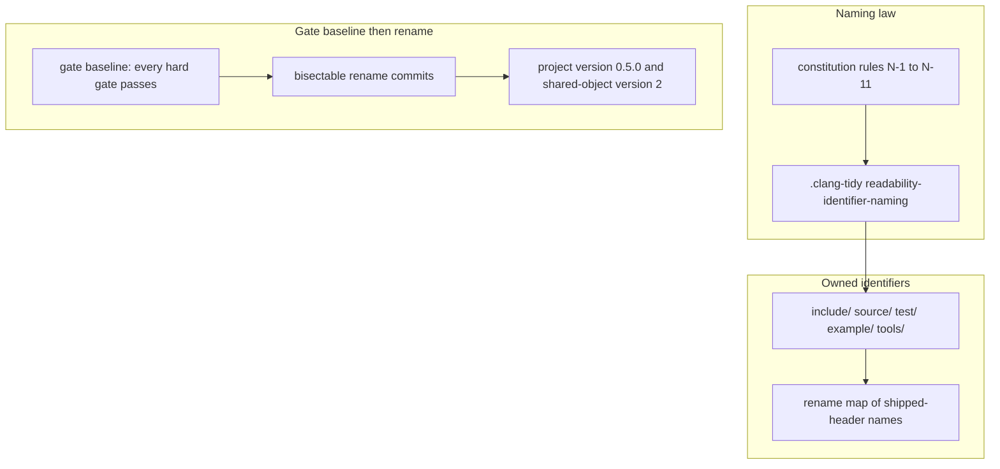

# Implementation Plan: Identifier Naming CamelCase

**Branch**: `014-identifier-naming-camelcase` | **Date**: 2026-10-07 | **Spec**: [spec.md](spec.md)

**Input**: Feature specification from `specs/014-identifier-naming-camelcase/spec.md`

## Summary

The project adopts one naming law before the benchmark harness adds a public surface. Types use PascalCase. Functions, methods, variables, and parameters use lowerCamelCase. Enumerators and macros use `UPPER_SNAKE_CASE`. Named constants use `kPascalCase`. Namespaces, file names, CMake targets, presets, and the package name stay as they are. The constitution holds the rules, the constant spelling, and the exception list. `.clang-tidy` implements that text. The rename is one breaking change on the 0.x line: project version 0.5.0, shared-object version 2, `SameMinorVersion` kept. No deprecated alias is added. Counter readings, catalog names, messages, and machine code stay the same after symbol names are normalized.

The audit point `6d32efcab3c13c3d41470c1c621d78839ce11543` has no passing gate record. Continuous Integration run 37553123469 failed the format check on 21 files. The gate baseline is a later default-branch commit where every hard gate passes and the rename has not started. The format repair is tasks.md T001. It lands before the first rename commit.

### Gate baseline

The green head is `5b9ed47631742f4f6b6b0174371e5155a287cef7`. It is not `6d32efcab3c13c3d41470c1c621d78839ce11543` and it is not `6aafd2dc8a1310ee335820ad8dc4dedd0eb0ae17`. [Run 37617561034](https://github.com/charlesarcher/speedgun-ng/actions/runs/37617561034) concluded success. Every job succeeded: lint, shared-audit, sanitize, tsan, coverage, test-rocky, downstream-consumer, consumer-release, dbc-gate, test, prose-lint, and docs.

The test job passed these tests: simdjson_nm_proof, hdrhistogram_purity_scan, hdrhistogram_nm_proof, zlib_purity_scan, zlib_nm_proof, yaml_purity_scan, yaml_nm_proof, quill_dependency_check, quill_purity_scan, dbc_asm_smoke, counters_tsc_read_shape, simulation_mark_shape, dbc_gate_fixtures, prose_gate_fixtures, counters_tsc_test, counters_core_test, counters_fake_test, counters_compile_fail, counters_header_purity, counters_push_atomic_scan, counters_recorder_test, counters_noalloc_test, counters_trap_checked, counters_trap_checked_rejects_unknown_mode, counters_objects_test, counters_registration_order_test_clock_first, counters_registration_order_test_pmu_first, counters_clock_push_test, counters_provider_ext_test, pmu_events_check, counters_linux_pmu_seam_test, counters_standalone_example, counters_giraffe_example, counters_clock_raw_test, simulation_test, and dbc_semantics_matrix. counters_pmu_test and counters_overhead skipped. The host granted no PMU object.

The name check is not a gate on this SHA. `WarningsAsErrors` does not yet name `readability-identifier-naming`, so the green run emitted no per-file count. The closing commit turns that check on.

### Format-check paths (CI run 37553123469)

- include/speedgun-ng/counters_measurement.hpp
- include/speedgun-ng/counters_provider.hpp
- include/speedgun-ng/counters_system.hpp
- source/counters/clock_provider.cpp
- source/counters/detail/pmu.hpp
- source/counters/fake_provider.cpp
- source/counters/fold.cpp
- source/counters/linux_pmu/embedded_tables.hpp
- source/counters/linux_pmu/encode.cpp
- source/counters/linux_pmu/fast_read.cpp
- source/counters/linux_pmu/group_io.cpp
- source/counters/linux_pmu/provider.cpp
- source/counters/linux_pmu/table_parse.cpp
- source/counters/plan.cpp
- source/counters/push_provider.cpp
- source/counters/system.cpp
- test/source/counters_clock_push_test.cpp
- test/source/counters_linux_pmu_seam_test.cpp
- test/source/counters_noalloc_test.cpp
- test/source/counters_pmu_test.cpp
- test/source/counters_provider_ext_test.cpp

## Technical Context

**Language/Version**: C++23, `CMAKE_CXX_EXTENSIONS=OFF`. CMake 3.20 or newer.

**Primary Dependencies**: The existing toolchain. clang-tidy check `readability-identifier-naming`, clang-format, CTest, and the release preset `ci-ubuntu`. No new runtime dependency. Vendored trees under `external/` stay unedited.

**Storage**: N/A

**Testing**: `ctest --preset=dev` for the per-commit loop. One `cmake --preset=ci-ubuntu` build per feature. Format check, spell check, prose check, sanitizer presets, the thread-sanitizer job, coverage gates, and the downstream consumer job.

**Target Platform**: Linux, GCC and Clang. macOS and Windows are unsupported.

**Project Type**: Library. Public headers live in `include/speedgun-ng/`. Implementation lives in `source/`.

**Performance Goals**: The published sampling figures in `docs/pages/counters-overhead.md` stay within five percent of the gate-baseline figures on `Linux 7.2.4-1-cachyos x86_64`, AMD Ryzen 9 9950X3D (FR-003, research D-07).

**Constraints**: No behavior change (FR-001, FR-016). Each rename commit compiles, passes its tests, and passes the format check (FR-007). A string literal keeps its text. The name check reports zero findings, and a finding fails the build (FR-004). The constitution moves to 2.14.0 (FR-010). Closed spec directories stay unedited, except the logged wording correction in FR-020.

**Scale/Scope**: Twelve public headers under `include/speedgun-ng/`: `speedgun-ng.hpp`, `counters.hpp`, `counters_core.hpp`, `counters_fake.hpp`, `counters_pmu.hpp`, `counters_push.hpp`, `counters_clock.hpp`, `simulation.hpp`, `dbc.hpp`, `counters_measurement.hpp`, `counters_provider.hpp`, `counters_system.hpp`. The rename also covers `source/`, `test/`, `example/`, and `tools/`. File names stay. The rename mechanism is research D-01. The commit groups are D-02. The machine-code comparison is D-03. The macro-collision check is D-04.

## Constitution Check

*GATE: Must pass before Phase 0 research. Re-check after Phase 1 design.*

Citations below are anchored on the working tree, constitution version 2.13.0. A `file:line` citation is an audit-point anchor. After T001, a task finds the site by the named token when the line has moved.

### Pre-design gates

| Principle | Gate | Status |
| --- | --- | --- |
| I | C++23, no new runtime dependency | PASS. The rename uses the compiler and clang-tidy already in the test job. |
| II | Design By Contract on changed interfaces | PASS. No predicate gains a new meaning. FR-002 records the one string change an always-on contract makes when it stringifies a renamed identifier. |
| III | Logical view, physical view, and test plan | PASS at the close of this plan. The Design section holds those views. TDD mode does not apply: the covering tests already exist, and FR-001 forbids a new test that changes behavior. SC-011 is a one-shot negative check, recorded in the test plan, then removed. |
| IV | Documentation matches the code | PASS. The rename map, the overhead sentence, and the logged follow-up wording correction are in this feature. |
| V | Format check, and formatting-only commits stay separate | PASS. A name-length reflow rides the rename commit that forces it (FR-007). A whitespace change with no renamed identifier stays out of the sequence. The audit-point format repair is its own commit, and it lands as part of the gate baseline. |
| VI | Tests stay, and none is weakened | PASS. FR-001 names that obligation. |
| VII | Sampling cost and published figures | PASS. The rename adds no sampling work. FR-003 keeps the published figures within five percent. |
| VIII | Hard gates, and a gate-set change needs an amendment | PASS. The amendment adds `readability-identifier-naming` to the hard gate list. Constitution line 466 requires that amendment. The 2.13.0 report used the same route for the thread-sanitizer item. No existing gate is removed or weakened. |
| IX | Spec before plan before tasks before code | PASS. `spec.md` precedes this plan. `tasks.md` is present. This plan holds the views IX requires at lines 481-482. |
| X | Surgical change, and X.3 yields on naming | PASS, by the amendment this feature writes. Line 553 currently says local style wins on naming. The amendment replaces that clause. The replacement is in the design below. |
| XI | Generated prose | PASS when `cmake -P cmake/prose-lint.cmake` reports zero findings on the artifacts this command adds. |

### The X.3 replacement

The current sentence at `.specify/memory/constitution.md:553-555` is:

> Local style wins: naming, indentation, comment conventions, file organization in the edited file are matched even against a different preference.

The amendment shall replace that obligation with two sentences:

> Local style wins on indentation, comment conventions, and file organisation. Naming follows the naming rules in this constitution, and a local spelling yields to those rules.

The following sentence stays: adopting another layout convention is a dedicated formatting-only change (V). The amendment also writes rules N-1 to N-11, the `kPascalCase` constant spelling, and the exception list from `spec.md` into Principle V. A guidance file that states a naming convention is updated to match, or it loses that sentence and points at the constitution (FR-011).

### Gates this feature changes

Principle VIII gains one hard-gate item: the name check `readability-identifier-naming` reports zero findings, and a finding fails the build. `.clang-tidy:20` sets `WarningsAsErrors` to an empty string. The closing commit sets that field to `readability-identifier-naming` (research D-05). Other checks stay on the existing baseline. The amendment and that field land in the same commit (research D-08).

### Version fields this feature moves

| Field | Audit-tree site | After the rename |
| --- | --- | --- |
| Project version | `CMakeLists.txt:7` is `0.4.1` | `0.5.0` |
| Shared-object version | `CMakeLists.txt:47` is `SOVERSION 1` | `2` |
| Package compatibility | `cmake/install-rules.cmake:39` is `SameMinorVersion` | unchanged |
| Shared-library default | `cmake/variables.cmake:9` defaults `BUILD_SHARED_LIBS` to `OFF` | unchanged |
| Header version note | `include/speedgun-ng/counters_measurement.hpp:25` and `:31` | the note records 0.5.0 and shared-object version 2 |

`CMakeLists.txt:137`, `:232`, `:384`, and `:558` force `BUILD_SHARED_LIBS` off around vendored subdirectories. Those lines stay. The parent library is not forced off. `.github/workflows/ci.yml:251` configures a shared build, so `SOVERSION` is live in that job (research, corrections). The bump from 1 to 2 still records the break (FR-008).

### Post-design gates

Re-checked after `research.md`, `data-model.md`, `contracts/`, and `quickstart.md`.

| Principle | Gate | Status |
| --- | --- | --- |
| I | No new runtime dependency | PASS. D-01 uses `clang-tidy` and `clang-apply-replacements`, both already on the host. |
| II | Contract meaning stays | PASS. The comparison configures `speedgun-ng_CONTRACTS=ignore`. The one permitted string change is the always-on predicate text FR-002 names. |
| III | Views and test plan | PASS. This file holds the component view, the logical views, the physical view, the verification matrix, and the test plan. `quickstart.md` names the commands. |
| IV | Documentation matches the tree | PASS. Research citations were read on the working tree. The rename-map contract and the overhead edit are in the closing commit. |
| V | Formatting-only commits stay separate | PASS. Name-length reflow rides the rename commit that forces it. The format repair is the gate-baseline predecessor. |
| VI | Tests stay | PASS. No test is removed. SC-011 plants a misname and then removes it. |
| VII | Sampling figures | PASS. The rename adds no sampling work. D-07 sets a five percent bound on the named host. |
| VIII | Gate-set change by amendment | PASS. The new gate item and `WarningsAsErrors` land in the closing commit together. No existing gate is removed or weakened. |
| IX | Spec before plan before tasks | PASS. `tasks.md` is present. |
| X | X.3 yields on naming by amendment | PASS. The replacement sentence is in this plan. D-08 places the edit at lines 553-555. |
| XI | Generated prose | PASS when `cmake -P cmake/prose-lint.cmake` reports zero findings on the files this command adds. |

No unjustified violation remains. Complexity Tracking below records the X.3 conflict and the amendment that removes it.

## Project Structure

### Documentation (this feature)

```text
specs/014-identifier-naming-camelcase/
├── plan.md
├── research.md
├── data-model.md
├── quickstart.md
├── contracts/
└── tasks.md
```

The rename map is published in this directory and in `docs/`. `tasks.md` exists and lists the implementation tasks.

### Source Code (repository root)

```text
include/speedgun-ng/     # shipped headers; every owned identifier follows N-1 to N-11
source/                  # implementation and file-local helpers
test/                    # tests; a test changes identifier text alone
example/
tools/                   # gate scripts that name a C++ identifier
docs/pages/              # guidance derived from the constitution
.clang-tidy              # naming keys derived from the constitution
.specify/memory/constitution.md
```

**Structure Decision**: One library tree. The feature edits identifiers, the constitution, the name-check configuration, version fields, and the documents FR-011 and FR-015 name. It does not add a directory. It does not rename a file.

## Design

### Component view

UML component view:



### Logical view: one law, then the rename

The constitution is the source of the spelling. `.clang-tidy` copies that spelling into check options. A guidance file copies it or points at it. A suppression names an exception entry. A spec does not create a deviation (FR-012).

The rename changes the spelling of every identifier the project owns. It leaves namespaces, file names, CMake names, string literals, catalog names, object paths, provenance strings, unit tokens, read-mode labels, and error messages alone (FR-016). The member `availability` stays. The type becomes `Availability`, and the qualification workaround at the two cited sites goes (FR-018).

### Logical view: the break is a version

A 0.4 request rejects a 0.5 package because `SameMinorVersion` stays and the minor component moves. The shared-object version moves from 1 to 2 because every mangled symbol changes. The version list in this plan records that break. The successor log of `specs/007-counters-and-timers/citations-log.md` gains one entry that points at the rename map (FR-015).

### Physical view: change per area

| Area | Change | Requirement |
| --- | --- | --- |
| `.specify/memory/constitution.md` | Rules N-1 to N-11, constant spelling, exception list, X.3 replacement, VIII gate item, Sync Impact Report, lineage row 2.14.0, Last Amended date | FR-009, FR-010, FR-011 |
| `.clang-tidy` | Naming keys match the constitution. A finding fails the build by the mechanism `research.md` chooses. | FR-004, FR-011 |
| `include/speedgun-ng/` | Every owned identifier. The rename map lists each changed shipped-header name, including `detail`. | FR-013, FR-015 |
| `source/`, `test/`, `example/`, `tools/` | Owned identifiers, including file-local helpers. Test-only names stay out of the map. | FR-013, FR-015 |
| Gate scripts and `.github/workflows/ci.yml` | A match that names a C++ identifier updates with that identifier. Output strings `consumer: pmu catalog entries` and `embedded:` stay. The namespace token in `tools/dbc/asm_smoke.sh` stays. | FR-017 |
| `CMakeLists.txt`, header version notes | 0.5.0 and shared-object version 2 | FR-008 |
| `docs/pages/`, `README.md`, `AGENTS.md`, agent guidance | A naming sentence matches the constitution. Line 299 of the overhead page loses `pmu_probe_fast`. | FR-011, FR-020 |
| `specs/013-counters-defect-followup/` | The logged wording correction only. The successor log records it. | FR-020 |

Commit groups, the rename tool, the machine-code comparison, and the macro-collision check are research D-01 through D-04. The closing commit carries the constitution amendment (D-08), the clang-tidy mapping (D-05), and the version fields above.

### Verification Matrix

| Requirement | Check | Artifact |
| --- | --- | --- |
| FR-001, SC-001 | The gate-baseline test set passes at the rename head, by name | `quickstart.md` |
| FR-002, SC-002 | Normalized machine-code comparison | `research.md` procedure, `quickstart.md` command |
| FR-003, SC-003 | Sampling figures within five percent | `quickstart.md` |
| FR-004, SC-004, SC-011 | Name check reports zero findings; one planted misnamed identifier fails the step | `quickstart.md` |
| FR-005, SC-008 | Every hard gate passes at the rename head | `quickstart.md` |
| FR-006, SC-007 | Enumerator and constant tokens are not defined macros | `research.md` procedure |
| FR-007, SC-005 | Each commit in the range builds, tests, and formats | `quickstart.md` range walk |
| FR-008, SC-009 | Version fields match the table above | `contracts/` |
| FR-009 to FR-012, SC-010 | Constitution text and clang-tidy keys match | `contracts/` |
| FR-015, SC-006 | Rename map covers every changed shipped-header spelling | `data-model.md`, `contracts/` |
| FR-021 | The plan names the gate baseline | `research.md` |

### Test Plan

1. Produce the gate baseline by the predecessor in research D-06. Record the passing test set, the gate results, and the name-check finding count per translation unit in this plan (FR-021). No rename commit opens before that record exists. The last green run, `6aafd2dc8a1310ee335820ad8dc4dedd0eb0ae17`, is not that baseline.
2. For each rename commit, configure the dev preset, build, run `ctest --preset=dev`, and run the format check. A failure stops the sequence.
3. At the rename head, run the release preset once (`cmake --preset=ci-ubuntu`, then `cmake --build build`).
4. Run the normalized machine-code comparison from `research.md`. The permitted difference is the contract-predicate string FR-002 names.
5. Run the macro-collision check from `research.md`.
6. Run the name check. Expect zero findings.
7. Plant one misnamed identifier, run the name-check step, expect a failure, then remove the plant (SC-011).
8. Search the trees FR-015 names. An old shipped-header spelling appears only in the rename map and the exception list.
9. Run the downstream consumer job. The output lines `consumer: pmu catalog entries` and `embedded:` stay.
10. Re-measure the overhead page figures on the reference host. Compare them with the gate-baseline figures.

## Complexity Tracking

No unjustified constitution violation. The X.3 naming clause conflicts with the new law at the audit point. The amendment in this plan removes that conflict in the same change that adopts the law. Principle V stays in force for every formatting change that does not ride a renamed identifier.

### Rename-head record

The closing commit is `a12de1b`. The records below are its.

- T030: `cmake --preset=ci-ubuntu` and `cmake --build build` exit 0 at
  the rename head, with the preset's `enforce` contract configuration
  and the preset's clang-tidy and cppcheck hooks live.
- T031 (D-03): the release preset built with
  `speedgun-ng_CONTRACTS=ignore` at the gate baseline `5b9ed47` and at
  the rename head. Sixty-seven owned object pairs. Each `objdump -d` is
  normalized: address column stripped, owned mangled symbols replaced
  by positional tokens (`nm` and `llvm-cxxfilt` carry the demangling),
  symbol offsets dropped. Every normalized diff is empty. FR-002,
  SC-002.
- T032 (D-04): a unit including every public header plus
  `linux/perf_event.h`, `linux/types.h`, `unistd.h`, and
  `sys/syscall.h` is preprocessed with `clang++ -std=c++23 -dM -E`. No
  enumerator token and no `kPascalCase` constant token is a defined
  macro; the risk tokens `NONE`, `GAP`, `SYSCALL`, `CPU`, `THREAD`,
  `ABSENT`, `BYTES`, `OPS` are in the checked set. The twenty-one `SG_*`
  macros the headers define are the library's own.
- T033: the name check reports zero findings over the forty-seven owned
  translation units of `build/dev/compile_commands.json`, and zero
  inside the full-check `ci-ubuntu` build. The per-file full-check
  counts at the head match the gate baseline built in the same
  `enforce` configuration: totals 4,129 to 4,052, and no file's count
  rises after the `dbc_literal_fixture.cpp` include the rename made
  unused was removed in this record's commit. The fixture is new at
  `f7591cc`; it is not a baseline file.
- T034: the consumer scenario runs against the installed 0.5 package:
  `consumer: pmu catalog entries 385` and
  `embedded: arch/x86/skylake/ 587`. Both lines stay.
- T035: the overhead re-measure on the reference host moves the raw
  gated medians beyond five percent in the fast direction: library
  sampling path 30 t / 7.0 ns against the published 37 t / 8.6 ns,
  gated core PMU group 187 t / 43.5 ns against 258 t / 60.0 ns. The
  bare `rdtsc` pair moves with them: 29 t against the published 36 t,
  nineteen percent. The page's own record names a host-state run at
  6.7 ns and 47.2 ns with this signature. The library-minus-bare delta
  stays one tick, and T031 proves the object code identical, so no
  measured path changed; the move is the host's. The audit-point run
  stays the gated figure, and the record flags the move.
- T036: every quickstart scenario carries its result beside it.
- T039 (convergence): the 2026-10-07 quiet-host pass confirms the
  published medians within five percent: three runs at one-minute
  load 0.72, 0.68 and 0.73 read the library path at 38 t / 8.8 ns
  (2.7 percent from the published 37 t / 8.6 ns) and the gated core
  PMU group at 261 t / 60.7 ns (1.2 percent from 258 t / 60.0 ns).
  The fast-mode runs recorded under T035 coincided with a one-minute
  load average of 2.05 on this host. The maintainer chose to
  republish the page with the pass and the host-state history; the
  gated medians stay, and the page carries the new pass.
- Version list: `CMakeLists.txt:7` is `0.5.0`, `CMakeLists.txt:47` is
  `SOVERSION 2`, `cmake/install-rules.cmake:39` stays
  `SameMinorVersion`. A consumer requesting 0.4 against the installed
  0.5 package fails to configure with "The version found is not
  compatible with the version requested."
